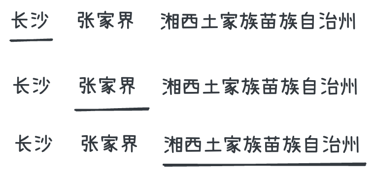
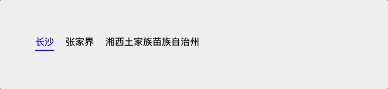
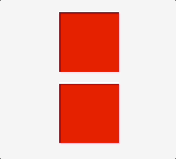
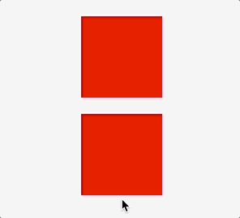
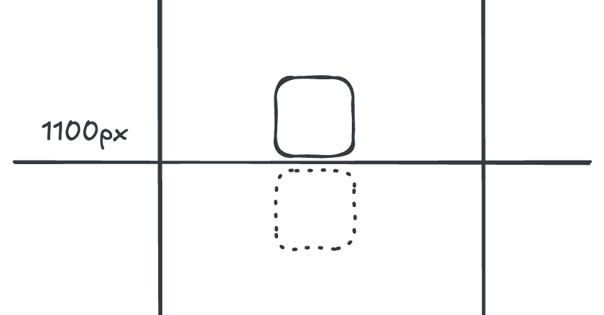
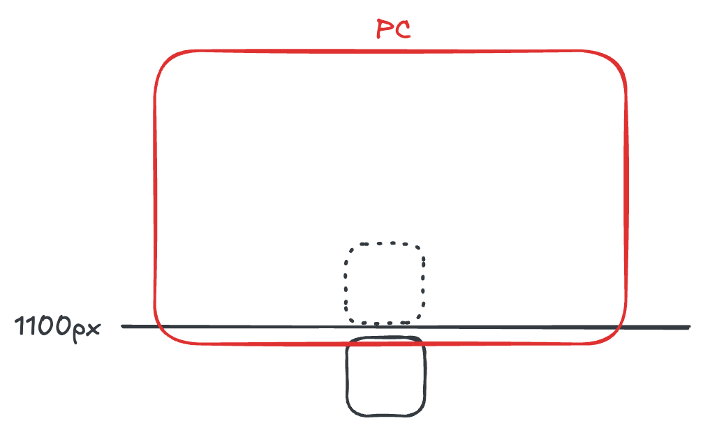
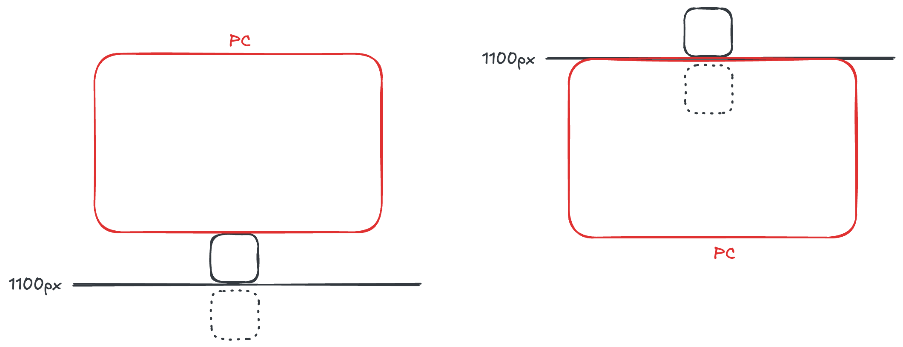
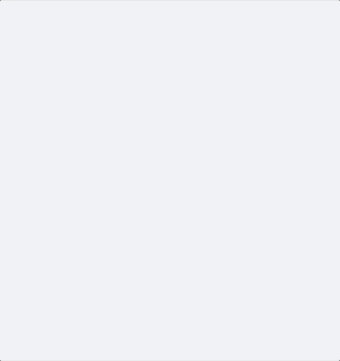
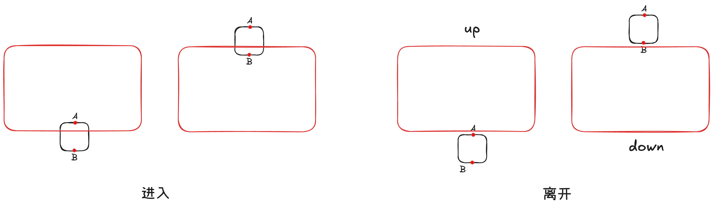
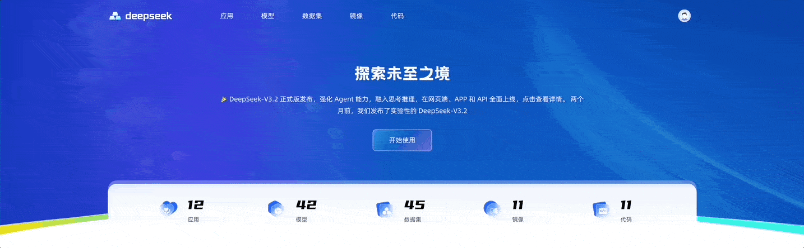

# Motion 动画

[Motion](https://motion.dev/docs/) 是一个易于上手的动画库，它独特的混合引擎结合了浏览器的高性能和 JavaScript 引擎的无限潜力。支持：

- HTML/CSS
- SVG
- WebGL

动画，而且还原生支持 React 框架。

## 安装 & 使用

```sh
$ npm install motion
```

```ts
import { motion } from "motion/react"
```

## Motion Component

为了方便在 React 里使用 Motion，Motion 提供了 [Motion Component](https://motion.dev/docs/react-motion-component)。每个 HTML 和 SVG 元素都有一个对应 Motion 组件，比如

```tsx
<motion.div />
<motion.a href="#" />
<motion.circle cx={0} />
```

这些组件都是对普通的 HTML 元素的封装，但是提供了[动画属性](https://motion.dev/docs/react-motion-component#props)，便于在 React 里使用 Motion。

## Motion 基础

### 动起来 - `animate`

最简单的动画使用 Motion Component 的 [`animate`](https://motion.dev/docs/react-motion-component#animate) 属性。

```jsx
// 向右移动 100px
<motion.div animate={{ x: 100 }} />
```

并且当 `animate` 的值发生变化时，Motion Component 将继续以 `animate` 的值进行动画。

```jsx
const [x, setX] = useState(100)
<motion.div animate={{ x: x }} />
```

#### CSS 属性

Motion 动画支持所有的 CSS 属性，包括浏览器通常不支持动画的 CSS 属性，比如 `background-image` 、`mask-image` 等。

```jsx
<motion.nav
  animate={{ maskImage: "linear-gradient(to right, rgba(0,0,0,1) 90%, rgba(0,0,0,1) 100%)" }}
/>
```

#### `transform` 简写

在第一个例子中，出现了  `x` 属性，但是 CSS 并没有 `x` 属性，其实它是 [`transform`](https://developer.mozilla.org/en-US/docs/Web/CSS/Reference/Properties/transform) 属性的简写，

```jsx
// 等价于 <motion.div animate={{ transform: translate(100px, 0) }} />
<motion.div animate={{ x: 100 }} />
```

除此之外还有：

- 平移： `x` 、 `y` 、 `z`
- 缩放： `scale` 、 `scaleX` 、 `scaleY`
- 旋转： `rotate` 、 `rotateX` 、 `rotateY` 、 `rotateZ`
- 倾斜： `skew` 、 `skewX` 、 `skewY`
- 视角： `transformPerspective`

当然也可以直接使用 `transform`，还能获得更好的硬件加速。

```jsx
<motion.li animate={{ transform: "translateX(0px)" }} />
```

同样的 `transform-origin` 也有三个简写

- `originX`
- `originY`
- `originZ`

#### 值类型

`animate` 的值类型支持：

- 数字： `0` `100` 。
- 包含数字的字符串： `"0vh"` 、 `"10px"` 等。
- 颜色：十六进制、RGBA、HSLA。
- 包含多个数字或颜色的复杂字符串（如 `box-shadow` ）。
- `display: "none"/"block"` 和 `visibility: "hidden"/"visible"` 。

#### CSS 变量

Motion 可以为 CSS 变量添加动画效果，还可以使用 CSS 变量定义作为动画目标。

```jsx
<motion.ul
  initial={{ '--rotate': '0deg' }}
  animate={{ '--rotate': '360deg' }}
  transition={{ duration: 2, repeat: Infinity }}
>
  <li style={{ transform: 'rotate(var(--rotate))' }} />
  <li style={{ transform: 'rotate(var(--rotate))' }} />
  <li style={{ transform: 'rotate(var(--rotate))' }} />
</motion.ul>
```

> 📢 对 CSS 变量值进行动画处理**总是会触发绘制事件** ，因此使用 `MotionValue` 来设置此类动画可能性能更高。

#### Keyframes

`animate` 也支持数组，称为 Keyframes。

```jsx
<motion.div animate={{ x: [0, 100, 0] }} />
```

#### Variants

有时候一个动画可以包含多个动画属性，而且可能多个组件使用相同的动画，这个时候可以使用 [Variants](https://motion.dev/docs/vue-animation#variants)，避免重复编写。

```jsx
const variants = {
  visible: { opacity: 1 },
  hidden: { opacity: 0 },
}

<motion.div
  variants={variants}
  initial="hidden"  // variants 对象的属性名
  animate="visible" // variants 对象的属性名
/>
```

Variants 更厉害的地方是它具有穿透性。

**注意：**这里的穿透性是指 `animate`、`initial`（后面会讲到） 等 props 设置的 Variants 值传递给了子组件，而不是 `variants` props 的值传递到子组件的 `variants` props 上。这一点要注意，一开始我也理解错了。

```jsx
const list = {
  visible: { opacity: 1 },
  hidden: { opacity: 0 },
}

const item = {
  visible: { opacity: 1, x: 0 },
  hidden: { opacity: 0, x: -100 },
}

return (
  <motion.ul
    initial="hidden"
    animate="visible"
    variants={list}
  >
    <motion.li variants={item} />   
    <motion.li variants={item} />
    <motion.li variants={item} />
  </motion.ul>
)
```

上面例子中 `ul` 的 `initial="hidden"`、`animate="visible"` 传递给了子组件 `li`，但是要求子组件能识别 `hidden`、`visible`。这就要求它们也要设置 `variants` props。如果设置了  `variants` props，它们就能一起动画。

### 动画效果 - `transition`

默认情况下，Motion 会根据动画值的类型创建合适的动画效果，以实现流畅的动画。像 `x` 或 `scale` 这样的物理属性使用 `spring` 动画效果，而像 `opacity` 或 `color` 则使用 `ease` 动画效果。

但是，我们可以通过 [`transition`](https://motion.dev/docs/react-transitions) 属性自定义动画效果。

```jsx
<motion.div
  animate={{ x: 100 }}
  transition={{ ease: "easeOut", duration: 2 }}
/>
```

#### 类型

`transition` 有三种类型 `type`：`tween`、`spring` 和 `inertia`

##### `tween`

基于持续时间的 `easing` 动画。

**`ease`**

- 内置 `easing` 函数名

  - `linear`
  - `easeIn`、`easeOut`、`easeInOut`
  - `circIn`、`circOut`、`circInOut`
  - `backIn`、`backOut`、`backInOut`
  - `anticipate`

[Easing Functions Cheat Sheet](https://easings.net/) 有一些 `easing` 函数可视化展示。

- 由四个数字组成的数组，用来定义三次贝塞尔曲线，例如：`[.17,.67,.83,.67]`，可以通过 [Cubic Bezier](https://cubic-bezier.com/) 可视化定制。
- 自定义 [JavaScript easing 函数](https://motion.dev/docs/easing-functions)，它接受并返回 `0~1` 的值。

**`duration`**

动画的持续时间，默认是 0.3s。

**`times`**

当动画多个关键帧（Keyframes）时，`times` 设置每个关键帧持续时间，`0~1`。

```jsx
<motion.div
  animate={{
    x: [0, 100, 0],
    duration: 1,
    transition: { times: [0, 0.3, 1] }
  }}
/>
```

从 0px 移动到 100px，持续 0.3s，从 100px 移动到 0px，持续 0.7s。

`times` 的个数必须和关键帧的个数相同。

##### `spring`

弹簧动画。它有两种模式:

一、基于物理弹簧特性，通过设置 `stiffness`（硬度）、`damping`（阻尼）和 `mass`（质量）模拟物理弹簧的动画效果。

二、基于持续时间，设置 `duration`（持续时间）或者 `visualDuration`（视觉持续时间）和 `bounce` （弹力）。

动画效果可以参考 [Motion - Spring visualiser](https://motion.dev/docs/react-transitions#spring-visualiser)。

##### `inertia`

惯性动画，根据初始速度减缓物体速度的动画，通常用于实现惯性滚动。

这个类型的参数比较多，详情请参考 [Motion - Inertia](https://motion.dev/docs/react-transitions#inertia)。 

#### 配置

Motion 有两种配置动画效果的方式

##### 组件配置

最常用的就是组件配置，如上面所述，每个 Motion 组件有一个 `transition` 属性

```jsx
<motion.div
  animate={{ x: 100 }}
  transition={{ ease: "easeOut", duration: 2 }} // `ease` 有值，默认是 `tween` 类型 
/>
```

甚至可以设置不同的动画属性有不同的动画效果

```jsx
<motion.li
  animate={{
    x: 0,
    scale: 1.2,
    opacity: 1,
    transition: {
      default: { type: "spring" }, // for others, 在这个例子中是 `x`、`scale`
      opacity: { ease: "linear" } // for `opacity`
    }
  }}
/>
```

##### 全局配置

通过 [`MotionConfig`](https://motion.dev/docs/react-motion-config#transition)，可以全局配置所有 Motion 组件的 `transition`。

```tsx
<MotionConfig transition={{ duration: 0.4, ease: "easeInOut" }}>
  <App />
</MotionConfig>
```

## 进入动画

首次创建 `motion` 组件时，如果 `animate` 中的值与初始渲染的值不同，它将动画到 `animate` 指定的值

```jsx
<motion.div animate={{ scale: 2 }} />
```

但是如果 `animate` 中的值与初始渲染的值相同，就不会产生动画。

如果想要一个初始动画，可以通过 [`initial`](https://motion.dev/docs/react-motion-component#initial) 设置一个初始值，然后动画到 `animate` 指定的值

```jsx
// 一开始 `scale` 为 0，然后动画到 1
<motion.div initial={{ scale: 0 }} animate={{ scale: 1 }} />
```

如果想要禁止进入动画，设置 `initial={false}`。这将使元素以在 `animate` 中定义的值渲染。

```jsx
// 没有动画，组件的 `scale` 直接为 2
<motion.div initial={false} animate={{ scale: 2 }} />
```

## 退出动画

在 React 中，当一个组件被删除时，它通常会立即被删除。因此 Motion 提供了 [AnimatePresence](https://motion.dev/docs/react-animate-presence) 组件，当元素执行由 `exit` 定义的动画时，将元素保存在 DOM 中，动画结束后再删除元素。

```jsx
<AnimatePresence>
  {isVisible && (
    <motion.div
      key="modal"
      initial={{ opacity: 0 }}
      animate={{ opacity: 1 }}
      exit={{ opacity: 0 }}
    />
  )}
</AnimatePresence>
```

<iframe src="https://examples.motion.dev/react/exit-animation?utm_source=embed"  style="width: 100%;height:400px;border:none" />

## 交互动画

在实际的开发过程中，我们会经常使用交互动画，比如 hover、tap 等。

```less
item-image {
  &:hover {
    transform: scale(1.1);
  }
  &:active {
    transform: scale(0.8);
  }
}
```

因此，Motion 提供了相应的动画属性以支持交互动画

- `whileHover`
- `whileTap`
- `whileFocus`
- `whileDrag`

它们的功能和 `animate` 一样

```jsx
<motion.div
  whileHover={{ scale: 1.2 }}
  whileTap={{ scale: 0.8 }}
/>
```

### Drag 

Motion 通过一个 `drag` 属性，实现了一个可拖动的组件

```jsx
<motion.div drag />
```

通过传入 `"x"` 或者 `"y"`，可以让组件只能在单个轴上拖动

```jsx
<motion.div drag="x" />
```

通过 `dragConstraints` 限制组件可以拖动的范围

```jsx
<motion.div
  drag
  dragConstraints={{
    top: -50,
    left: -50,
    right: 50,
    bottom: 50,
  }}
/>
```

或者限制在某个组件内

```jsx
export function DragContainer() {
  const constraintsRef = useRef(null)

  return (
    <motion.div ref={constraintsRef} style={{ width: 300, height: 200 }}>
      <motion.div drag dragConstraints={constraintsRef} />
    </motion.div>
  )
}
```

通过 `dragDirectionLock` 限制每次只能沿一个轴拖动

> 与 `drag="x"/"y"` 的区别是， `drag="x"/"y"` 是限制组件终身只能在一个轴上拖动，而  `dragDirectionLock` 是限制单次只能沿一个轴拖动，即拖到组件永远不会走斜线。

```jsx
<motion.div
  dragDirectionLock
  onDirectionLock={axis => console.log(`Locked to ${axis} axis`)}
/>
```

更多详情，请参考 [Drag Animation](https://motion.dev/docs/react-drag)

## Layout 动画

通过设置 `layout` 属性，开启布局动画。布局动画是指当组件的 position 或者 size 发生变化时，执行动画。

```jsx
<motion.div layout />
```

主要是用于布局的变化，比如 flex 布局的变化

```jsx
export default function LayoutAnimation() {
  const [isOn, setIsOn] = useState(false)
  const toggleSwitch = () => setIsOn(!isOn)

  return (
    <button
      style={{
        justifyContent: "flex-" + (isOn ? "start" : "end"),
      }}
      onClick={toggleSwitch}
    >
      <motion.div
        layout
        transition={{
          type: "spring",
          visualDuration: 0.2,
          bounce: 0.2,
        }}
      />
    </button>
  )
}
```

当使用布局动画时，应该通过 `style` 或 `className` 来改变布局，而不是通过 `animate` 或 `whileHover` 等属性，因为  `layout`  会自动处理动画。

这里还有个 shuffle 的例子，能生动形象的展示 layout 动画

<iframe src="https://examples.motion.dev/react/reorder-items?utm_source=embed"  style="width: 100%;height:500px;border:none" />

动画布局通常是缓慢的，但是 Motion 使用 CSS `transform` 属性执行布局动画，以获得尽可能高的性能。

### `layoutId`

Layout 动画还可以通过 `layoutId` 属性，在两个独立的元素之间创建无缝的 “魔法运动” 效果。

你是否还记得当年实现 Tabs indicator 动画的艰辛吗？



1. 设置 indicator 为 Tab 的绝对定位 `absolute`
2. 计算和保存每一个 Tab item 宽度和位置，这是最难的部分
3. 根据 Tab item 宽度数组与当前选中的 Tab item index，计算 indicator 的位置 `left` 和 `width`

通过 `layoutId`，我们可以很容易实现上面的动画。

```jsx
function KFTabs({ options }: KFTabsProps) {
  const [currentValue, setCurrentValue] = useState(options[0].value);

  return (
    <div className='kf-tabs'>
      {options.map((item) => {
        return (
          <div
            key={item.value}
            className={classNames('kf-tabs__item', {
              'kf-radio-group__item--active': currentValue === item.value,
            })}
            onClick={() => {
               setCurrentValue(item.value);
            }}
          >
            <div className={'kf-tabs__item__label'}>{item.label}</div>
            {currentValue === item.value && (
              <motion.div
                layoutId="indicator"
                className={'kf-tabs__item__indicator'}
                initial={false}
                transition={{ duration: 0.3, ease: 'easeInOut' }}
              ></motion.div>
            )}
          </div>
        );
      })}
    </div>
  );
}
```



不在需要每一个 Tab item 宽度和位置。

它的原理是当添加新组件的 `layoutId` 属性与现有组件的 `layoutId` 匹配时，它将自动从旧组件中动画出来。

### 小贴士

为了在可滚动容器中正确地设置 Layout 动画，必须将 `layoutScroll` 属性添加到可滚动元素中。

```jsx
<motion.div layoutScroll style={{ overflow: "scroll" }} />
```

为了在固定元素中正确地设置 Layout 动画，必须将 `layoutRoot` 属性添加到固定元素中。

```jsx
<motion.div layoutRoot style={{ position: "fixed" }} />
```

由于性能原因，当一个组件执行 Layout 动画时，其它的组件将无法检测到其布局的变化。



但是可以通过在 [`LayoutGroup`](https://motion.dev/docs/react-layout-group) 组件中包装多个组件来同步布局更改。

```jsx
import { LayoutGroup } from "motion/react"

function List() {
  return (
    <LayoutGroup>
      <Accordion />
      <Accordion />
    </LayoutGroup>  
  )
}
```



## 滚动动画

Motion 的滚动动画有两种类型：

- Scroll-triggered：当元素进入或离开 viewport（视口）时触发动画。
- Scroll-linked：与滚动进度关联的动画。

### Scroll-triggered

Scroll-triggered 是元素进入或离开 viewport（视口）时触发的动画。Motion 组件通过 `whileInView` 设置动画目标或 variant 实现这样的动画。

```jsx
<motion.div
  initial={{ opacity: 0 }}
  whileInView={{ opacity: 1 }}
/>
```

#### 进入与离开

要很好的实现 Scroll-triggered 动画，首先要了解 Motion 怎么定义组件的“进入”与“离开”

这里我要做一个组件显示时，`transformY(100)` => `transformY(0)` 的动画

```jsx
const variants: Variants = {
  visible: {
    y: 0,
  },
  hidden: {
    y: 100,
  },
};

<motion.div
  variants={variants}
  initial={'hidden'}
  whileInView="visible"
/>
```

假设元素的 `top` 为 `1000px`，组件的高度是 `100px`，那么组件处于 `1000px ~ 1099px`。

当视口滚动到哪个位置，组件是被视为”进入“？



根据我的测验，当视口底部滚动到 `1100px`，组件才被视为”进入“，即：



可以这么理解，一开始因为设置 `initial="hidden"`，组件执行了 `transformY(100)`，此时组件处于 `1100px ~ 1199px`。只有滚动到这个区间时，才能看到组件。

那当视口滚动到哪个位置，组件是被视为”离开“？

“离开”分为两种：

- 显示组件后，调转方向往上滚动，当视口底部滚动到 `999px` 时，组件被隐藏在屏幕下方
- 或者继续往下滚动，当视口顶部滚动到 `1100px` 时，组件被隐藏在屏幕上方

即：



搞清楚组件的“进入”与“离开”后，我们就能发现上面代码的问题，这也是 Motion 组件的典型问题：

如右图所示：屏幕继续往下滚动，当视口顶部滚动到 `1100px` 时，组件被视为“离开”，“离开”时，Motion 会执行 `initial="hidden"` 定义的动画，执行`transformY(100)`，组件下移 `100px`， 此时组件又“进入”了视口，Motion 将执行 `whileInView="visible"` 定义的动画，执行 `transformY(0)`，组件上移 `100px`，组件又“离开”了视口，从而产生了循环动画，导致组件“闪烁”。

#### 解决方案

**方案一：** 对于纵向滚动来说，最好不要设计 `transformY` 的动画，可以改为 `transformX` 或者 `scale` 这种纵向位置不变的动画。

```jsx
const variants: Variants = {
  visible: {
    x: 0,
    opacity: 1,
    transition: {
      ease: 'easeInOut',
      duration: 0.5,
    },
  },
  hidden: {
    x: -100,
    opacity: 0,
  },
};
```

**方案二：** 设置 [`viewport`](https://motion.dev/docs/react-motion-component#viewport-1) 的 `once` 为 `true`，只做一次进入动画。

```jsx
<motion.div
  variants={variants}
  initial={'hidden'}
  whileInView="visible"
  viewport={{ once: true }}
/>
```

**方案三：** 如果设计师硬性要求必须做 `transformY` 动画，可以使用嵌套结构。

保持父组件的位置不动，移动子组件，父组件能正确识别“进入”与“离开”

```jsx
const parentVariants: Variants = {
  visible: {
    overflow: 'visible',
  },
  hidden: {
    overflow: 'hidden',
  },
};

const variants: Variants = {
  visible: {
    y: 0,
    transition: {
      ease: 'easeInOut',
      duration: 0.5,
    },
  },
  hidden: {
    y: 100,
  },
};

<motion.div
  initial='hidden'
  whileInView="visible"
  variants={parentVariants}
  className="parent"
>
  <motion.div variants={variants} className="child" />
</motion.div>
```

样式

```css
.parent {
  width: 100px;
  height: 100px;
  position: relative;
}

.child {
  position: absolute;
  top: 0;
  height: 100%;
  left: 0;
  width: 100%;
}
```

**方案四：** 根据滚动方向设置“离开”时的 Y 偏移

上面提到的问题，其实是向下滚动，导致组件在屏幕上方“离开”，执行“离开”动画，组件下移 `100px`，导致组件又“进入”了。如果此时组件不是下移 `100px`，而是上移 `100px`，就不会有问题了。因此我们需要根据滚动方向设置“离开”时的 Y 偏移。

首先自定义 hook，获取滚动方向。

我们使用两个 Motion hook：`useScroll` 和 `useMotionValueEvent`，很容易获取滚动方向。

```jsx
import { useMotionValueEvent, useScroll } from 'motion/react';
import { useState } from 'react';

export const useScrollDirection = () => {
  const [scrollDirection, setScrollDirection] = useState('up'); // 默认值必须为 'up'
  const { scrollY } = useScroll();

  useMotionValueEvent(scrollY, 'change', (current) => {
    const diff = current - (scrollY.getPrevious() || 0);
    setScrollDirection(diff > 0 ? 'down' : 'up');
  });

  return scrollDirection;
};
```

向下滚动导致组件在屏幕上方“离开”时，`transformY(-100)`，向上滚动导致组件在屏幕下方“离开”时，`transformY(100)`。

初始时需要 `transformY(100)`，所以 `direction` 的默认值是 `'up'`。

```jsx
const direction = useScrollDirection();
const variants: Variants = {
  visible: {
    y: 0,
    transition: {
      ease: 'easeInOut',
      duration: 0.5,
    },
  },
  hiddenDown: {
    y: 100,
  },
  hiddenUp: {
    y: -100,
  },
};

<motion.div
  id="test"
  initial={direction === 'down' ? 'hiddenUp' : 'hiddenDown'}
  whileInView="visible"
  variants={variants}
/>
```



**方案五：** 使用 [`useInView`](https://motion.dev/docs/react-use-in-view) + [`useAnimate`](https://motion.dev/docs/react-use-animate) 自定义 Scroll-triggered 动画

解决思路：在组件顶部和底部添加两个标记点 A 和 B：

- 当 A 进入且 B 离开，或者当 B 进入且 A 离开，执行 `"visible"` 动画
- B 先于 A 离开，`"direction"` 标记为 `"up"`
- A 先于 B 离开，`"direction"` 标记为 `"down"`
- 当 A 和 B 都离开，执行 `"hidden"` 动画。`"direction"` 为 `"up"` 时，下移，反之上移



首先封装一个组件 `TransformWrapper`

```tsx
type TransformWrapperProps = {
  y: number; // Y 偏移量
  children: React.ReactNode;
};

function TransformWrapper({ y, children }: TransformWrapperProps) {
  const topRef = useRef<HTMLDivElement>(null);      // 顶部的标记点
  const bottomRef = useRef<HTMLDivElement>(null);   // 底部的标记点
  const isTopInView = useInView(topRef);            // 顶部的标记点是否可见
  const isBottomInView = useInView(bottomRef);      // 底部的标记点是否可见
  const [direction, setDirection] = useState('up'); // 默认值同样是 "up"
  const [scope, animate] = useAnimate();

  useEffect(() => {
    // 执行 visible 动画
    if ((isTopInView && !isBottomInView) || (!isTopInView && isBottomInView)) {
      animate(
        scope.current,
        {
          opacity: 1,
          y: 0,
        },
        { duration: 0.5, ease: 'easeInOut' },
      );
    } else if (!isTopInView && !isBottomInView) {
      // 执行 hidden 动画
      animate(
        scope.current,
        {
          opacity: 0,
          y: direction === 'down' ? -y : y, // 根据滚动方式确定是上移还是下移
        },
        { duration: 0.5, ease: 'easeInOut' },
      );
    }
  }, [isTopInView, isBottomInView, direction]);

  useEffect(() => {
    if (!isBottomInView && isTopInView) {
      setDirection('up');
    } else if (!isTopInView && isBottomInView) {
      setDirection('down');
    }
  }, [isTopInView, isBottomInView]);

  return (
    <div className={styles['container']} ref={scope}>
      <div className={styles['container__top']} ref={topRef}></div>
      <div className={styles['container__bottom']} ref={bottomRef}></div>
       {children}
    </div>
  );
}

export default TransformWrapper;
```

样式

```less
.container {
  position: relative;

  &__top {
    position: absolute;
    top: 0;
    left: 0;
    width: 100%;
    height: 2px;
  }

  &__bottom {
    position: absolute;
    bottom: 0;
    left: 0;
    width: 100%;
    height: 2px;
  }
}
```

使用

```tsx
<TransformWrapper y={100}>
  <div></div>
</TransformWrapper>
```

#### 配置

Motion 组件可以通过 [`viewport`](https://motion.dev/docs/react-motion-component#viewport-1) 定义其行为

##### `root`

Motion 组件默认的滚动容器是 `window`，通过 `root` 可以是设置滚动容器

```jsx
function Component() {
  const scrollRef = useRef(null);
  
  return (
    <div ref={scrollRef} style={{ overflow: "scroll" }}>
      <motion.div
        initial={{ opacity: 0 }}
        whileInView={{ opacity: 1 }}
        viewport={{ root: scrollRef }}
      />
    </div>
  )
}
```

##### `once`

如果 `true` ，则只做一次进入动画。

##### `amount`

组件进入视口的比例，只有达到该比例才算“进入”。值为 `"some"`、 `"all"` 或 `0 ~ 1` 的数字。`"some"` 表示 `0`， `"all"` 表示 `1`。默认值为 `"some"` 。

##### `margin`

添加到视口的边距，用于改变检测区域。默认值为 `"0px"` 。使用多个值可以调整上/右/下/左边距，例如 `"0px -20px 0px 100px"` 。

### Scroll-linked

Scroll-linked 根据滚动进度执行动画。

[`useScroll`](https://motion.dev/docs/react-use-scroll) hook 返回四个 [Motion Value](https://motion.dev/docs/react-motion-value)。

- `scrollX`/`scrollY`：滚动距离，单位为像素
- `scrollXProgress`/`scrollYProgress`：滚动进度，`0 ~ 1`

#### Motion Value

Motion Value 是 Motion 提供的一种特殊类型，可以追踪动画值的状态和速度。

##### `useMotionValue`

Motion 使用 [`useMotionValue`](https://motion.dev/docs/react-motion-value#usage) 创建一个 Motion Value 

```js
 const value = useMotionValue(0);
```

通过 `get()` 获取最新状态，`set()` 方法设置为新状态

将 MotionValue 作为 Motion 组件的子元素，每当 MotionValue 更新， Motion 组件将渲染最新的值。

这比设置 React state 更高效，因为更新 MotionValue 将直接更新 DOM，而不是导致 React 重新渲染。

下面是使用 Motion Value 创建一个计数器的动画

```tsx
import { useMotionValue, motion, animate } from "motion/react"

function Counter() {
  const count = useMotionValue(0);

  useEffect(() => {
    const controls = animate(count, 100, { duration: 5 })
    return () => controls.stop()
  }, []);

  return <motion.pre>{count}</motion.pre>
}
```

使用 `useMotionValue` 创建的 Motion Value 不具有动画性

```js
const value = useMotionValue(0);
// 直接设置成 100，没有动画效果
value.set(100);
```

可以使用 `animate` 动态修改 Motion Value。或者使用 `useSpring`。

##### `useSpring`

[`useSpring`](https://motion.dev/docs/react-use-spring) 创建一个 Motion Value，并使用 spring 动画显示其最新值。

```js
const value = useSpring(0);
// 以 spring 动画到 100
value.set(100);
// 跳过动画，直接设置 100
value.jump(100);
```

[`useSpring`](https://motion.dev/docs/react-use-spring) 还能跟踪另一个 Motion Value，并使用 spring 动画到另一个 Motion Value 的最新值。

```js
const x = useMotionValue(0);
const y = useSpring(x);

// y 都会通过 spring 动画到 100
x.set(100)
y.set(100)
```

##### `useTransform`

[`useTransform`](https://motion.dev/docs/react-use-transform) 转换一个或多个 Motion Value。

它有两种转换方式：

- 转换函数

```jsx
const x = useMotionValue(1);
const y = useMotionValue(1);
const z = useTransform(() => x.get() + y.get()); // z.get() === 2
```

在转换函数中，通过 `get` 方法读取的任何 Motion Value 都将被自动订阅。当这些 Motion Value 改变时，在下一个动画帧中再次运行转换函数，计算新值。

- 映射

```js
const x = useMotionValue(0);
const opacity = useTransform(x, [-100, 0, 100], [0, 1, 0]);
```

##### `useMotionTemplate`

[`useMotionTemplate`](https://motion.dev/docs/react-use-motion-template) 通过字符串模板创建 Motion Value

```js
const x = useMotionValue(100);
const transform = useMotionTemplate`transform(${x}px)`;
```

##### `useMotionValueEvent`

Motion Value 有下列这些事件

- `change`
- `animationStart`
- `animationCancel`
- `animationComplete`

可以通过 `on` 方法订阅这些事件

```js
const x = useMotionValue(100);
const unsubscribe = x.on("change", latest => console.log(latest));
// 取消订阅
unsubscribe();
```

但是更方便的方式是使用 [`useMotionValueEvent`](https://motion.dev/docs/react-use-motion-value-event)

```js
useMotionValueEvent(x, "change", (latest) => {
  console.log("x changed to", latest)
})
```

#### 首页 Banner 动画

Scroll-linked 动画跟 Motion Value 的使用密不可分，[Motion - Scroll-linked Animations](https://motion.dev/docs/react-scroll-animations#scroll-linked-animations) 上提供了多个 Scroll-linked 的示例。

这里我们将使用 Scroll-linked  实现首页 Banner 动画



实现思路：

1. 首先获取 Y 轴滚动距离 `scrollY`
2. 通过 `useSpring` 得到一个 spring 动画版的 `springScrollY`
3. 根据 `springScrollY`，使用 `useTransform` 计算height、left、right、top、radius、padding 等值
4. 因为我使用 rem，响应式布局，使用 `useMotionTemplate` 转换为 rem
5. 使用 `useMotionValueEvent`，判断滚动距离，切换背景图

```tsx
function HomeBanner() {
  const [minBgImage, setMinBgImage] = useState(undefined);
  const [largeBgImage, setLargeBgImage] = useState(headerImage);
  const { scrollY } = useScroll();
  const springScrollY = useSpring(scrollY, {
    stiffness: 100,
    damping: 30,
    restDelta: 0.001,
  });

  const initialHeight = convertRemToPx(35); // rem 转 px
  const minHeight = convertRemToPx(4.7); // rem 转 px
  const height = useTransform(() => `max(calc(35rem - ${springScrollY.get()}px), 4.7rem)`);
  const inline = useTransform(springScrollY, [0, initialHeight], [0.0, 16.25]);
  const inlineRem = useMotionTemplate`${inline}rem`;
  const radius = useTransform(springScrollY, [0, initialHeight], [0.0, 2.5]);
  const radiusRem = useMotionTemplate`${radius}rem`;
  const top = useTransform(springScrollY, [0, initialHeight], [0, 10]);
  const paddingInline = useTransform(springScrollY, [0, initialHeight], [16.25, 10]);
  const padding = useMotionTemplate`1.25rem ${paddingInline}rem 0`;
  
  useMotionValueEvent(scrollY, 'change', (value) => {
    setMinBgImage(value > initialHeight - minHeight ? miniHeaderImage : undefined);
    setLargeBgImage(value > initialHeight - minHeight ? undefined : headerImage);
  });

  return (
    <motion.div
      className={styles['home-banner']}
      style={{
        height: height,
        left: inlineRem,
        right: inlineRem,
        borderRadius: radiusRem,
        top: top,
        backgroundImage: minBgImage ? `url(${minBgImage})` : undefined,
      }}
      transition={{
        type: 'spring',
        duration: 0.3,
      }}
    >
      <motion.div
        className={styles['home-banner__content']}
        style={{
          padding: padding,
          backgroundImage: largeBgImage ? `url(${largeBgImage})` : undefined,
        }}
      >
        <NavBar></NavBar>
        <Intro></Intro>
        <StatisticsBlock></StatisticsBlock> 
      </motion.div>
    </motion.div>
  );
}
```

样式

```less
.home-banner {
  position: fixed;
  top: 0;
  right: 0;
  left: 0;
  z-index: 100;
  height: 35rem;
  overflow: hidden;
  background-color: transparent;
  background-repeat: no-repeat;
  background-position: left top;
  background-size: 100% 100%;

  &__content {
    position: relative;
    z-index: 10;
    display: flex;
    flex-direction: column;
    align-items: center;
    padding: 1.25rem 16.25rem 0;
    background-repeat: no-repeat;
    background-position: left top;
    background-size: 100% 100%;
  }
}
```

## References

- [Motion Docs](https://motion.dev/docs/)
- [Motion Examples](https://motion.dev/examples?platform=react)
- [Motion Component](https://motion.dev/docs/react-motion-component)
- [Motion AnimatePresence Component](https://motion.dev/docs/react-animate-presence)
- [Motion Transitions Props](https://motion.dev/docs/react-transitions)
- [Motion Easing Functions](https://motion.dev/docs/easing-functions)
- [Motion Drag Animation](https://motion.dev/docs/react-drag)
- [Motion Layout animation](https://motion.dev/docs/react-layout-animations#shared-layout-animations)
- [Motion Variants](https://motion.dev/docs/vue-animation#variants)
- [Motion values overview](https://motion.dev/docs/react-motion-value)
- [MDN - `<easing-function>`](https://developer.mozilla.org/en-US/docs/Web/CSS/Reference/Values/easing-function#linear-easing-function)
- [Easing Functions Cheat Sheet](https://easings.net/)
- [Cubic Bezier](https://cubic-bezier.com/)
- [MDN - Web Animations API](https://developer.mozilla.org/en-US/docs/Web/API/Web_Animations_API)
- [View Transition API](https://developer.mozilla.org/en-US/docs/Web/API/View_Transition_API)
- [Blog - Animations on the Web](https://emilkowal.ski/)
- [Blog - Inside Framer's Magic Motion](https://www.nan.fyi/magic-motion)