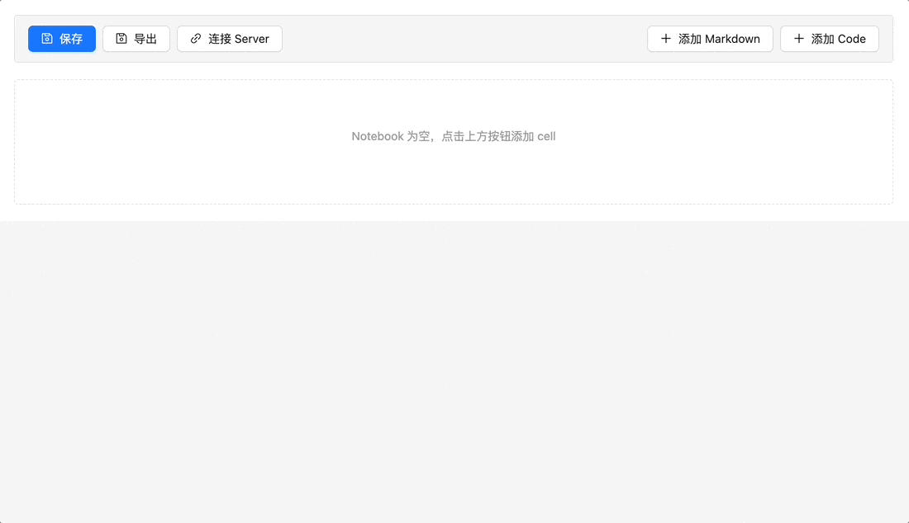
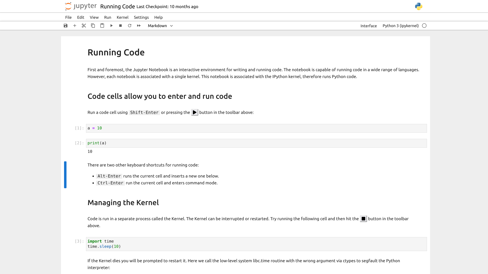
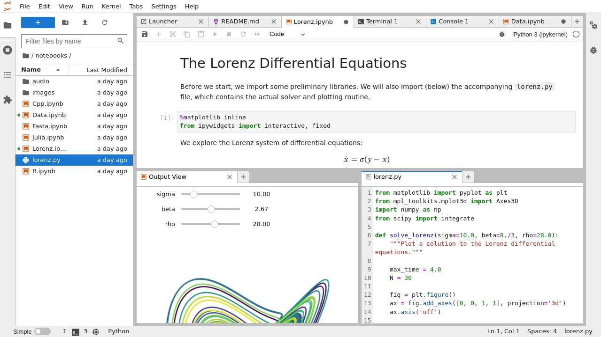
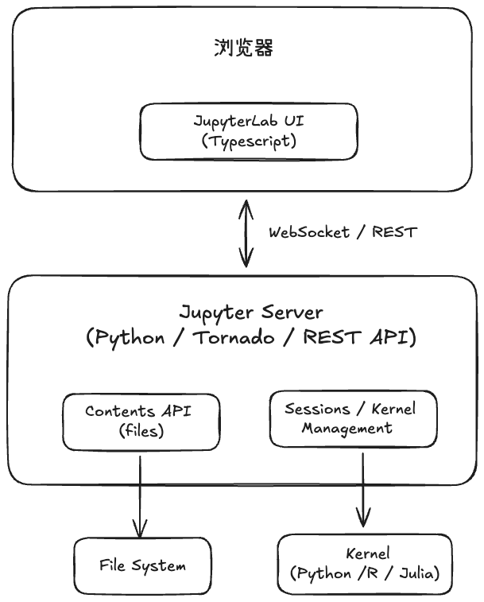
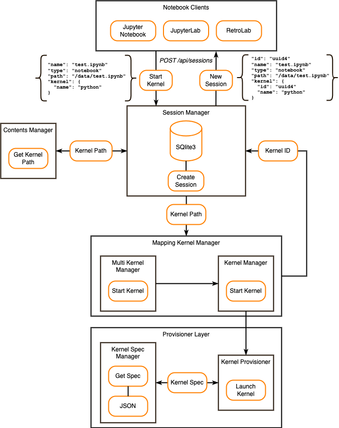

# Jupyter Notebook React 实现

Jupyter 是一个大型项目，涵盖了众多不同的软件产品和工具，包括广受欢迎的 [Jupyter Notebook](https://jupyter-notebook.readthedocs.io/en/latest/) 和 [JupyterLab](https://jupyterlab.readthedocs.io/en/latest/)。Jupyter 项目及其子项目都是围绕计算笔记本（Computational Notebook）展开的 。

计算笔记本是一种可共享的文档，它结合了计算机代码、解释性文本、数据、丰富的可视化效果（例如 3D 模型、图表、图形与图像）以及交互式控件。笔记本与编辑器（例如 Jupyter Notebook、JupyterLab）配合使用，提供了一个快速的交互式环境，用于原型设计和解释代码、探索和可视化数据，以及与他人分享想法。

## 问题与目标

我们怎样在自己的系统里实现 Jupyter Notebook 功能呢？以前我们是直接在后台启动 Jupyter Notebook 或 JupyterLab 应用，然后通过 `iframe` 嵌入到我们系统 。但是这样存在一些问题：

- 不便于用户共享，用户启动的 Jupyter Notebook 或  JupyterLab 应用都是独立的，无法预览其他用户创建的 notebook。虽然 [JupyterHub](https://jupyterhub.readthedocs.io/en/stable/) 可以实现多用户共享，但是它有一套自己的认证机制，它更适合一个团队的成员共享。
- 用户为了预览 notebook，也要启动 Jupyter Notebook 或  JupyterLab 应用，消耗资源。
-  Jupyter Notebook 或  JupyterLab 应用的 UI 与系统风格不一致。

因此本文将使用 React 实现 Jupyter Notebook，做一个 Jupyter Notebook-Like 的功能，实现以下功能：

- 用户可以方便地创建 notebook，用户之间可以预览。
- 自定义 notebook  UI ，以符合系统自身的风格。
- 在接入 Jupyter Server 后，能运行 notebook 里的代码。
- 可以编辑、保存和导出 notebook。

## 实现效果



## Jupyter 生态

在学习 Jupyter 时，经常看到 Jupyter Notebook 与 JupyterLab。Jupyter Notebook 和 JupyterLab 都是创建、渲染以及编辑 notebook 的 Web 应用。

**它们都支持：**

- 代码编辑，具备自动语法高亮、缩进和 Tab 键自动补全功能。
- 能够执行代码，并将计算结果附加到代码上。
- 使用富媒体（如 HTML、LaTeX、PNG、SVG 等）显示计算结果。
- 使用 Markdown 标记语言编辑富文本。
- 使用 LaTeX 在 Markdown 单元格中添加数学符号，并由 [MathJax](https://www.mathjax.org/) 进行原生渲染。

**不同之处**

Jupyter Notebook 是早期的经典应用，提供了一种简化的、轻量级的 notebook 创作体验。通常是一个页面只能打开一个 `.ipynb` 文件。

JupyterLab 是新一代的 Web 应用，提供功能丰富的标签式多 notebook 编辑环境、可以自定义界面布局，以及增加了系统控制台等附加工具。

**主要功能对比**

| **功能**          | **Notebook** | **JupyterLab** |
| ----------------- | ------------ | -------------- |
| 多文件同时打开    | ❌            | ✅              |
| 多标签            | ❌            | ✅              |
| 拖拽分屏          | ❌            | ✅              |
| 文件管理          | 简单         | 强大           |
| 编辑 .py/.md/.txt | ❌            | ✅              |
| 终端              | ❌            | ✅              |
| 控制台（Console） | ❌            | ✅              |

简单说一句结论：**JupyterLab 是新一代平台，Notebook 是老的经典应用**。

所以 JupyterLab 是我们的研究对象。

### Jupyter Notebook

#### 安装

安装 Jupyter Notebook 推荐使用 [`Anaconda`](https://www.anaconda.com/download)。


 `Anaconda` 适合初学者，因为已经内置了 Jupyter Notebook 和  JupyterLab。

还可以通过 [`pip`](https://docs.jupyter.org/en/latest/glossary.html#term-pip) 安装

```sh
$ pip3 install jupyter
```

#### 运行

安装之后，运行 Jupyter Notebook 很简单

```sh
$ jupyter notebook
```



从上面这张图可以看出，Jupyter Notebook 是一个单页应用，不支持文件管理，多标签功能。

### JupyterLab

#### 安装

同样推荐使用 [`Anaconda`](https://www.anaconda.com/download) 安装 JupyterLab。

另外也可以使用 `conda`、`mamba`、`pip`、`pipenv` 以及 `docker` 安装 JupyterLab。

```sh
# conda
$ conda install -c conda-forge jupyterlab
# mamba
$ mamba install -c conda-forge jupyterlab
# pip
$ pip install jupyterlab
```

更多安装方式请参考 [Jupyter - Installation](https://jupyterlab.readthedocs.io/en/latest/getting_started/installation.html#installation)。

#### 运行

 运行 JupyterLab 也很简单

```sh
$ jupyter lab
```



从上面这张图可以看出，JupyterLab 支持多文件管理，支持多标签等功能。

### 其它

#### JupyterHub

[JupyterHub](https://jupyterhub.readthedocs.io/en/stable/) 是一个多用户 Jupyter Notebook 服务平台，可用于学生班级、企业或科研团队。

#### Jupyter Desktop

[Jupyter Desktop](https://github.com/jupyterlab/jupyterlab-desktop) 是一款基于 Electron 的桌面应用程序。

#### Voilà

[Voilà](https://voila.readthedocs.io/en/stable/) 将 Jupyter Notebook 转换为一个独立的静态 Web 应用程序。它删除了 notebook 中的代码，是一个不能编辑、执行的 Jupyter Notebook。

#### JupyterLite

[JupyterLite](https://jupyterlite.readthedocs.io/en/stable/) 是一种完全基于浏览器运行的 JupyterLab，它使用 [WebAssembly](https://developer.mozilla.org/en-US/docs/WebAssembly)（Wasm）运行 code，因此它不需要 Jupyter Server。

#### Voici

[Voici](https://voici.readthedocs.io/en/latest/) 是 [Voilà](https://github.com/voila-dashboards/voila) 和 [JupyterLite](https://github.com/jupyterlite/jupyterlite) 的组合，它和 [JupyterLite](https://github.com/jupyterlite/jupyterlite) 一样使用 [WebAssembly](https://developer.mozilla.org/en-US/docs/WebAssembly)（Wasm）在浏览器中渲染 notebook。它可以作为 [Voilà](https://github.com/voila-dashboards/voila)  的替代品。

## Notebook 文件格式

Jupyter notebook 文件（`.ipynb`）其实就是一个[特殊的 JSON 文件](https://github.com/jupyter/nbformat/blob/master/nbformat/v4/nbformat.v4.schema.json)。下面是它的基本格式：

```json
{
  "metadata": { // Notebook 级别的元数据
    "kernel_info": {
      # if kernel_info is defined, its name field is required.
      "name": "the name of the kernel"
    },
    "language_info": {
      # if language_info is defined, its name field is required.
      "name": "the programming language of the kernel",
      "version": "the version of the language",
      "codemirror_mode": "The name of the codemirror mode to use [optional]",
    },
  },
  "nbformat": 4, // 主版本
  "nbformat_minor": 5, // 小版本
  "cells": [
    # list of cell dictionaries, see below
  ],
}
```

其中最重要的是 `cells`，有三种类型：

- `markdown`
- `code`
- `raw`

### Markdown Cell

Markdown Cell 主要用于解释性内容，支持 [GitHub-flavored](https://help.github.com/articles/github-flavored-markdown) 风格，JuputerLab 使用 [`marked`](https://github.com/chjj/marked) 进行渲染。其定义如下：

```json
{
  "cell_type": "markdown",
  "metadata": {}, // Cell 级别的元数据
  "source": "[multi-line *markdown*]",
}
```

#### 附件

Markdown Cell 和 Raw Cell 可以包含附件，通常是内联图片，这些图片可以在 Markdown 中被引用。

```json
{
  "cell_type": "markdown",
  "metadata": {},
  "source": ["Here is an *inline* image "],
  "attachments": {"test.png": {"image/png": "base64-encoded-png-data"}},
}
```

### Code Cell

Code Cell 是 Jupyter notebook 的主要内容，包含代码、代码结果输出和执行次数。

```json
{
  "cell_type": "code",
  "execution_count": 1,  # integer or null
  "metadata": {
    "collapsed": True,  # whether the output of the cell is collapsed
    "scrolled": False,  # any of true, false or "auto"
  },
  "source": "[some multi-line code]",
  "outputs": [
    {
      # list of output dicts (described below)
      "output_type": "stream",
      # ...
    }
  ],
}
```

Code Cell  的输出又有下面四种类型：

- `stream`

- `display_data`

- `execute_result`

- `error`

#### `Stream`

`stdout` 或者 `stderr` 的输出

```json
{
  "output_type": "stream",
  "name": "stdout",  # or stderr
  "text": "[multiline stream text]",
}
```

#### `display_data`

富文本输出，支持各种 mime-type，比如 `"text/plain"`、`"image/png"` 等。

一个 output data 可以同时有多个 mime-type，前端会选择最合适的一个进行展示，JupyterLab 使用 **Rendermime** 处理这些 mime-type 输出的渲染。

```json
{
  "output_type": "display_data",
  "data": {
    "text/plain": "[multiline text data]",
    "image/png": "[base64-encoded-multiline-png-data]",
    "application/json": {
      # JSON data is included as-is
      "key1": "data",
      "key2": ["some", "values"],
      "key3": {"more": "data"},
    },
    "application/vnd.exampleorg.type+json": {
      # JSON data, included as-is, when the mime-type key ends in +json
      "key1": "data",
      "key2": ["some", "values"],
      "key3": {"more": "data"},
    },
  },
  "metadata": { // Output 级别的元数据
    "image/png": {
      "width": 640,
      "height": 480,
    },
  },
}
```

#### `execute_result`

执行 Code Cell 的结果，与 `display_data` 类型差不多，多了一个表示执行次数的 `execution_count`

```json
{
  "output_type": "execute_result",
  "execution_count": 42,
  "data": {
    "text/plain": "[multiline text data]",
    "image/png": "[base64-encoded-multiline-png-data]",
    "application/json": {
      # JSON data is included as-is
      "json": "data",
    },
  },
  "metadata": {
    "image/png": {
      "width": 640,
      "height": 480,
    },
  },
}
```

#### `error`

执行失败，显示一个错误信息

```json
{
  'output_type': 'error',
  'ename' : str,   # Exception name, as a string
  'evalue' : str,  # Exception value, as a string

  # The traceback will contain a list of frames,
  # represented each as a string.
  'traceback' : list,
}
```

### Raw Cell

Raw Cell 表示在 nbconvert 输出中应保持不变的内容。Raw Cell  唯一有用的是 `metadata` 的 `format` 字段，它指定 nbconvert 使用什么格式转换 Raw Cell 的内容。

```json
{
  "cell_type": "raw",
  "metadata": {
      # the mime-type of the target nbconvert format.
      # nbconvert to formats other than this will exclude this cell.
      "format": "mime/type"
  },
  "source": ["some nbformat output text"],
}
```

这种类型的 Cell 一般很少使用。

## JupyterLab 架构

下面是 JupyterLab 整体架构，主要包括有两大部分组成：

- JupyterLab UI，渲染页面
- Jupyter Server，提供核心服务和 [REST API](https://petstore.swagger.io/?url=https://raw.githubusercontent.com/jupyter/jupyter_server/main/jupyter_server/services/api/api.yaml)。



### JupyterLab UI

JupyterLab 通过一个[前端组件库](https://github.com/jupyterlab/jupyterlab/tree/main/packages)来实现 notebook 编辑器的界面。这些组件库都是用 Typescript 编写的，比如

- [`@jupyterlab/cells`](https://github.com/jupyterlab/jupyterlab/blob/main/packages/cells)，渲染 Jupyter notebook 单元格。
- [`@jupyterlab/outputarea`](https://github.com/jupyterlab/jupyterlab/blob/main/packages/outputarea)，渲染代码的执行结果。
- [`@jupyterlab/rendermime`](https://github.com/jupyterlab/jupyterlab/tree/main/packages/rendermime)，MIME 渲染器，为多种格式（如 Markdown、HTML、Image 和 LaTeX）提供默认的渲染器。
- [`@jupyterlab/rendermime-interfaces`](https://github.com/jupyterlab/jupyterlab/blob/main/packages/rendermime-interfaces)，为实现特殊的 MIME 渲染器提供接口。
- [`@jupyterlab/nbformat`](https://github.com/jupyterlab/jupyterlab/tree/main/packages/nbformat)，Typescript 类型定义。
- [`@jupyterlab/services`](https://github.com/jupyterlab/jupyterlab/blob/main/packages/services)，与 Jupyter Server 进行交互，比如连接、执行代码需要靠它。

这些组件都不是 React 组件，它们依赖 [`jupyterlab/lumino`](https://github.com/jupyterlab/lumino) 进行渲染。

#### Lumino

[`Lumino`](https://lumino.readthedocs.io/en/latest/api/index.html) 是 JupyterLab 前端渲染库，类似于 JQuery、React、Vue。

`Lumino` 提供了一套丰富的组件、布局、事件和数据结构工具包。我们可以使用这些工具包构建可扩展的、高性能的 Web 应用程序。

```
@lumino/
├─ application    应用
├─ widgets        UI / 布局 / 生命周期
├─ coreutils      工具箱（插件系统、UUID、JSON、Promise）
├─ commands       命令系统（菜单、快捷键、palette）
├─ messaging      Widget 消息系统（底层）
├─ signaling      状态变化、解耦通信
├─ disposable     资源释放、生命周期管理
├─ collections    数据结构（LinkedList、Heap）
├─ algorithm      算法工具（迭代器）
├─ polling        定时轮询
├─ dragdrop       拖拽系统
├─ keyboard       键盘映射
├─ datagrid       高性能表格
├─ domutils       DOM 工具栏（剪贴板、Selector、BoxSizing）
├─ properties     响应式属性（很少用）
└─ virtualdom     虚拟 DOM（⚠️ 基本弃用）
```

其中最重要的是`@lumino/widgets` 和  `@lumino/coreutils` 工具包。

##### `@lumino/widgets`

这是 Lumino 最核心的包，负责：

- Widget，可以理解为一个组件
- DOM 生命周期
- 布局系统，比如 `BoxLayout`、`AccordionLayout`、`PanelLayout` 等
- Attach / Detach、Resize 管理

Widget 的定义（简化版）

```ts
export class Widget implements IMessageHandler, IObservableDisposable {
  constructor(options: Widget.IOptions = {}) {
    this.node = Private.createNode(options);
    this.addClass('lm-Widget');
  }
}

namespace Private {
  export function createNode(options: Widget.IOptions): HTMLElement {
    return options.node || document.createElement(options.tag || 'div');
  }
}
```

怎么使用 Widget 创建一个 HTML 块呢？

```html
<div>
  <h1>标题</h1>
  <p>这是段落</p>
  <span>这是正文</span>
  
<div>
```

1. 首先创建一个 Widget

```ts
import { Widget } from '@lumino/widgets';

function createNode(): HTMLElement {
  const root = document.createElement('div');

  const h1 = document.createElement('h1');
  h1.textContent = '标题';

  const p = document.createElement('p');
  p.textContent = '这是段落';

  const span = document.createElement('span');
  span.textContent = '这是正文';

  const img = document.createElement('img');
  img.src = 'http://localhost:8000/image/example.jpg';

  root.append(h1, p, span, img);
  return root;
}

class ArticleWidget extends Widget {
  constructor() {
    super({ node: createNode() });
  }
}

export default ArticleWidget;
```

2. 然后挂载到 Document

```ts
const widget = new ArticleWidget();
Widget.attach(widget, document.body);
```

`attach` 其实就是使用了 [`insertBefore`](https://developer.mozilla.org/en-US/docs/Web/API/Node/insertBefore) 方法。

```ts
export function attach(
    widget: Widget,
    host: HTMLElement,
    ref: HTMLElement | null = null
  ): void {
    if (widget.parent) {
      throw new Error('Cannot attach a child widget.');
    }
    if (widget.isAttached || widget.node.isConnected) {
      throw new Error('Widget is already attached.');
    }
    if (!host.isConnected) {
      throw new Error('Host is not attached.');
    }
    MessageLoop.sendMessage(widget, Widget.Msg.BeforeAttach);
    host.insertBefore(widget.node, ref);
    MessageLoop.sendMessage(widget, Widget.Msg.AfterAttach);
  }
```

同理 `detach` 使用了 [`removeChild`](https://developer.mozilla.org/en-US/docs/Web/API/Node/removeChild) 方法。

```ts
  export function detach(widget: Widget): void {
    if (widget.parent) {
      throw new Error('Cannot detach a child widget.');
    }
    if (!widget.isAttached || !widget.node.isConnected) {
      throw new Error('Widget is not attached.');
    }
    MessageLoop.sendMessage(widget, Widget.Msg.BeforeDetach);
    widget.node.parentNode!.removeChild(widget.node);
    MessageLoop.sendMessage(widget, Widget.Msg.AfterDetach);
  }
}
```

##### `@lumino/coreutils`

顾名思义，`@lumino/coreutils` 提供了核心工具，比如 Random、UUID、Promise 代理、JSON 等，其中最重要的是插件系统。这也是 JupyterLab 的工作方式。

```ts
interface IPlugin<T, U> {
  id: string; // 插件 ID
  description?: string; // 插件描述
  autoStart?: boolean | "defer"; //是否自动启用插件
  provides?: null | Token<U>; // 该插件提供的服务，Token 作为插件的唯一标识
  requires?: Token<any>[]; // 插件依赖服务类型（必需）
  optional?: Token<any>[]; // 插件依赖服务类型（可选）
  activate: ((app, ...args) => U | Promise<U>); // 激活插件，函数的返回值作为插件提供服务的具体实例。
  deactivate?: null | ((app, ...args) => void | Promise<void>); // 停用插件
}
```

JupyterLab 大量使用了插件，比如 [`@jupyterlab/markedparser-extension`](https://github.com/jupyterlab/jupyterlab/tree/main/packages/markedparser-extension) 提供了渲染 Markdown 内容的服务。 

```ts
const plugin: JupyterFrontEndPlugin<IMarkdownParser> = {
  id: '@jupyterlab/markedparser-extension:plugin',
  description: 'Provides the Markdown parser.',
  autoStart: true,
  provides: IMarkdownParser,
  requires: [IEditorLanguageRegistry],
  optional: [IMermaidMarkdown],
  activate: (
    app: JupyterFrontEnd,
    languages: IEditorLanguageRegistry,
    mermaidMarkdown: IMermaidMarkdown | null
  ) => {
    return createMarkdownParser(languages, {
      blocks: mermaidMarkdown ? [mermaidMarkdown] : []
    });
  }
};

export const IMarkdownParser = new Token<IRenderMime.IMarkdownParser>(
  '@jupyterlab/rendermime:IMarkdownParser',
  'A service for rendering markdown syntax as HTML content.'
);
```

`createMarkdownParser` 创建 Markdown 解析器。JupyterLab 使用这个插件提供的 Markdown 解析器，渲染 `"text/markdown"` 类型的输出。

同时 `@lumino/coreutils` 提供了注册插件的类 `PluginRegistry`

```ts
Class PluginRegistry<T> {
  registerPlugins(plugins): void; // 注册插件
  deregisterPlugin(id, force?): void; // 注销插件
  activatePlugin(id): Promise<void>; // 激活插件
  deactivatePlugin(id): Promise<string[]> // 停用插件
}
```

`@lumino/application` 以及它的子类 [`@jupyterlab/application`](https://github.com/jupyterlab/jupyterlab/blob/main/packages/application/src/lab.ts) 使用 `PluginRegistry` 注册插件。

#### 插件系统

JupyterLab UI 是由一个 shell widget（root 容器） + 一堆插件构成。

比如上面提到的 `@jupyterlab/markedparser-extension` 只是其中一个插件，提供渲染 Markdown 内容的服务。

##### 注册插件

JupyterLab 怎么注册插件？JupyterLab 没有提供相关的文档，我们只能从代码层面寻找答案。

1. 首先在 `dev_mode/package.json` 里列出了需要的插件，JupyterLab 把插件分为两类：
   - 标准插件（`extensions`） 
   - MIME 插件（`mimeExtensions`）

```json
"jupyterlab": {
  "extensions": {
    "@jupyterlab/markedparser-extension": "",
    "@jupyterlab/rendermime-extension": "",
    ...
  },
  "mimeExtensions": {
    "@jupyterlab/javascript-extension": "",
    "@jupyterlab/json-extension": "",
    "@jupyterlab/mermaid-extension": "lib/mime.js",
    "@jupyterlab/pdf-extension": "",
    "@jupyterlab/vega5-extension": ""
  },
}
```

2. Webpack（`dev_mode/webpack.config.js`） 读取 `dev_mode/package.json` 里 `extensions` 与 `mimeExtensions`，并使用 [`Handlebars.js 模版` ](https://github.com/handlebars-lang/handlebars.js) 填充 `dev_mode/index.js` 里的模版内容，输出到 `index.out.js`。

`dev_mode/webpack.config.js` (简化版)

```js
// 1. 读取 `dev_mode/package.json` 里 `extensions` 与 `mimeExtensions` 内容
const packageData = require('./package.json');
const jlab = packageData.jupyterlab;
const { extensions, mimeExtensions } = jlab;

// 2. 使用 `Handlebars.js` 模版填充 `dev_mode/index.js` 里的模版内容
const source = fs.readFileSync('index.js').toString();
const template = Handlebars.compile(source);
const extData = {
  jupyterlab_extensions: extensions,
  jupyterlab_mime_extensions: mimeExtensions
};
// 3. 输出到 `index.out.js`
fs.writeFileSync(path.join(buildDir, 'index.out.js'), template(extData));
```

`dev_mode/index.js` (简化版)

```js
/**
 * The main entry point for the application.
 */
export async function main() {
  var pluginRegistry = new PluginRegistry();
  var JupyterLab = require('@jupyterlab/application').JupyterLab;
  var register = [];

  // 1. 处理注册的 MIME 扩展
  const mimeExtensions = [];
  {{#each jupyterlab_mime_extensions}}
  if (!queuedFederated.includes('{{@key}}')) {
    try {
      let ext = require('{{@key}}{{#if this}}/{{this}}{{/if}}');
      ext.__scope__ = '{{@key}}';
      for (let plugin of activePlugins(ext)) {
        mimeExtensions.push(plugin);
      }
    } catch (e) {
      console.error(e);
    }
  }
  {{/each}}

  // 2. 处理已注册的标准扩展。
  {{#each jupyterlab_extensions}}
  if (!queuedFederated.includes('{{@key}}')) {
    try {
      let ext = require('{{@key}}{{#if this}}/{{this}}{{/if}}');
      ext.__scope__ = '{{@key}}';
      for (let plugin of activePlugins(ext)) {
        register.push(plugin);
      }
    } catch (e) {
      console.error(e);
    }
  }
  {{/each}}

  // 3. 注册标准插件
  pluginRegistry.registerPlugins(register);

  // 4. 实例化 Jupyter Application
  const lab = new JupyterLab({
    pluginRegistry,
    mimeExtensions,
    ...
  });
}
```

3. `dev_mode/bootstrap.js` 加载 `index.out.js` 完成标准插件的注册

```js
void (async function bootstrap() {
  let main = (await import('./index.out.js')).main;
  window.addEventListener('load', main);
})();
```

4. JupyterLab 实例化时，注册 MIME 插件

```ts
export class JupyterLab extends JupyterFrontEnd<ILabShell> {
  constructor(options: JupyterLab.IOptions = { shell: new LabShell() }) {
    if (options.mimeExtensions) {
      for (const plugin of createRendermimePlugins(options.mimeExtensions)) {
        this.registerPlugin(plugin);
      }
    }
  }
}
```

##### 使用插件

JupyterLab 又是怎么使用插件呢？我们以 `@jupyterlab/markedparser-extension` 渲染 `text/markdown` 类型的 output 为例进行说明。

1. 首先 [`@jupyterlab/markedparser-extension`](https://github.com/jupyterlab/jupyterlab/tree/main/packages/markedparser-extension) 并不是单独使用，而是作为 [`@jupyterlab/rendermime-extension`](https://github.com/jupyterlab/jupyterlab/tree/main/packages/rendermime-extension) 的依赖， [`@jupyterlab/rendermime-extension`](https://github.com/jupyterlab/jupyterlab/tree/main/packages/rendermime-extension) 创建了 [`RenderMimeRegistry`](https://github.com/jupyterlab/jupyterlab/tree/main/packages/rendermime) 实例，将 [`@jupyterlab/markedparser-extension`](https://github.com/jupyterlab/jupyterlab/tree/main/packages/markedparser-extension) 提供的服务作为 `markdownParser` 参数。

```ts
const plugin: JupyterFrontEndPlugin<IRenderMimeRegistry> = {
  id: '@jupyterlab/rendermime-extension:plugin',
  description: 'Provides the render mime registry.',
  optional: [
    IDocumentManager,
    ILatexTypesetter,
    ISanitizer,
    IMarkdownParser,
    ITranslator
  ],
  provides: IRenderMimeRegistry,
  activate: activate,
  autoStart: true
};

/**
 * Activate the rendermine plugin.
 */
function activate(
  app: JupyterFrontEnd,
  docManager: IDocumentManager | null,
  latexTypesetter: ILatexTypesetter | null,
  sanitizer: IRenderMime.ISanitizer | null,
  markdownParser: IMarkdownParser | null,
  translator: ITranslator | null
): RenderMimeRegistry {
  return new RenderMimeRegistry({
    initialFactories: standardRendererFactories,
    markdownParser: markdownParser ?? undefined,
    // ...
  });
}
```

2.  [`RenderMimeRegistry`](https://github.com/jupyterlab/jupyterlab/tree/main/packages/rendermime) 添加 MIME 渲染映射

```ts
export class RenderMimeRegistry implements IRenderMimeRegistry {
  constructor(options: RenderMimeRegistry.IOptions = {}) {
    // Parse the options.
    this.translator = options.translator ?? nullTranslator;
    this.resolver = options.resolver ?? null;
    this.linkHandler = options.linkHandler ?? null;
    this.latexTypesetter = options.latexTypesetter ?? null;
    this.markdownParser = options.markdownParser ?? null;
    this.sanitizer = options.sanitizer ?? new Sanitizer();

    // Add the initial factories.
    if (options.initialFactories) {
      for (const factory of options.initialFactories) {
        this.addFactory(factory);
      }
    }
  }
}
```

其中 `standardRendererFactories` 包含 `text/markdown` 类型的渲染工厂

```ts
export const markdownRendererFactory: IRenderMime.IRendererFactory = {
  safe: true,
  mimeTypes: ['text/markdown'],
  defaultRank: 60,
  createRenderer: options => new widgets.RenderedMarkdown(options)
};
```

最终得到一个映射：`'text/markdown'` =>  `options => new widgets.RenderedMarkdown(options)`

而 `widgets.RenderedMarkdown(options)` 对应 `RenderedMarkdown` 类

3. 为 MIME 类型创建一个渲染器

```ts
function createRenderer(mimeType: string): IRenderMime.IRenderer {
    return this._factories[mimeType].createRenderer({
      mimeType,
      resolver: this.resolver,
      sanitizer: this.sanitizer,
      linkHandler: this.linkHandler,
      latexTypesetter: this.latexTypesetter,
      markdownParser: this.markdownParser,
      translator: this.translator
    });
}
```

它将创建 `RenderedMarkdown` 实例

```ts
export class RenderedMarkdown extends RenderedHTMLCommon {
  constructor(options: IRenderMime.IRendererOptions) {
    super(options);
    this.addClass('jp-RenderedMarkdown');
  }
  
  render(model: IRenderMime.IMimeModel): Promise<void> {
    return (this._rendered = renderers.renderMarkdown({
      host: this.node,
      source: String(model.data[this.mimeType]),
      trusted: model.trusted,
      resolver: this.resolver,
      sanitizer: this.sanitizer,
      linkHandler: this.linkHandler,
      shouldTypeset: this.isAttached,
      latexTypesetter: this.latexTypesetter,
      markdownParser: this.markdownParser,
      translator: this.translator
    }));
  }
}
```

4. 渲染代码输出的组件 [`OutputArea`](https://github.com/jupyterlab/jupyterlab/tree/main/packages/outputarea) 通过 [`RenderMimeRegistry`](https://github.com/jupyterlab/jupyterlab/tree/main/packages/rendermime) 创建 `RenderedMarkdown` 实例，然后通过 `output.renderModel(model)` 调用 `RenderedMarkdown` 的 `render` 方法

```ts
function createRenderedMimetype(model: IOutputModel): Widget | null {
  let output = this.rendermime.createRenderer(mimeType);
	output.renderModel(model)
  return output
} 
```

5.  `RenderedMarkdown` 的 `render` 方法调用 `renderers.renderMarkdown`，最终使用 [`@jupyterlab/markedparser-extension`](https://github.com/jupyterlab/jupyterlab/tree/main/packages/markedparser-extension) 提供的服务 `markdownParser` 渲染 markdown 内容。

```ts
export async function renderMarkdown(
  options: renderMarkdown.IRenderOptions
): Promise<void> {
  const { host, source, markdownParser, ...others } = options;

  let html = '';
  if (markdownParser) {
    // Separate math from normal markdown text.
    const parts = removeMath(source);

    // Convert the markdown to HTML.
    html = await markdownParser.render(parts['text']);

    // Replace math.
    html = replaceMath(html, parts['math']);
  } else {
    // Fallback if the application does not have any markdown parser.
    html = `<pre>${source}</pre>`;
  }

  // Render HTML.
  await renderHTML({
    host,
    source: html,
    ...others
  });
}
```

至于 JupyterLab 什么时候将 [`@jupyterlab/rendermime-extension`](https://github.com/jupyterlab/jupyterlab/tree/main/packages/rendermime-extension) 创建了 [`RenderMimeRegistry`](https://github.com/jupyterlab/jupyterlab/tree/main/packages/rendermime) 实例给 [`OutputArea`](https://github.com/jupyterlab/jupyterlab/tree/main/packages/outputarea)，那又是另外一个故事了。

### Jupyter Server

[Jupyter Server](https://jupyter-server.readthedocs.io/en/latest/index.html) 为 Jupyter Web 应用程序提供核心服务和 [REST API](https://petstore.swagger.io/?url=https://raw.githubusercontent.com/jupyter/jupyter_server/main/jupyter_server/services/api/api.yaml)。可以使用 Jupyter Server 提供的框架和服务来创建应用程序（比如 JupyterLab）和服务。

Jupyter 服务器采用基于 [ZeroMQ](https://zeromq.org/) 的 [双进程内核架构 ](https://ipython.readthedocs.io/en/stable/overview.html#ipythonzmq)，并使用 [Tornado](http://www.tornadoweb.org/en/stable/) 来处理 HTTP 请求。

#### 安装

```sh
$ pip install jupyter_server
```

如果安装了 [`Anaconda`](https://www.anaconda.com/download)，那么已经安装了 `jupyter_server`

#### 运行

```sh
$ jupyter server
```

然后就能看到服务地址，比如 `http://localhost:8888/?token=xxx`

##### 配置文件

默认情况下，Jupyter Server 会在 Jupyter 路径下的 `jupyter_server_config` 文件中查找服务器特定的配置。

列出 Jupyter Server 将要查找的路径：

```sh
$ jupyter --paths

config:
    /Users/username/.jupyter
    /usr/local/etc/jupyter
    /etc/jupyter
data:
    /Users/username/Library/Jupyter
    /usr/local/share/jupyter
    /usr/share/jupyter
runtime:
    /Users/username/Library/Jupyter/runtime
```

`config` 目录下的路径按优先级顺序排列。如果同一个 trait 在多个位置列出，则会将其值设置为优先级最高的文件中的值。

Jupyter Server 使用 IPython 的 traitlets 系统进行配置。您可以快速在 `.jupyter` 目录下创建一个 `jupyter_server_config.py` 文件中，它将所有默认值注释掉：

```sh
$ jupyter server --generate-config
```

在 Python 文件中，这些特性将以 `c.ServerApp` 为前缀。例如，您的配置文件可能如下所示：

```python
# inside a jupyter_server_config.py file.

c.ServerApp.port = 9999
```

相同的配置用 JSON 表示如下：

```json
{
  "ServerApp": {
    "port": 9999
  }
}
```

##### 命令行参数

您也可以使用 CLI 参数进行配置。每个参数前添加 `--ServerApp` 前缀，如下所示：

```sh
$ jupyter server --ServerApp.port=9999
```

#### 架构

下面是 Jupyter Server 系统架构


- **ServerApp** 是基于 [Tornado](https://github.com/tornadoweb/tornado) 的应用程序，它将所有组件连接在一起。
- **Config Manager** 初始化 ServerApp 的配置。
- **Custom Extensions** 允许您创建自定义服务器的 REST API 端点。
- **Gateway Server** 是一种网络服务器，一旦进行配置，它就能为运行在其他主机上的 Jupyter 核心提供访问权限。
- **Contents Manager and File Contents Manager** 负责在文件系统上提供 Notebook 服务。
- **Session Manager** 处理用户的会话。当用户启动新的内核时，Session Manager 会启动一个进程为该用户配置内核，并生成一个新的 Session ID。每个打开的 Notebook 都有一个独立的 Session，但不同的 Notebook 内核可以使用相同的 Session。如果用户希望在多个打开的 Notebook 之间共享数据，这一点非常有用。会话管理器使用 SQLite3 数据库来存储会话信息。默认情况下，该数据库存储在内存中，但也可以配置为保存到磁盘上。
- **Mapping Kernel Manager** 负责管理服务器应用程序内运行的内核的生命周期。它为用户的 Session 启动新的内核，并支持对该内核的中断、重启和关闭操作。
- **Jupyter Client** 被 Jupyter Server 用来与 Notebook 内核一起工作。
  - **Kernel Manager** 管理 Notebook 的单个内核。
  - **Kernel Spec Manager** 解析符合内核 JSON 规范的文件，并提供可用内核配置的列表。

更多详情请参考 [Jupyter Server Architecture](https://jupyter-server.readthedocs.io/en/latest/developers/architecture.html#jupyter-server-architecture)。

#### 创建 Session 工作流



当用户启动一个新内核时：

1. **Notebook Clients** 向 Jupyter 服务器发送 [`POST /api/sessions`](https://petstore.swagger.io/?url=https://raw.githubusercontent.com/jupyter/jupyter_server/master/jupyter_server/services/api/api.yaml#/sessions/post_api_sessions) 请求。此请求包含所有必要的数据，例如 Notebook 名称、类型、路径和内核名称等。
2.  **Session Manager** 根据输入数据向 **Contents Manager** 请求内核文件系统路径。
3. **Session Manager** 将内核路径发送给 **Mapping Kernel Manager** 。
4.  **Mapping Kernel Manager** 使用 **Multi Kernel Manager** 和 **Kernel Manager** 启动内核创建进程。
5. **Kernel Manager** 使用 **Provisioner Layer** 启用一个新内核。
6. **Kernel Provisioner** 负责根据内核规范启动内核。
7. **Kernel Spec Manager** 从 JSON 文件中获取内核规范。该规范位于 `kernel.json` 文件中。
8. 一旦 **Kernel Provisioner** 启动内核， **Kernel Manager** 为 **Session Manager** 生成新的内核 ID。
9. **Session Manager** 将新的会话数据保存到 SQLite3 数据库（会话 ID、notebook 路径、notebook 名称、notebook 类型、内核 ID 等）。
10. **Notebook Clients** 接收已创建的会话数据。

更多详情请参考 [Create Session Workflow](https://jupyter-server.readthedocs.io/en/latest/developers/architecture.html#create-session-workflow)。

#### `@jupyterlab/services`

我们可以通过 [Jupyter Server REST API](https://petstore.swagger.io/?url=https://raw.githubusercontent.com/jupyter-server/jupyter_server/main/jupyter_server/services/api/api.yaml) 和 WebSocket 与 Jupyter Server 进行连接，执行代码，但是 JupyterLab 提供了一个 [`@jupyterlab/services`](https://github.com/jupyterlab/jupyterlab/blob/main/packages/services) 库，它封装了 [Jupyter Server REST API](https://petstore.swagger.io/?url=https://raw.githubusercontent.com/jupyter-server/jupyter_server/main/jupyter_server/services/api/api.yaml)、WebSocket、[Jupyter Messaging Protocol](https://jupyter-client.readthedocs.io/en/latest/messaging.html) 等实现细节，方便我们快速集成。

简便流程如下：

1. 创建 ServerSettings

```ts
import { ServerConnection } from '@jupyterlab/services';

// 假设 jupyter server 地址是 http://localhost:8888/?token=xxx
// baseUrl 必须以 / 结尾
const serverSettings = ServerConnection.makeSettings({
  baseUrl: 'http://localhost:8888/',
  token: 'xxx',
  wsUrl: 'ws://localhost:8888/',
  appendToken: true,
});
```

2. 启动 / 连接 Kernel

```ts
export async function createKernelSession(
  settings: ServerConnection.ISettings,
  kernelName: string = 'python3',
): Promise<Session.ISessionConnection> {
  // 创建 KernelManager
  const kernelManager = new KernelManager({ serverSettings: settings });

  // 创建 SessionManager
  const sessionManager = new SessionManager({
    serverSettings: settings,
    kernelManager,
  });

  // 创建新会话
  const session = await sessionManager.startNew({
    path: `notebook-${Date.now()}.ipynb`,
    type: 'notebook',
    name: '',
    kernel: {
      name: kernelName,
    },
  });

  return session;
}
```

3. 执行代码

```ts
const future = kernel.requestExecute({ code });

// 实时接收输出
future.onIOPub = handleMessage;

// 执行完成
future.done.then(() => {
  console.log('execution finished');
});
```

## 实现

至此，我们分析了

- Notebook 的文件结构
- JupyterLab 的架构
- JupyterLab 的 UI 框架、插件系统
- Jupyter Server 的架构
- 通过 `@jupyterlab/services` 连接 Jupyter Server，执行代码

因此，我们可以仿照 JupyterLab，使用 React 实现 Jupyter Notebook。

- 使用 [`react-md-editor`](https://github.com/uiwjs/react-md-editor) 渲染和编辑 Markdown Cell
- 使用 [`monaco-react`](https://github.com/suren-atoyan/monaco-react) 或者 [`react-codemirror`](https://github.com/uiwjs/react-codemirror) 渲染与编辑 Code Cell
- 使用 [`@jupyterlab/outputarea`](https://github.com/jupyterlab/jupyterlab/blob/main/packages/outputarea) 封装 Code 输出
- 使用 [`@jupyterlab/services`](https://github.com/jupyterlab/jupyterlab/blob/main/packages/services) 连接 Jupyter Serve 执行代码

一个简单版的 JupyterLab 就完成了。

我们也可以进一步研究 JupyterLab 的源代码，实现更多功能，比如和 JupyterLab 一样使用插件系统。

### 完整代码

[`cp3hnu/jupyter-react`](https://github.com/cp3hnu/jupyter-react)

## References

- [Jupyter](https://jupyter.org/)

- [Jupyter Documentation](https://docs.jupyter.org/en/latest/)

- [What is Jupyter?](https://docs.jupyter.org/en/latest/what_is_jupyter.html)

- [Try Jupyter](https://jupyter.org/try)

- [Jupyter Notebook Documentation](https://jupyter-notebook.readthedocs.io/en/latest/)

- [JupyterLab Documentation](https://jupyterlab.readthedocs.io/en/latest/)

- [Jupyter Desktop](https://github.com/jupyterlab/jupyterlab-desktop)

- [JupyterHub](https://jupyterhub.readthedocs.io/en/stable/)

- [Voila](https://voila.readthedocs.io/en/stable/)

- [JupyterLite](https://jupyterlite.readthedocs.io/en/stable/)

- [Voici](https://voici.readthedocs.io/en/latest/)

- [The Notebook file format](https://nbformat.readthedocs.io/en/latest/format_description.html)

- [Jupyter Server](https://jupyter-server.readthedocs.io/)

- [Messaging in Jupyter](https://jupyter-client.readthedocs.io/en/latest/messaging.html)

- [JupyterLab UI API Docs](https://jupyterlab.readthedocs.io/en/latest/api/)

- [Jupyter Server REST API Docs](https://petstore.swagger.io/?url=https://raw.githubusercontent.com/jupyter-server/jupyter_server/main/jupyter_server/services/api/api.yaml)

- [Jupyter Widgets](https://ipywidgets.readthedocs.io/en/latest/)

- [nbviewer](https://nbviewer.org/)

- [nbconvert](https://nbconvert.readthedocs.io/en/latest/)

- [nbclient](https://nbclient.readthedocs.io/en/latest/)

- [Lumino API](https://lumino.readthedocs.io/en/latest/api/index.html)

- [IPython](https://ipython.org/)

- [IPython Documentation](https://ipython.readthedocs.io/en/stable/index.html)

- [`jupyter/notebook`](https://github.com/jupyter/notebook)

- [`jupyterlab/jupyterlab`]( https://github.com/jupyterlab/jupyterlab)

- [`voila-dashboards/voila`](https://github.com/voila-dashboards/voila)

- [`jupyterlite/jupyterlite`](https://github.com/jupyterlite/jupyterlite)

- [`jupyterlab/jupyterlab-desktop`](https://github.com/jupyterlab/jupyterlab-desktop)

- [`jupyter/nbformat`](https://github.com/jupyter/nbformat)

- [`jupyter/nbconvert`](https://github.com/jupyter/nbconvert)

- [`jupyter/nbclient`](https://github.com/jupyter/nbclient) 

- [`jupyter/nbviewer`](https://github.com/jupyter/nbviewer)

- [`jupyter/jupyter_client`](https://github.com/jupyter/jupyter_client)

- [`jupyterlab/lumino`](https://github.com/jupyterlab/lumino)

- [`jupyter-server/jupyter_server`](https://github.com/jupyter-server/jupyter_server)

- [`jupyter-server/jupyverse`](https://github.com/jupyter-server/jupyverse/)

- [`jupyter-server/kernel_gateway`](https://github.com/jupyter-server/kernel_gateway)

-  [papermill](https://pypi.org/project/papermill/)

-  [ZeroMQ](https://zeromq.org/get-started/)

- [Binder](https://mybinder.org/)

- [Anaconda](https://www.anaconda.com/download)

- [FastAPI](https://fastapi.tiangolo.com/)

- [Tornado](https://github.com/tornadoweb/tornado)

- [波尔](https://www.bohrium.com/notebooks?notebookTab=recommendations)

  