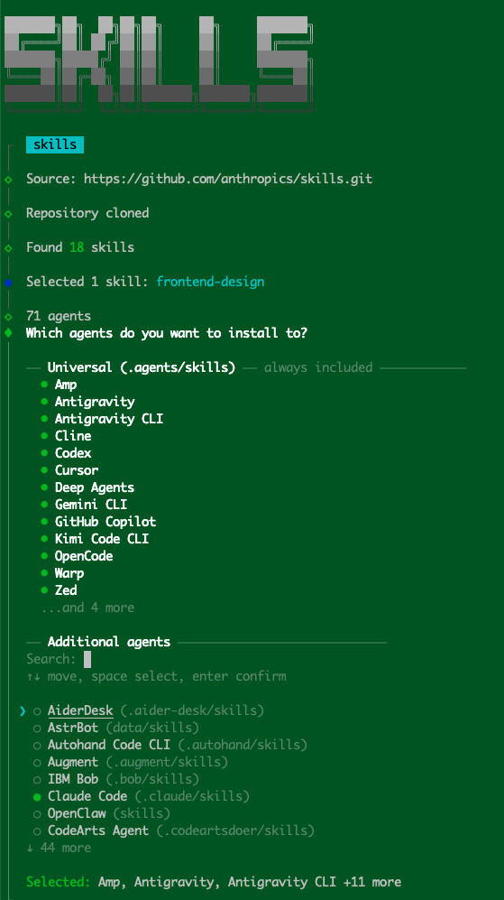
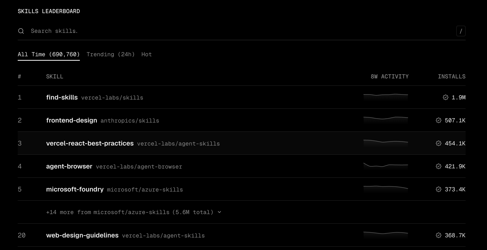

# Agent Skills

什么是 Agent Skills？按照 [Agent Skills](https://agentskills.io/home) 官网的说法，Agent Skills 是一种标准化的方式，用来给 AI Agent 增加新的能力和专业知识。

简单理解，一个 Skill 就是一份可复用的“操作说明书”。它的作用是把一些重复的工作流程、团队约定、领域知识沉淀下来，让 Agent 在需要的时候按步骤执行，而不是每次都靠临时 Prompt 重新解释。比如写迁移脚本、做代码审查、生成设计稿、排查 CI 问题，都可以做成 Skills。

## Skill 目录结构

Skill 是一个目录，其中至少包含一个 `SKILL.md` 文件。还可以包含 `scripts/`、`references/` 、`assets/` 以及其它资源。

```
skill-name/
├── SKILL.md          # Required: metadata + instructions
├── scripts/          # Optional: executable code
├── references/       # Optional: documentation
├── assets/           # Optional: templates, resources
└── ...               # Any additional files or directories
```

- `SKILL.md`：Skill 的主要内容，每个`SKILL.md` 文件由 YAML frontmatter 元数据和 Markdown 正文组成。
- `scripts/`：包含代理可以运行的可执行代码，可选。
- `references/`：包含代理需要时可查阅的文档。比如技术文档、结构化数据格式、特定领域文件等，可选。
- `assets/`：包含静态资源，比如文档模板、配置模板、图片、数据文件，可选。

在 Skill （`SKILL.md`）中引用这些文件时，使用相对于 skills 根目录的相对路径，比如

```markdown
See [the reference guide](references/REFERENCE.md) for details.

Run the extraction script:
scripts/extract.py
```

当 Agent 使用某个 Skill 时，一开始只加载其 `SKILL.md` 文件。仅在任务需要时，才会加载 `scripts/`、`references/` 、`assets/` 以及其它资源，从而了解 Skill 的更多细节。

## `SKILL.md`

Skill 的主要内容，由 YAML frontmatter 元数据和 Markdown 正文组成，例如

```markdown
---
name: api-conventions
description: API design patterns for this codebase
---

When writing API endpoints:
- Use RESTful naming conventions
- Return consistent error formats
- Include request validation
```

### YAML frontmatter 元数据

`SKILL.md` 顶部的 YAML frontmatter 用来描述这个 Skill 是什么、什么时候该用，以及它需要什么运行条件。根据 [Agent Skills Specification](https://agentskills.io/specification#frontmatter)，通用规范主要包含下面这些字段。其中 `name` 和 `description` 是必须的，而且 `name` 必须和父目录名称一致。

| 字段 | 必填 | 说明 |
| --- | --- | --- |
| `name` | 是 | Skill 的名称，必须和父目录名称一致。只能使用小写字母、数字和连字符，不能以连字符开头或结尾。 |
| `description` | 是 | 描述这个 Skill 做什么，以及什么时候应该使用它。Agent 主要依靠这个字段判断是否要加载 Skill。 |
| `license` | 否 | Skill 的许可证信息，可以写许可证名称，也可以指向 Skill 中附带的许可证文件。 |
| `compatibility` | 否 | 说明环境要求，比如适用于哪个 Agent、是否需要某些系统命令、网络访问或特定运行时。 |
| `metadata` | 否 | 自定义元数据，通常是 key-value 结构，比如作者、版本、所属团队等。 |
| `allowed-tools` | 否 | 预先允许 Skill 使用的工具列表，属于实验性字段，不同 Agent 的支持程度可能不一样。 |

Claude Code 也遵循 Agent Skills 的通用规范，但它在此基础上扩展了更多字段，用来控制调用方式、参数、模型、工具权限和运行上下文。根据 [Claude Code Skills](https://code.claude.com/docs/en/skills#frontmatter-reference)，常见字段如下：

| 字段 | 必填 | 说明 |
| --- | --- | --- |
| `name` | 否 | Skill 的显示名称。Claude Code 中命令名称通常来自目录名，而不是这个字段。 |
| `description` | 推荐 | 描述 Skill 做什么、什么时候用。Claude 会用它判断是否自动加载这个 Skill。 |
| `when_to_use` | 否 | 对触发条件的补充说明，比如适用场景、关键词或示例请求。 |
| `argument-hint` | 否 | 在自动补全里展示参数提示，比如 `[issue-number]` 或 `[filename] [format]`。 |
| `arguments` | 否 | 定义位置参数名称，方便在正文里用 `$name` 这类变量引用参数。 |
| `disable-model-invocation` | 否 | 设置为 `true` 后，Claude 不会自动调用这个 Skill，只能由用户手动输入 `/skill-name` 触发。 |
| `user-invocable` | 否 | 设置为 `false` 后，这个 Skill 不会出现在 `/` 菜单里，适合只给 Claude 自动使用的背景知识。 |
| `allowed-tools` | 否 | Skill 激活时允许 Claude 使用的工具列表。 |
| `disallowed-tools` | 否 | Skill 激活时禁止 Claude 使用的工具列表。 |
| `model` | 否 | 指定这个 Skill 激活时使用的模型。 |
| `effort` | 否 | 指定这个 Skill 激活时的思考强度，比如 `low`、`medium`、`high` 等。 |
| `context` | 否 | 设置为 `fork` 时，Skill 会在一个独立的 subagent 上下文中运行。 |
| `agent` | 否 | 当 `context: fork` 时，指定使用哪个 subagent 类型。 |
| `hooks` | 否 | 给 Skill 生命周期配置 hooks。 |
| `paths` | 否 | 用 glob 限制 Skill 只在处理特定文件时自动触发。 |
| `shell` | 否 | 指定 Skill 中动态 shell 注入使用的 shell，比如 `bash` 或 `powershell`。 |

这些 Claude Code 扩展字段很实用，但并不是所有 Agent 都会识别。比如 OpenCode 明确说明未知 frontmatter 会被忽略，Codex 则把一部分产品配置放到 `agents/openai.yaml` 中。因此，如果是通用 Skill，建议把核心能力写在 Markdown 正文里，把产品特定能力作为增强项使用。

#### 优化 Skill 描述

`description` 是 Skill 最重要的元数据之一。因为 Agent 在启动时通常不会立刻读取完整的 `SKILL.md`，而是先读取每个 Skill 的 `name` 和 `description`，用它们判断当前任务是否需要加载这个 Skill。

所以一个好的 `description` 不是简单介绍“这个 Skill 是什么”，而是要帮助 Agent 判断“什么时候该用它”。如果写得太模糊，Skill 可能不会在该触发的时候触发；如果写得太宽泛，又可能在不相关的任务里误触发。

优化 Skill 描述时，可以重点关注这几点：

- **写成触发条件**：比起 `Process CSV files`，更推荐写成 `Use this skill when the user wants to analyze, clean, transform, or visualize CSV, TSV, or Excel data files.`。也就是告诉 Agent 在什么场景下应该使用它。
- **关注用户意图，而不是实现细节**：描述用户想要达成的目标，而非 skills 的内部机制。Agent 应与用户的需求进行匹配。
- **覆盖显式和隐式表达**：有些用户会直接说“分析 CSV”，有些只会说“老板让我从这个数据文件里做个报表”。描述里可以适当覆盖这些不直接点名领域的情况。
- **边界要清楚**：如果 Skill 只负责数据分析，就不要写成“处理所有表格文件”。否则像“修改 Excel 公式”、“把 CSV 导入数据库”这种相邻但不同的任务也可能误触发。
- **保持简洁**：通用规范里 `description` 最多 1024 个字符。实际写作时，一小段通常就够了，太长会占用所有 Skill 的发现阶段上下文。

一个简单的优化前后对比：

```yaml
# Before
description: Process CSV files.

# After
description: >
  Use this skill when the user wants to analyze, clean, transform,
  summarize, or visualize CSV, TSV, or Excel data files, even if they
  describe the task as making a chart, report, or spreadsheet summary
  instead of explicitly mentioning data analysis.
```

更多详情，请参考 [Agent Skills - Optimizing skill descriptions](https://agentskills.io/skill-creation/optimizing-descriptions)

### Markdown 正文

Markdown 正文格式没有限制。只需编写有助于 Agent 有效完成任务的内容即可。

不过“没有限制”不代表随便写。Skill 正文的目标不是写给人看的完整教程，而是写给 Agent 执行的任务说明。它应该尽量清楚、具体、可操作。

[Agent Skills](https://agentskills.io/skill-creation/optimizing-descriptions) 给出了一些建议：

- **先说明目标**：开头用几句话说明这个 Skill 要帮助 Agent 完成什么任务，最终产出是什么。比如是生成报告、审查代码、执行部署，还是按照某套规范修改文件。
- **给出明确步骤**：如果任务有固定流程，尽量写成步骤，而不是大段描述。Agent 更容易按 `1. 2. 3.` 的顺序执行，也更不容易漏掉关键检查。
- **写清输入和输出**：告诉 Agent 需要从哪里获取信息、最终应该返回什么格式。比如“先读取 PR diff，再输出风险列表和测试建议”，比“帮我 review 一下代码”更稳定。
- **补充边界和例外情况**：如果某些场景不要做、需要先询问用户、或者遇到失败要停止，都应该写清楚。比如部署类 Skill 可以明确要求测试失败时不要继续发布。
- **给示例**：对于格式要求强的任务，可以放一两个输入输出示例。示例通常比抽象规则更容易让 Agent 复现你想要的结果。
- **保持正文聚焦**：`SKILL.md` 被激活后会进入上下文，正文太长会持续占用 token。主文件里最好只放流程和关键判断，详细文档、模板、长示例可以拆到 `references/` 或 `assets/` 里，再在正文中引用。

比如一个代码审查 Skill 的正文可以写成这样：

```markdown
## Goal

Review the current code changes and identify correctness risks, regressions,
security issues, and missing tests.

## Steps

1. Inspect the changed files and understand the intent of the change.
2. Focus on behavior, edge cases, and user-facing regressions.
3. Ignore purely stylistic issues unless they hide a real bug.
4. Return findings first, ordered by severity.

## Output

- If there are issues, list each finding with file reference and reason.
- If no issues are found, say so clearly and mention any remaining test gaps.
```

这样的正文比“帮我做代码审查”更有效，因为它把目标、执行重点和输出格式都固定下来了。Agent 仍然有推理空间，但不会每次都重新猜你的工作流。

更多详情，请参考 [Agent Skills - Best practices for skill creators](https://agentskills.io/skill-creation/optimizing-descriptions)

## 工作流程

Skills 的一个关键点是“按需加载”。Agent 一开始只需要知道有哪些 Skills、它们大概适合什么任务；当用户的请求匹配某个 Skill 时，Agent 再读取完整说明并执行。这样既能扩展能力，又不会一开始就把所有上下文都塞进模型里。

Agent 通过以下三个阶段，逐步加载 SKills

1. **Discovery**: 启动时，Agent 仅加载每项可用 Skill 的名称和描述，仅够了解其是否可能相关。
2. **Activation**: 当任务与 Skill 的描述相匹配时，Agent 会将完整的 `SKILL.md` 指令读入上下文。
3. **Execution**: 代理会按照 `SKILL.md` 指令执行，必要时可运行脚本或加载引用的文件。

只有在任务需要时才会加载完整的指令，因此 Agent 只需占用少量上下文信息即可掌握多种 Skills。

## 安装 Skills

每个 AI agent 都需要将 Skills 安装到他们约定的文件夹下，才可以正常使。而他们约定的目录又各不相同。因此安装 Skills 最后的方式是使用 [`skills.sh`](https://skills.sh/)。

```sh
$ npx skills add https://github.com/anthropics/skills --skill frontend-design
```



从上面这个图，我们可以看到，[`skills.sh`](https://skills.sh/) 将 skills 安装在 `~/.agents/skills` 或者 `project_dir/.agents/skills` 里。

目前有  Codex、Cursor、Gemini CLI、OpenCode 等 17 AI agents 支持这种方式。

另外还有 52 个 AI agents（比如 Claude Code、OpenClaw、Windsurf、Trae 等）不支持这种方式，需要安装到他们约定的文件夹下。可以挑选是否为这些额外的 AI agents 安装 Skills.

> 这里列出了支持的所有的 AI agents - [Supported Agents](https://github.com/vercel-labs/skills#supported-agents)

选择之后（比如选择了 Claude Code），[`skills.sh`](https://skills.sh/) 会将 Skill 安装到 `~/.agents/skills` 以及  `~/.claude/skills` 或者 `project_dir/.agents/skills` 以及 `project_dir/.claude/skills` 里。


下面列举了一些常用 Agent 安装 Skills 的约定文件夹

| Agents      | 用户级目录                   | 项目级目录          |
| ----------- | ---------------------------- | ------------------- |
| Claude Code | `~/.claude/skills/`          | `.claude/skills/`   |
| CodeX       | `~/.codex/skills/`           | `.codex/skills/`    |
| Cursor      | `~/.cursor/skills/`          | `.cursor/skills/`   |
| OpenCode    | `~/.config/opencode/skills/` | `.opencode/skills/` |
| Trae        | `~/.trae/skills/`            | `.trae/skills/`     |
| Windsurf    | `~/.windsurf/skills/`        | `.windsurf/skills/` |

## 推荐 Skills

 [`skills.sh`](https://skills.sh/) 不仅提供了 CLI 工具，帮助我们下载安装 Skills，而且还能查看与搜索 Skills，并且提供了下载排名。



下面是我常用的一些 Skills。

### Anthropics

[`anthropics/skills`](https://github.com/anthropics/skills) 提供了 Anthropic 为 Claude 实现的 Skills。

#### 安装

```sh
$ npx skills add https://github.com/anthropics/skills --skill skill-name
```

#### Skills 集合

下面是 [`anthropics/skills`](https://github.com/anthropics/skills) 提供的 Skills 集合：

| **name**                | **description**                                       |
| ----------------------- | ----------------------------------------------------- |
| `algorithmic-art`       | 通过算法和代码生成艺术作品、图形和视觉效果。          |
| `brand-guidelines`      | 根据品牌规范生成一致的文案、设计和品牌资产。          |
| `canvas-design`         | 为 Claude Canvas 创建和优化可视化设计与布局。         |
| `claude-api`            | 提供 Claude API 使用指南、SDK 示例和最佳实践。        |
| `doc-coauthoring`       | 辅助多人协作文档写作、编辑和内容整合。                |
| `docx`                  | 创建、编辑和处理 Word（DOCX）文档。                   |
| `frontend-design`       | 设计和实现高质量前端界面、组件和 Web 应用 UI。        |
| `internal-comms`        | 编写企业内部沟通内容，如公告、邮件和团队更新。        |
| `mcp-builder`           | 创建和配置 MCP（Model Context Protocol）Server。      |
| `pdf`                   | 创建、编辑、解析和处理 PDF 文件。                     |
| `pptx`                  | 创建和编辑 PowerPoint 演示文稿。                      |
| `skill-creator`         | 帮助用户设计和生成新的 Skill。                        |
| `slack-gif-creator`     | 为 Slack 等协作工具生成 GIF 动图内容。                |
| `theme-factory`         | 创建和管理设计主题、配色方案和视觉风格系统。          |
| `web-artifacts-builder` | 生成 Web Artifact（HTML、CSS、JS 等可运行网页产物）。 |
| `webapp-testing`        | 自动化测试 Web 应用，包括功能测试和交互验证。         |
| `xlsx`                  | 创建、编辑和处理 Excel（XLSX）电子表格。              |

对于我们前端工程师，下面这些 Skills 我认为最值得研究：

| **优先级** | **Skill**               | **价值**                    |
| ---------- | ----------------------- | --------------------------- |
| ⭐⭐⭐⭐⭐      | `frontend-design`       | UI 设计与前端实现提示词工程 |
| ⭐⭐⭐⭐⭐      | `mcp-builder`           | 学习如何自动生成 MCP Server |
| ⭐⭐⭐⭐       | `web-artifacts-builder` | 生成独立运行的 Web 页面     |
| ⭐⭐⭐⭐       | `webapp-testing`        | 自动化测试 Web 应用         |
| ⭐⭐⭐⭐       | `skill-creator`         | 学习 Skill 的设计模式       |
| ⭐⭐⭐        | `theme-factory`         | 设计系统与主题生成          |

### Vercel-labs

[`vercel-labs/agent-skills`](https://github.com/vercel-labs/agent-skills) 提供了 AI 智能编程的 Skills 集合。

#### 安装

```sh
$ npx skills add https://github.com/vercel-labs/agent-skills --skill skill-name
```

#### Skills 集合

下面是 [`vercel-labs/agent-skills`](https://github.com/vercel-labs/agent-skills) 提供的 Skills 集合

| **name**                 | **description**                                              |
| ------------------------ | ------------------------------------------------------------ |
| `composition-patterns`   | 介绍 Agent、AI Workflow 和 Prompt 的组合模式，帮助构建复杂多步骤 AI 应用。 |
| `deploy-to-vercel`       | 指导 Agent 将项目部署到 Vercel，包括项目配置、构建和发布流程。 |
| `react-best-practices`   | React 开发最佳实践，包括组件设计、状态管理、性能优化、代码组织等。 |
| `react-native-skills`    | React Native 开发指南，涵盖移动应用开发、组件使用、平台适配和性能优化。 |
| `react-view-transitions` | 使用 React 和 View Transitions API 实现页面切换动画与流畅导航体验。 |
| `vercel-cli-with-tokens` | 使用 Vercel CLI 和 Access Token 自动化部署、CI/CD 集成及项目管理。 |
| `vercel-optimize`        | Vercel 平台性能优化指南，包括页面加载、图片优化、缓存策略和 Edge Runtime。 |
| `web-design-guidelines`  | Web 设计规范与 UI/UX 指南，包括布局、视觉层次、可访问性、响应式设计等。 |
| `writing-guidelines`     | AI 内容生成和技术写作规范，包括文案风格、结构组织、可读性和一致性要求。 |

### Superpowers

[`obra/superpowers`](https://github.com/obra/superpowers) 是一种完整的软件开发方法论，专为您的编码 Agent 而设计，基于一组可组合的 Skills 和一些初始指令构建，确保Agent 能够正确使用这些功能。

#### 安装

因为 Superpowers 不仅有 Skills，还有 SubAgent、Commands、Hooks 等，推荐通过插件的方式安装，比如 Cursor 的安装方式：

1. 打开 Cursor 设置页面，选择 “Plugins”
2. 在插件市场搜索 “superpowers”
3. 点击安装

其它 Agents 的安装方式，请参考 [`obra/superpowers`](https://github.com/obra/superpowers) 

如果 Superpowers 没有提供对应 Agents 的插件，也可以使用  [`skills.sh`](https://skills.sh/) 安装它的 Skills

```sh
$ npx skills add https://github.com/obra/superpowers --skill skill-name
```

#### Skills 集合

下面是 [`obra/superpowers`](https://github.com/obra/superpowers) 提供的 Skills 集合

| **name**                         | **description**                                              |
| -------------------------------- | ------------------------------------------------------------ |
| `brainstorming`                  | 在编写代码前进行需求澄清和设计讨论，通过提问和方案比较将模糊想法转化为明确设计。 |
| `systematic-debugging`           | 系统化调试流程，强调根因分析（Root Cause Analysis），避免“猜测式修复”。 |
| `verification-before-completion` | 在宣布任务完成前进行验证，确保问题真正解决而非表面修复。     |
| `writing-plans`                  | 将设计或需求拆解成详细实现计划，包含任务、文件路径、验证步骤和验收标准。 |
| `executing-plans`                | 按既定计划执行开发任务，支持阶段性检查点和批量执行。         |
| `dispatching-parallel-agents`    | 将独立任务分发给多个子 Agent 并行处理，提高开发效率。        |
| `subagent-driven-development`    | 基于子 Agent 的开发流程，每个任务由独立 Agent 执行并经过多阶段审查。 |
| `test-driven-development`        | 严格执行 TDD 开发模式，先写失败测试再实现功能。              |
| `requesting-code-review`         | 提交代码审查前的检查流程，确保代码符合需求和质量标准。       |
| `receiving-code-review`          | 处理 Code Review 反馈的方法论，系统地响应和修复问题。        |
| `using-git-worktrees`            | 使用 Git Worktree 创建隔离开发环境，实现并行开发和安全实验。 |
| `finishing-a-development-branch` | 功能开发完成后的收尾流程，包括测试、合并、PR 创建和分支清理。 |
| `writing-skills`                 | 编写新的 Superpowers Skill，遵循统一结构、测试方法和最佳实践。 |
| `using-superpowers`              | Superpowers 的核心引导 Skill，负责判断何时加载和执行其他 Skill。 |

#### 工作流程

1. **brainstorming** - 在编写代码之前启动。通过提问完善初步想法，探索各种方案，分段展示设计以供验证。保存设计文档。
2. **using-git-worktrees** - 设计方案获批后激活。在新分支上创建隔离工作区，运行项目设置，验证测试基线是否干净。
3. **writing-plans** - 根据已批准的设计方案启动。将工作分解成易于处理的小任务（每个任务耗时 2-5 分钟）。每个任务都包含精确的文件路径、完整的代码和验证步骤。
4. **subagent-driven-development** or **executing-plans** - 根据计划激活。为每个任务派遣新的子代理，并进行两阶段审查（先检查规范符合性，再检查代码质量），或者分批执行，并设置人工检查点。
5. **test-driven-development** - 在实现阶段激活。强制执行红绿重构流程：编写失败的测试，观察其失败，编写最小代码，观察其通过，然后提交。删除测试之前编写的代码。
6. **requesting-code-review** - 在任务间隙激活。根据计划进行审查，并按严重程度报告问题。严重问题会阻碍进度。
7. **finishing-a-development-branch** - 当任务完成后激活。验证测试，提供选项（合并/PR/保留/丢弃），清理工作树。

### `ui-ux-pro-max-skill`

[`nextlevelbuilder/ui-ux-pro-max-skill`](https://github.com/nextlevelbuilder/ui-ux-pro-max-skill) 为构建专业的 UI/UX 设计提供智能支持

#### 安装

```sh
# 安装 uipro-cli
$ npm install -g uipro-cli

# 项目安装
$ cd /path/to/your/project

$ uipro init --ai claude      # Claude Code
$ uipro init --ai cursor      # Cursor
$ uipro init --ai codex       # Codex CLI
$ uipro init --ai windsurf    # Windsurf
$ uipro init --ai opencode    # OpenCode
$ uipro init --ai trae        # Trae

# skills.sh 安装
$ npx skills add https://github.com/nextlevelbuilder/ui-ux-pro-max-skill --skill ui-ux-pro-max
```

> 📢 [`nextlevelbuilder/ui-ux-pro-max-skill`](https://github.com/nextlevelbuilder/ui-ux-pro-max-skill#global-install-available-for-all-projects) 文档里写了，使用 `--global` 进行全局安装，但是我在使用时却报错：
>
> error: unknown option '--global' 
>
> 应该是这种方式被废除了，而文档没有更新

#### 工作流程

1. **提出任务** - 提出任何 UI/UX 任务（构建、设计、创建、实现、审查、修复、改进）
2. **设计系统已生成** - AI 使用推理引擎自动生成完整的设计系统
3. **智能推荐** - 根据您的产品类型和要求，找到最匹配的样式、颜色和字体
4. **代码生成** - 使用正确的颜色、字体、间距和最佳实践来实现用户界面
5. **交付前检查** - 验证是否存在常见的 UI/UX 反模式

### `seo-geo-claude-skills`

[`aaron-he-zhu/seo-geo-claude-skills`](https://github.com/aaron-he-zhu/seo-geo-claude-skills) 为 Claude Code、Cursor、Codex 等 AI 代理提供 20 项 SEO 和 GEO 技能。包括关键词研究、内容写作、技术审核和排名跟踪。

| Phase         | Skills                                                       |
| ------------- | ------------------------------------------------------------ |
| Research      | [`keyword-research`](https://github.com/aaron-he-zhu/seo-geo-claude-skills/blob/main/research/keyword-research/SKILL.md), [`competitor-analysis`](https://github.com/aaron-he-zhu/seo-geo-claude-skills/blob/main/research/competitor-analysis/SKILL.md), [`serp-analysis`](https://github.com/aaron-he-zhu/seo-geo-claude-skills/blob/main/research/serp-analysis/SKILL.md), [`content-gap-analysis`](https://github.com/aaron-he-zhu/seo-geo-claude-skills/blob/main/research/content-gap-analysis/SKILL.md) |
| Build         | [`seo-content-writer`](https://github.com/aaron-he-zhu/seo-geo-claude-skills/blob/main/build/seo-content-writer/SKILL.md), [`geo-content-optimizer`](https://github.com/aaron-he-zhu/seo-geo-claude-skills/blob/main/build/geo-content-optimizer/SKILL.md), [`meta-tags-optimizer`](https://github.com/aaron-he-zhu/seo-geo-claude-skills/blob/main/build/meta-tags-optimizer/SKILL.md), [`schema-markup-generator`](https://github.com/aaron-he-zhu/seo-geo-claude-skills/blob/main/build/schema-markup-generator/SKILL.md) |
| Optimize      | [`on-page-seo-auditor`](https://github.com/aaron-he-zhu/seo-geo-claude-skills/blob/main/optimize/on-page-seo-auditor/SKILL.md), [`technical-seo-checker`](https://github.com/aaron-he-zhu/seo-geo-claude-skills/blob/main/optimize/technical-seo-checker/SKILL.md), [`internal-linking-optimizer`](https://github.com/aaron-he-zhu/seo-geo-claude-skills/blob/main/optimize/internal-linking-optimizer/SKILL.md), [`content-refresher`](https://github.com/aaron-he-zhu/seo-geo-claude-skills/blob/main/optimize/content-refresher/SKILL.md) |
| Monitor       | [`rank-tracker`](https://github.com/aaron-he-zhu/seo-geo-claude-skills/blob/main/monitor/rank-tracker/SKILL.md), [backlink-analyzer](https://github.com/aaron-he-zhu/seo-geo-claude-skills/blob/main/monitor/backlink-analyzer/SKILL.md), [`performance-reporter`](https://github.com/aaron-he-zhu/seo-geo-claude-skills/blob/main/monitor/performance-reporter/SKILL.md), [`alert-manager`](https://github.com/aaron-he-zhu/seo-geo-claude-skills/blob/main/monitor/alert-manager/SKILL.md) |
| Cross-cutting | [`content-quality-auditor`](https://github.com/aaron-he-zhu/seo-geo-claude-skills/blob/main/cross-cutting/content-quality-auditor/SKILL.md), [`domain-authority-auditor`](https://github.com/aaron-he-zhu/seo-geo-claude-skills/blob/main/cross-cutting/domain-authority-auditor/SKILL.md), [`entity-optimizer`](https://github.com/aaron-he-zhu/seo-geo-claude-skills/blob/main/cross-cutting/entity-optimizer/SKILL.md), [`memory-management`](https://github.com/aaron-he-zhu/seo-geo-claude-skills/blob/main/cross-cutting/memory-management/SKILL.md) |

## References

- [Agent Skills](https://agentskills.io/home)
- [Claude Code Docs - Skills](https://code.claude.com/docs/en/skills)
- [Claude Skills](https://claude.com/skills)
- [A complete guide to building skills for Claude](https://claude.com/blog/complete-guide-to-building-skills-for-claude)
- [Skills explained: How Skills compares to prompts, Projects, MCP, and subagents](https://claude.com/blog/skills-explained)
- [How to create Skills: Key steps, limitations, and examples](https://claude.com/blog/how-to-create-skills-key-steps-limitations-and-examples)
- [skills.sh](https://skills.sh/)
- [`vercel-labs/skills`](https://github.com/vercel-labs/skills)
- [`anthropics/skills`](https://github.com/anthropics/skills)
- [`vercel-labs/agent-skills`](https://github.com/vercel-labs/agent-skills)
- [`vercel-labs/next-skills`](https://github.com/vercel-labs/next-skills)
- [`vercel-labs/agent-browser`](https://github.com/vercel-labs/agent-browser)
- [`obra/superpowers`](https://github.com/obra/superpowers)
- [`nextlevelbuilder/ui-ux-pro-max-skill`](https://github.com/nextlevelbuilder/ui-ux-pro-max-skill)
- [`OthmanAdi/planning-with-files`](https://github.com/OthmanAdi/planning-with-files)
- [`affaan-m/ECC`](https://github.com/affaan-m/ECC)
- [`aaron-he-zhu/seo-geo-claude-skills`](https://github.com/aaron-he-zhu/seo-geo-claude-skills)
- [`remotion-dev/skills`](https://github.com/remotion-dev/skills)
- [`addyosmani/agent-skills`](https://github.com/addyosmani/agent-skills)
- [`figma/mcp-server-guide`](https://github.com/figma/mcp-server-guide)


