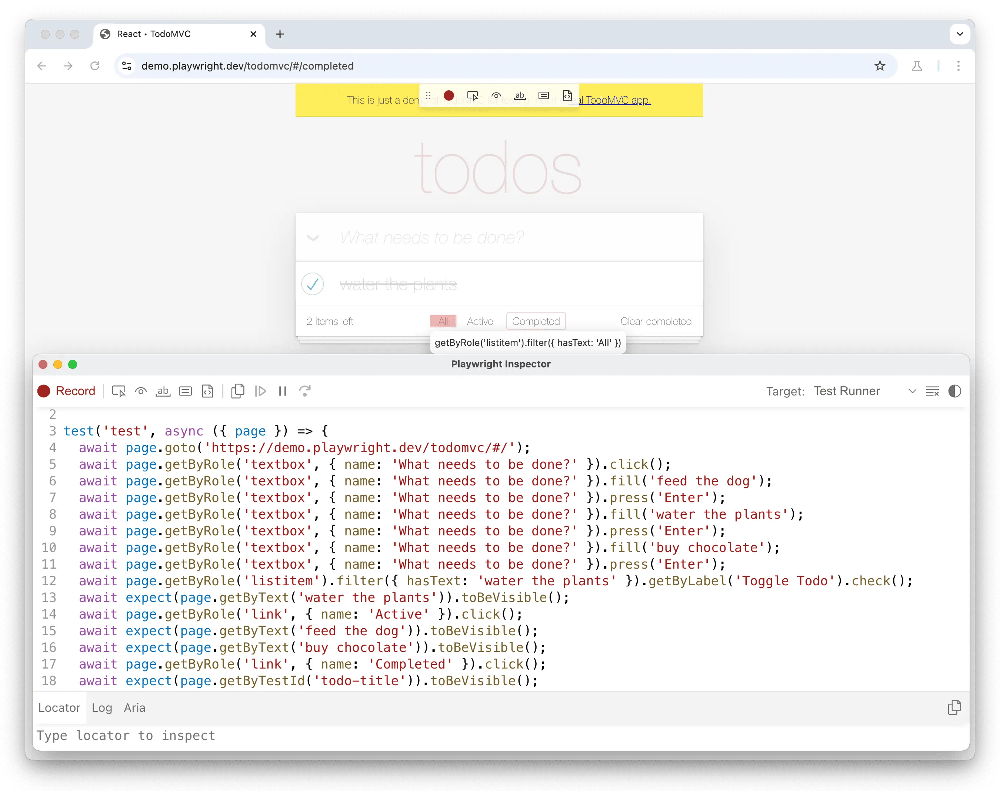

# Playwright 端到端测试

Playwright 是一个面向现代 Web 应用的端到端测试框架。它集成了测试运行器、断言、隔离、并行化和丰富的工具。Playwright 支持 Windows、Linux 和 macOS 上的 Chromium、WebKit 和 Firefox 内核浏览器，支持本地测试和持续集成 (CI) 测试。

## 安装

```sh
$ cd project-dir
$ npm init playwright@latest
```

它会询问四个问题：

- Do you want to use TypeScript or JavaScript?
  TypeScript 还是 JavaScript，默认值：`TypeScript`

- Where to put your end-to-end tests?
  测试文件夹名称，默认值： `tests` ，如果 `tests` 已存在，则默认值为 `e2e`

- Add a GitHub Actions workflow? 

  是否添加 GitHub Actions 工作流？默认值： `是` 

- Install Playwright browsers (can be done manually via 'npx playwright install')? 
  是否安装 Playwright 浏览器，默认值： `是` 

如果同意安装 Playwright browsers，则 Playwright 开始下载并安装浏览器（Firefox、WebKit、Chromium），文件存放在 `~/Library/Caches/ms-playwright` 目录下

然后在目录根目录下创建：

```
playwright.config.ts
tests/
  example.spec.ts
```

- `playwright.config.ts`  是 Playwright 的配置文件，配置目标浏览器、超时、重试次数、项目、报告器等。
- `tests/example.spec.ts` 是一个最小的测试样例。

如果同意添加 GitHub Actions 工作流，还会在根目录下创建 `.github` 文件夹，里面是 GitHub Actions 工作流相关的配置。

### VS Code 插件

我们还可以安装 [VS Code 扩展](https://marketplace.visualstudio.com/items?itemName=ms-playwright.playwright)，创建和运行测试。

### 更新

Playwright 每次发布新版本都会更新其支持的浏览器版本，以确保最新版本始终支持最新的浏览器。

这意味着每次更新 Playwright 后，都需要重新安装新的浏览器。

```sh
# 更新 Playwright
$ npm install -D @playwright/test@latest

# 下载新的浏览器和依赖项
$ npx playwright install --with-deps

# 查看最新版本
$ npx playwright --version

# 列出 playwright 安装的所有浏览器
$ npx playwright install --list

# 卸载 playwright 安装的浏览器
$ npx playwright uninstall
```

## CLI 常用命令

```sh
# Runs the end-to-end tests.
$ npx playwright test

# Starts the interactive UI mode.
$ npx playwright test --ui

# Runs the tests only on Desktop Chrome.
$ npx playwright test --project=chromium

# Runs the tests in a specific file.
$ npx playwright test example

# Run tests at a specific line
$ npx playwright test my-spec.ts:42

# Run tests by title
$ npx playwright test -g "add a todo item"

# Runs the tests in debug mode.
$ npx playwright test --debug
 
# Auto generate tests with Codegen.
$ npx playwright codegen

# Open HTML Test Reports
$ npx playwright show-report
```

## 写测试

Playwright 测试与 [Jest](https://jestjs.io/)、[Vitest](https://vitest.dev/)、[Testing Library](https://testing-library.com/) 一样，执行动作，判断结果与预期是否相符。

但是 Playwright 的优点是会自动等待[可操作性](https://playwright.dev/docs/actionability)检查通过后再执行每个操作，我们不需要手动添加等待或处理竞态条件。

下面是 Playwright 生成的测试样例代码

```ts
import { test, expect } from '@playwright/test';

test('has title', async ({ page }) => {
  await page.goto('https://playwright.dev/');

  // Expect a title "to contain" a substring.
  await expect(page).toHaveTitle(/Playwright/);
});

test('get started link', async ({ page }) => {
  await page.goto('https://playwright.dev/');

  // Click the get started link.
  await page.getByRole('link', { name: 'Get started' }).click();

  // Expects page to have a heading with the name of Installation.
  await expect(page.getByRole('heading', { name: 'Installation' })).toBeVisible();
});
```

从这份测试样例代码我们可以看到，主要由两部分组成：[Actions](https://playwright.dev/docs/input) 和 [Assertions](https://playwright.dev/docs/test-assertions)。

- Actions：模拟用户点击动作
- Assertions：表达用户期望的结果

### Actions

Actions 负责模拟真实用户在页面上的操作，比如打开页面、点击按钮、填写表单、上传文件等。Playwright 会在执行每个 Action 前自动完成[可操作性](https://playwright.dev/docs/actionability)检查（元素可见、稳定、可接收事件），因此通常不需要手动 `sleep` 或处理竞态条件。

常见的 Actions 如下：

| 方法 | 说明 |
| --- | --- |
| `page.goto(url)` | 打开指定 URL |
| `locator.click()` | 单击元素，支持双击 `dblclick()`、右键 `click({ button: 'right' })` |
| `locator.hover()` | 鼠标悬停在元素上 |
| `locator.fill(text)` | 填写输入框、文本域或 `contenteditable` 元素 |
| `locator.pressSequentially(text)` | 模拟键盘逐字符输入，适用于有特殊键盘处理的场景 |
| `locator.press(key)` | 按下键盘按键，如 `Enter`、`Control+ArrowRight` |
| `locator.check()` / `locator.uncheck()` | 勾选或取消勾选复选框、单选框 |
| `locator.selectOption(value)` | 在下拉框中选择一项或多项 |
| `locator.setInputFiles(path)` | 为 `<input type="file">` 选择文件 |
| `locator.focus()` | 将焦点移到指定元素 |
| `locator.dragTo(target)` | 将元素拖拽到目标位置 |
| `locator.scrollIntoViewIfNeeded()` | 将元素滚动到可视区域 |

下面是一个综合示例：

```ts
await page.goto('https://example.com/login');
await page.getByLabel('用户名').fill('admin');
await page.getByLabel('密码').fill('secret');
await page.getByRole('button', { name: '登录' }).click();
```

更多详情，请参考 [Playwright - Actions](https://playwright.dev/docs/input)。

### Assertions

Assertions 用来验证页面状态是否符合预期。Playwright 通过 `expect` 函数提供断言能力，其中面向 Web 的异步断言会自动重试，直到条件满足或超时（默认 5 秒），从而有效减少因页面异步渲染导致的测试不稳定。

常见的 Assertions 如下：

| 断言 | 说明 |
| --- | --- |
| `await expect(locator).toBeVisible()` | 元素可见 |
| `await expect(locator).toBeHidden()` | 元素不可见 |
| `await expect(locator).toHaveText(text)` | 元素文本完全匹配 |
| `await expect(locator).toContainText(text)` | 元素文本包含指定内容 |
| `await expect(locator).toHaveValue(value)` | 输入框的值匹配 |
| `await expect(locator).toBeChecked()` | 复选框或单选框已勾选 |
| `await expect(locator).toBeEnabled()` / `toBeDisabled()` | 元素可用 / 不可用 |
| `await expect(locator).toHaveCount(n)` | 匹配到的元素数量 |
| `await expect(locator).toHaveAttribute(name, value)` | 元素具有指定属性 |
| `await expect(page).toHaveTitle(title)` | 页面标题匹配 |
| `await expect(page).toHaveURL(url)` | 页面 URL 匹配 |

断言也支持取反和软断言：在 matcher 前加 `.not` 可验证相反条件；使用 `expect.soft()` 时，断言失败不会立即终止测试，而是继续执行并在最后标记测试失败。

```ts
await expect(page.getByRole('heading', { name: '欢迎' })).toBeVisible();
await expect(page).toHaveURL(/dashboard/);
await expect(page.getByLabel('记住我')).toBeChecked();
```

更多详情，请参考 [Playwright - Assertions](https://playwright.dev/docs/test-assertions)。

### Codegen

写 Playwright 测试文件是比较麻烦的，难点往往不在于 Actions 或 Assertions 的语法，而在于如何准确定位页面上的交互元素（locator）。一个按钮可能有多种选择方式：`getByRole`、`getByText`、`getByTestId`……选错了就会导致测试不稳定甚至直接失败。

为此，Playwright 提供了 **Codegen**（测试生成器）功能，可以录制测试：打开浏览器，像真实用户一样操作页面，Playwright 会同步生成对应的测试代码。它还会分析页面结构，优先推荐 role、text、test id 等更稳定的 locator，如果匹配到多个元素，会自动优化 locator 使其唯一目标元素。

**操作流程**

1. **启动 Codegen**。在终端运行以下命令，`url` 参数可选，也可以启动后在浏览器地址栏手动输入：

```sh
$ npx playwright codegen https://playwright.dev
```

命令会打开两个窗口：**浏览器窗口**（用于操作页面）和 **Playwright Inspector**（显示实时生成的代码）。

2. **录制操作**。在浏览器中执行点击、填写、导航等操作，Inspector 会同步生成对应的 Actions 代码。

3. **录制断言**。点击 Inspector 工具栏中的断言图标，再点击页面元素，可生成以下断言：
   - `assert visibility`：断言元素可见
   - `assert text`：断言元素包含指定文本
   - `assert value`：断言输入框具有指定值

4. **复制代码**。操作完成后，点击 Inspector 中的 **Record** 按钮停止录制，再点击 **Copy** 将生成的代码粘贴到测试文件中。

5. **生成 Locator**（可选）。停止录制后，点击 **Pick Locator**，在页面上悬停或点击元素，即可获取并复制对应的 locator 代码。



如果安装了 [VS Code 扩展](https://marketplace.visualstudio.com/items?itemName=ms-playwright.playwright)，也可以直接在 Testing 侧边栏点击 **Record new** 录制测试，体验与 CLI 类似。

更多详情，请参考 [Playwright - Test generator](https://playwright.dev/docs/codegen)。

## 执行测试

写好测试文件之后，运行 `npx playwright test` 进行测试

```sh
$ npx playwright test
```

还可以启动 UI 界面，进行交互式测试

```sh
$ npx playwright test --ui
```

查看测试报告

```sh
$ npx playwright show-report
```

调试测试

```sh
$ npx playwright test --debug
```

## Test Agents

如果觉得 Codegen 还不够智能，可以使用 Playwright 新推出的智能体 Test Agents：**planner**、**generator**、**healer**。

- **planner**：探索应用程序，生成了一个 Markdown 测试计划
- **generator**：将 Markdown 计划转换为 Playwright 测试文件
- **healer**：执行测试套件并自动修复失败的测试

### 安装

Playwright Test Agents 目前提供 3 个 AI Agents 快速安装

```sh
# vscode
$ npx playwright init-agents --loop=vscode

# claude code
$ npx playwright init-agents --loop=claude

# opencode
$ npx playwright init-agents --loop=opencode
```

通过分析它的安装过程，其实也很容易移植到别的 AI Agent，比如下面的命令

```sh
$ npx playwright init-agents --loop=vscode
```

其实是在当前目录下，添加了这些文件

```
Writing file: .github/chatmodes/🎭 generator.chatmode.md
Writing file: .github/chatmodes/🎭 healer.chatmode.md
Writing file: .github/chatmodes/ 🎭 planner.chatmode.md
Writing file: .vscode/mcp.json
Writing file: tests/seed.spec.ts
```

它一共做了下面三件事情：

1. 安装了三个 SubAgent，分别对应 **planner**、**generator**、**healer**
2. 添加 `playwright-test` MCP 服务

```json
{
  "servers": {
    "playwright-test": {
      "type": "stdio",
      "command": "npx",
      "args": [
        "playwright",
        "run-test-mcp-server"
      ]
    }
  },
  "inputs": []
}
```

3. 创建了一个 `tests/seed.spec.ts` 文件，这个文件用于 **planner**，生成测试计划

```ts
import { test, expect } from '@playwright/test';

test.describe('Test group', () => {
  test('seed', async ({ page }) => {
    // generate code here.
  });
});
```

所以很容易移植到别的 AI Agent，比如 Cursor

1. 将 3 个 SubAgents 移动到 `.cursor/agents` 目录下
2. 添加  `playwright-test` MCP 服务到  `.cursor/mcp.json`

然后就可以在 Cursor 里使用 Playwright Test Agents 了

### 使用 Agents

使用 Playwright Test Agents  非常简单

1. 首先使用 **planner** 生成测试计划，它将生成 markdown 文件


2. 使用 **generator** 将 markdown 计划转换为 Playwright 测试文件


3. 使用 **healer** 执行测试套件并自动修复失败的测试


## 测试

### 认证


## References

- [Playwright](https://playwright.dev/)
-  [Jest](https://jestjs.io/)
- [Vitest](https://vitest.dev/)
- [Testing Library](https://testing-library.com/)
- [Chrome Devtools](https://github.com/ChromeDevTools/chrome-devtools-mcp)
- [`vercel-labs/agent-browser`](https://github.com/vercel-labs/agent-browser)

