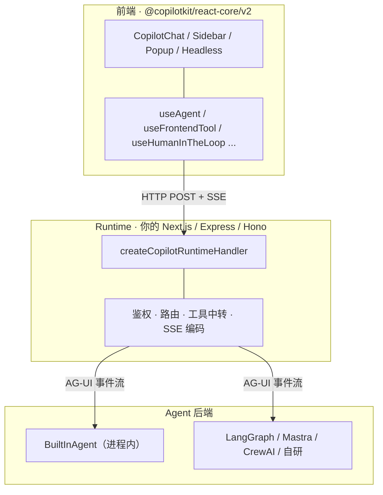
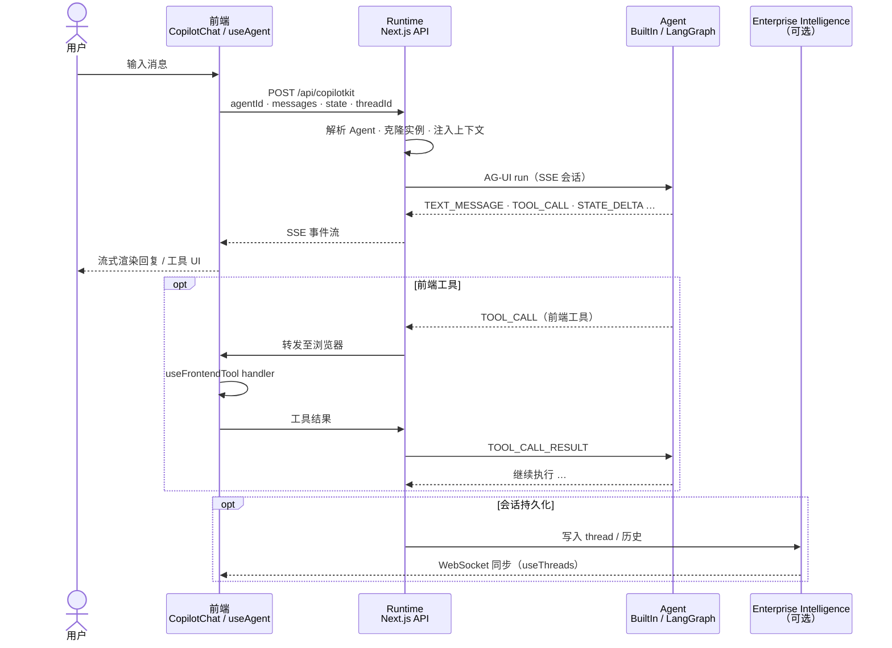
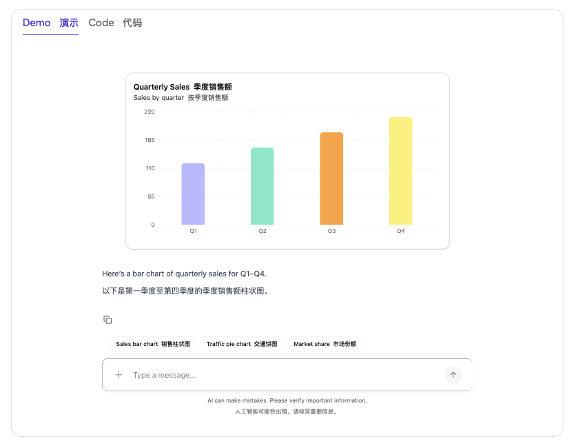
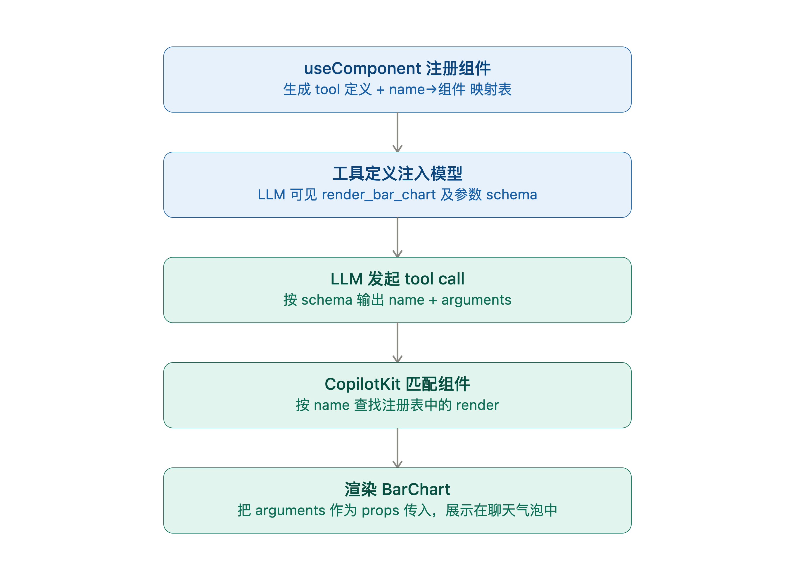

# CopilotKit - The frontend stack for Agent

[CopilotKit](https://docs.copilotkit.ai/) 是面向 Agent 应用的前端栈。它不只是聊天 UI，更关注 Agent 如何接入应用，比如读取页面上下文、调用前端工具、渲染真实 React 组件，以及在需要时暂停等待用户审批。

可以把 CopilotKit 理解成：**把 Agent 接到产品上的一套标准能力**，而不是单纯再包一层 Chat 组件。

核心能力如下：

| 产品能力 | 说明 |
| --- | --- |
| Chat UI | 可嵌入页面、侧边栏、浮窗的对话界面 |
| Generative UI | Agent 调用工具时，在聊天里渲染真实的 React 组件，而不是只吐文本 |
| Shared State | 应用状态与 Agent 状态双向同步 |
| Human-in-the-Loop | Agent 中途停下来，等人审批、选择、填表后再继续 |
| Frontend Tools | Agent 直接调用浏览器里的函数（改 UI、读当前页面、操作本地状态） |
| Headless UI | 不要预置皮肤时，可以定制自己的 UI |
| Any Agent | 后端只要支持 AG-UI，都可以接入 |

## 实现效果


## 架构

CopilotKit 采用三层结构：**Frontend**、**Runtime**、**Agent**，中间用 [AG-UI](https://docs.ag-ui.com/introduction) 事件协议连接。更多详情，请参考 [Architecture](https://docs.copilotkit.ai/ag2/concepts/architecture)。



### 三层职责

**Frontend**

框架原生 SDK，加上预置聊天组件 `CopilotChat` / `CopilotSidebar` / `CopilotPopup`。可以通过插槽的方式修改内部组件，甚至可以完全定制（Headless UI）.

**Runtime**

挂在应用服务器（Next.js、Express、Hono、Bun、Deno、Workers）上的请求处理程序。可以负责鉴权、工具调用转发、AG-UI 数据流等。

**Agent**

任意 AG-UI 兼容后端。可以是内置的 `BuiltInAgent`，也可以是 LangGraph、Mastra、CrewAI、Pydantic AI、Microsoft Agent Framework。它负责跑 prompt、调用工具、发出状态，并把事件流式传回 Runtime。

### 请求过程



一句话概括：用户说话 → 前端 POST 到 Runtime → Runtime 驱动 Agent → 事件经 SSE 流回前端。

如果工具定义在浏览器里，Runtime 会把调用转发到前端，执行完再把结果送回 Agent。

## 手动集成 CopilotKit

### 默认集成

默认集成天然支持 OpenAI、Anthropic、Google Gemini。下面以 Next.js + `BuiltInAgent` 为例，更多详情，请参考 [Quickstart](https://docs.copilotkit.ai/quickstart)。

**前置条件**

- Node.js 20+
- OpenAI API Key（也可换成 Anthropic / Google / [Custom Models](https://docs.copilotkit.ai/model-selection#custom-models-ai-sdk)）
- React 前端（示例用 Next.js）

1. 安装依赖

```sh
$ npm install @copilotkit/react-core @copilotkit/runtime
```

2. 配置环境变量

```sh
# .env
OPENAI_API_KEY=your_openai_api_key
```

3. 创建 Copilot Runtime（API Route）

在 `app/api/copilotkit/route.ts` 里配置 `BuiltInAgent` 和 `CopilotRuntime`。模型用内置字符串即可：

```ts
import {
  CopilotRuntime,
  copilotRuntimeNextJSAppRouterEndpoint,
} from "@copilotkit/runtime";
import { BuiltInAgent } from "@copilotkit/runtime/v2";
import { NextRequest } from "next/server";

const builtInAgent = new BuiltInAgent({
  model: "openai:gpt-5.4-mini",
});

const runtime = new CopilotRuntime({
  agents: { default: builtInAgent },
});

export const POST = async (req: NextRequest) => {
  const { handleRequest } = copilotRuntimeNextJSAppRouterEndpoint({
    runtime,
    endpoint: "/api/copilotkit",
  });

  return handleRequest(req);
};
```

`BuiltInAgent` 底层用的是 Vercel AI SDK，内置 `openai:`、`anthropic:`、`google:` 等模型前缀，更多详情，请参考 [Model Selection](https://docs.copilotkit.ai/model-selection)。

4. 配置 CopilotKit Provider

在 `app/layout.tsx` 里用 `CopilotKit` 包裹应用：

```tsx
import { CopilotKit } from "@copilotkit/react-core/v2";
import "@copilotkit/react-core/v2/styles.css";

export default function RootLayout({ children }: { children: React.ReactNode }) {
  return (
    <html lang="en">
      <body>
        <CopilotKit runtimeUrl="/api/copilotkit">
          {children}
        </CopilotKit>
      </body>
    </html>
  );
}
```

5. 添加聊天界面

```tsx
import { CopilotSidebar } from "@copilotkit/react-core/v2";

export default function Page() {
  return (
    <main>
      <h1>Your App</h1>
      <CopilotSidebar />
    </main>
  );
}
```

6. 启动

```sh
$ npm run dev
```

到这里已经可以对话了。

### 接入其他模型

任何 **OpenAI 兼容 API**，都可以用 `@ai-sdk/openai-compatible` 或 `@ai-sdk/openai` 的 `createOpenAI({ baseURL })` 包一层，再交给 `BuiltInAgent`。下面以千问为例说明怎么接入其他模型。更多详情，请参考 [Model Selection - Custom Models (AI SDK)](https://docs.copilotkit.ai/model-selection#custom-models-ai-sdk)。

1. 安装 AI SDK provider

```sh
$ npm install @ai-sdk/openai-compatible
```

2. 配置千问环境变量

阿里云百炼（DashScope）提供 OpenAI 兼容接口。复制 `.env.example` 为 `.env`：

```sh
# 阿里云百炼：https://bailian.console.aliyun.com/
DASHSCOPE_API_KEY=sk-...
DASHSCOPE_BASE_URL=https://dashscope.aliyuncs.com/compatible-mode/v1
DASHSCOPE_MODEL=qwen-plus
DASHSCOPE_ENABLE_THINKING=true   # 设为 false 可关闭思考链
```

3. 封装模型

```ts
import { createOpenAICompatible } from "@ai-sdk/openai-compatible";

export const QWEN_MODEL_ID = process.env.DASHSCOPE_MODEL;

const dashscope = createOpenAICompatible({
  name: "qwen",
  apiKey: process.env.DASHSCOPE_API_KEY,
  baseURL: process.env.DASHSCOPE_BASE_URL,
  includeUsage: true,
  transformRequestBody: (body) => ({
    ...body,
    enable_thinking: process.env.DASHSCOPE_ENABLE_THINKING !== "false",
    incremental_output: true,
  }),
});

export const qwen = dashscope.chatModel(QWEN_MODEL_ID);
```

4. Runtime 里使用千问

```ts
import {
  BuiltInAgent,
  CopilotRuntime,
  createCopilotRuntimeHandler,
} from "@copilotkit/runtime/v2";
import { qwen } from "@/lib/qwen";

const agent = new BuiltInAgent({
  model: qwen, // 传入 LanguageModel
  maxSteps: 8,
  tools: agentTools,
  prompt: "...",
});

const runtime = new CopilotRuntime({
  agents: {
    default: agent,
  },
});

const handler = createCopilotRuntimeHandler({
  runtime,
  basePath: "/api/copilotkit",
});

export const GET = handler;
export const POST = handler;
export const OPTIONS = handler;
```

## CopilotKit CLI

上面是手动集成：自己装依赖、写 Runtime、配 Provider。如果想从零快速搭一个可跑的示例项目，也可以用官方 CLI：

```sh
$ npx copilotkit@latest create
```

执行后会进入交互式向导，按提示选择项目名称、Agent 框架、前端模板等，生成一套已经接好 CopilotKit 的脚手架。

1. App name

   输入项目名称

2. Select agent framework

   选择智能体框架，Copilotkit 提供了 21 agent framework，供我们选择。

   下面是这 21 个 agent framework 的简单介绍

| 分类                    | 选项                                 | 简介                                                         |
| ----------------------- | ------------------------------------ | ------------------------------------------------------------ |
| **LangGraph 系列**      | 🦜 LangGraph (Python)                 | Python 版 LangGraph，官方文档称功能覆盖最全，HITL、checkpoint 支持最成熟 |
|                         | 🦜 LangGraph (JavaScript)             | TS/JS 版 LangGraph，走 AG-UI adapter，纯前端技术栈可用       |
| **Claude 系**           | 🔆 Claude Agent SDK (TypeScript)      | 基于 Anthropic Claude Agent SDK 的 TS 模板                   |
|                         | 🔆 Claude Agent SDK (Python)          | 同上的 Python 版，官方标注支持生成式 UI、共享状态、HITL、子 agent、流式输出全特性 |
| **其他 Python/TS 框架** | 🌑 Mastra                             | TypeScript 原生 agent 框架，自带 tools/memory/workflow       |
|                         | 🔼 Pydantic AI                        | 基于 Pydantic 的类型化 Python agent 框架                     |
|                         | 🧬 AWS Strands (Python)               | AWS Strands agent，Python 版（不经 AgentCore 部署）          |
| **Google ADK 相关**     | 🤖 ADK                                | Google Agent Development Kit，Gemini 驱动，经 AG-UI 接入     |
|                         | 🔺 Angular + ADK                      | ADK 的 Angular 前端模板（其余大多数模板默认是 React/Next.js） |
| **微软相关**            | 🟦 Microsoft Agent Framework (.NET)   | MS Agent Framework 的 .NET 实现                              |
|                         | 🟦 Microsoft Agent Framework (Python) | MS Agent Framework 的 Python 实现                            |
| **协议/生态**           | 🧩 MCP Apps                           | 基于 Model Context Protocol 的 App 集成模板，可把 MCP 工具服务器接入生成式 UI |
|                         | 🤖 A2A                                | Agent-to-Agent 协议模板，用于多 agent 间互通                 |
| **多 Agent 编排**       | 👥 CrewAI Flows                       | CrewAI 的 Flow（流程编排）模式，比 Crew 更强调确定性步骤控制 |
|                         | 🦙 LlamaIndex                         | LlamaIndex workflow 接入 CopilotKit                          |
|                         | 🧠 Agno                               | 带 tools、state、生成式 UI 示例的轻量 agent 框架             |
|                         | 🤖 AG2                                | 支持 chat、tools、HITL 流程的多 agent 框架（原 AutoGen）     |
| **AWS AgentCore 部署**  | ⛅ AgentCore + LangGraph              | 部署到 AWS Bedrock AgentCore 的 LangGraph 模板，含 CDK 基础设施和一键部署脚本 |
|                         | ⛅ AgentCore + Strands                | 部署到 AWS Bedrock AgentCore 的 Strands 模板，同样含完整部署脚本 |
| **生成式 UI 专用**      | 🎨 A2UI                               | Agent-to-UI 模板，agent 直接描述/驱动 UI 结构，适合动态表单类场景 |
|                         | ✨ Open Generative UI                 | 专为生成式 UI 优化的模板，配套 `useComponent` 等 hook，直接渲染真实 React 组件 |

因为我对 JavaScript 比较熟悉，所以选择 **LangGraph (JavaScript)**

3. CopilotKit account

>  Threads and other Intelligence features need a free license, which is issued to your CopilotKit account.

创建 CopilotKit 账号，如果已经有了账号，需要验证

4. Intelligence project

> Connect this app to one of your existing projects, or create a new one.
> An Intelligence project is where this app's threads, messages, and analytics are stored.

创建或者连接 Intelligence project

5. 选择 Channel，可以先跳过

6. 设置 `OPENAI_API_KEY`，如果暂时没有，也可以先跳过

向导结束后，CLI 会生成项目并安装依赖。进入目录后启动开发服务即可：

```sh
$ cd <your-app-name>
$ npm run dev
```

之后按提示补上 API Key、按需配置 Channel 或 Intelligence，就可以在浏览器里试对话了。

CLI 适合快速摸清整套结构；真正接到自己的业务里，还是要回到前面的手动集成。

## 组件与 Hook

完整 API 见 [References](https://docs.copilotkit.ai/reference)，选型可参考 [Which Hook for Which Job](https://docs.copilotkit.ai/concepts/which-hook)。

### 组件

| 组件 | 功能 |
| --- | --- |
| `CopilotKit` | 应用根 Provider，连接 Runtime，提供 Agent 注册表与全局上下文 |
| `CopilotChat` | 开箱即用的完整聊天界面，自动绑定 Agent、管理消息与运行态 |
| `CopilotSidebar` | 侧栏形态聊天，固定面板 + 开关按钮，适合与主内容并排 |
| `CopilotPopup` | 浮窗形态聊天，右下角唤起，不占主布局 |
| `CopilotThreadsDrawer` | 会话抽屉，列出 / 切换 / 重命名 / 归档 / 删除历史对话 |
| `CopilotChatMessageView` | 消息列表，按角色渲染 assistant / user / reasoning 等 |
| `CopilotChatAssistantMessage` | 单条助手消息：Markdown、工具调用、复制 / 重新生成等操作 |
| `CopilotChatReasoningMessage` | 推理消息组件，用于展示模型 thinking/reasoning 的折叠内容 |
| `CopilotChatUserMessage` | 单条用户消息：附件、编辑、多分支回复切换 |
| `CopilotChatView` | 聊天布局核心：消息区 + 输入区 + 建议 + 欢迎屏，支持 slot 定制 |
| `CopilotChatInput` | 输入区：文本、发送、附件、语音转写等 |

### Hook

| Hook | 功能 |
| --- | --- |
| `useAgent` | 访问 AG-UI Agent 实例：消息、状态、运行态、事件订阅、主动触发 run |
| `useAgentContext` | 把应用内的可序列化状态注册为 Agent 上下文（当前页面、选中项等） |
| `useFrontendTool` | 注册在浏览器执行的前端工具，Agent 可调用并可选 inline 渲染 UI |
| `useHumanInTheLoop` | 交互式前端工具，Agent 暂停等人操作后再继续（审批、选方案、填表） |
| `useInterrupt` | 处理 Agent 运行时级中断，用户 `resolve` / `cancel` 后恢复或取消 |
| `useConfigureSuggestions` | 配置空会话或特定时机展示的建议胶囊文案 |
| `useSuggestions` | 读取当前可用的建议列表 |
| `useCopilotChatConfiguration` | 读写聊天文案、`agentId`、`threadId`、弹层开关等 UI 配置 |
| `useCopilotKit` | 底层 CopilotKit 实例，用于连接状态、`runTool` 等进阶控制 |
| `useCapabilities` | 读取 Agent 声明的能力，按能力动态开关 UI 功能 |
| `useThreads` | 管理会话 thread：列表、重命名、归档、删除、分页与实时同步 |
| `useRenderTool` | 为指定工具名（或通配符）注册工具调用的展示 UI |
| `useDefaultRenderTool` | 为未单独注册 renderer 的工具提供默认展示 UI |
| `useComponent` | 把 React 组件注册为工具 renderer，Agent 调用时在聊天里渲染该组件 |
| `useRenderToolCall` | Headless 场景下获取工具调用的渲染函数，自行嵌入自定义聊天布局 |

真正把 Agent「接到产品」上的，通常是下面几个 Hook。

#### `useFrontendTool`

`useFrontendTool` 在浏览器里注册工具。Agent 调用后，`handler` 在客户端执行，可以直接读写 React 状态、改 UI。

例如做一个登录页设计助手，可以注册两个工具：读当前配置、写回设计。

**读配置 `getDesignConfig`**

```tsx
useFrontendTool({
  name: "getDesignConfig",
  description:
    "Read the current login page design configuration. Call this first to understand the current state before making changes.",
  parameters: z.object({}),
  handler: async () => config, // 返回当前 LoginDesignConfig
});
```

**改设计 `updateDesign`**

```tsx
useFrontendTool({
  name: "updateDesign",
  description:
    "Update login page design properties. Only include the fields you want to change.",
  parameters: z.object({
    brandColor: z.string().optional(),
    backgroundColor: z.string().optional(),
    layout: z.enum(["center", "left", "split"]).optional(),
    // ... 其它可选字段：title、cardStyle、showSocialLogin 等
  }),
  handler: async (patch) => {
    onUpdateDesign(patch); // 更新画布上的登录页预览
    return { success: true, updated: Object.keys(patch) };
  },
});
```

用户说「改成暗色主题」时，Agent 会先调 `getDesignConfig`，再调 `updateDesign`，左侧预览随即变化——这就是前端工具把 Agent 接到产品 UI 的典型路径。

#### `useComponent`

`useComponent` 让 Agent 通过调用工具的方式，直接在聊天中渲染 React 组件。

参考 [Tool-based Generative UI](https://docs.copilotkit.ai/generative-ui/tool-based)。

定义工具：

```js
useComponent({
  name: "render_bar_chart",
  description: "Display a bar chart with labeled numeric values.",
  parameters: barChartPropsSchema,
  render: BarChart,
});
```

实现效果：



实现流程：



#### `useRenderTool`

`useRenderTool` **只负责渲染**，不注册 `handler`。工具可以是前端定义的，也可以是服务端定义的。

参考 [Tool-based Generative UI](https://docs.copilotkit.ai/generative-ui/tool-based)。

以 `get_weather` 为例：按城市展示一张天气卡片。

```tsx
import { useRenderTool } from "@copilotkit/react-core/v2";
import { z } from "zod";

useRenderTool(
  {
    name: "get_weather",
    parameters: z.object({
      city: z.string().describe("City name"),
      units: z.enum(["celsius", "fahrenheit"]).default("celsius"),
    }),
    render: ({ parameters, status, result }) => {
      if (status === "inProgress" || status === "executing") {
        return <div>正在查询 {parameters.city} 的天气…</div>;
      }
      if (status === "complete" && result) {
        const data = typeof result === "string" ? JSON.parse(result) : result;
        return (
          <div className="rounded-lg border p-3">
            <div className="text-sm text-gray-500">{data.city}</div>
            <div className="text-lg font-medium">
              {data.temperature}°{parameters.units === "fahrenheit" ? "F" : "C"}
            </div>
            <div className="text-sm">{data.conditions}</div>
          </div>
        );
      }
      return null;
    },
  },
  [],
);
```

未单独注册 renderer 的工具，可用 `name: "*"` 通配，或使用 `useDefaultRenderTool` 做兜底。

#### `useHumanInTheLoop`

`useHumanInTheLoop` 注册的是**等人回复**的前端工具。Runtime / Agent 会停在工具调用上；用户操作后通过 `respond` 把结果送回，Agent 再继续。

```tsx
useHumanInTheLoop({
  name: "askUserToChoose",
  description:
    "Present design options to the user and wait for them to pick one. " +
    "Use this when choosing a color scheme, layout, or feature to include/exclude.",
  parameters: z.object({
    question: z.string().describe("The question to ask"),
    options: z
      .array(
        z.object({
          label: z.string(),
          value: z.string(),
          description: z.string().optional(),
        }),
      )
      .min(2)
      .max(6),
  }),
  render: ({ status, args, respond }) => (
    <div className="my-3 rounded-lg border bg-white p-4">
      <p className="mb-3 text-[13px] font-medium">{args.question}</p>
      <div className="flex flex-wrap gap-2">
        {(args.options ?? []).map((opt) => (
          <button
            key={opt.value}
            type="button"
            disabled={status !== "executing"}
            onClick={() => respond?.({ chosen: opt.value, label: opt.label })}
          >
            {opt.label}
          </button>
        ))}
      </div>
      {status === "complete" && (
        <p className="mt-2 text-[11px] text-gray-400">✓ 已选择</p>
      )}
    </div>
  ),
});
```

实践里建议在 system prompt 里约定：需要用户在多个方案之间做选择时，必须用这类交互工具，不要只在文本里列选项。

## Example


## CopilotKit VS Assistant-ui

[CopilotKit](https://www.copilotkit.ai/) 和 [Assistant-ui](https://www.assistant-ui.com/) 都能构建 AI 对话界面，但关注层次不同：

- **CopilotKit** 更关注 Agent 如何接入应用、读取上下文、调用前端工具和暂停等待用户。
- **Assistant-ui** 更关注如何构建精细、可组合的聊天界面。

简单来说，CopilotKit 更像「Agent 应用前端栈」；Assistant-ui 更像「聊天 UI 工具包」。

### 各自优缺点

| | CopilotKit | Assistant-ui |
| --- | --- | --- |
| **优点** | 内置 Agent Runtime、前端工具、共享上下文和 Human-in-the-Loop<br>支持 Chat、Sidebar、Popup 等开箱即用界面<br>以 AG-UI 解耦前端与 Agent 后端<br>支持 React、Vue、Angular、React Native 和 Channels | 提供高度可组合的 Thread、Message、Composer 等聊天原语<br>聊天交互细节成熟，便于实现自定义 ChatGPT 风格界面<br>与 Vercel AI SDK、LangGraph 及自定义 Runtime 集成灵活<br>UI 代码由项目持有，样式和交互可控性高 |
| **缺点** | 引入 Runtime、Agent 与协议层后整体架构较重<br>只做普通聊天时可能超出实际需求<br>高度定制聊天界面需要使用 slots 或 Headless API<br>部分完整 Threads 能力依赖 Enterprise Intelligence Platform | 主要解决聊天 UI，不提供 CopilotKit 那样完整的应用状态协作层<br>Agent 编排、应用上下文同步和复杂暂停恢复通常需要自行接入<br>主要面向 React Web，多端覆盖范围较窄<br>复杂 Agent 产品需要组合其他后端框架和基础设施 |

### 详细对比

| 维度 | CopilotKit | Assistant-ui |
| --- | --- | --- |
| 产品定位 | Agent 应用前端栈 | React AI 聊天 UI 工具包 |
| 主要目标 | 让 Agent 读取应用上下文、操作 UI、调用工具并与用户协作 | 快速构建可定制、体验完整的聊天界面 |
| UI 方式 | 预置组件、slots 和 Headless API | Thread、Message、Composer 等组合原语 |
| Agent 连接 | Copilot Runtime + AG-UI | Runtime Adapter，可接 AI SDK、LangGraph 或自定义后端 |
| 前端工具 | `useFrontendTool`，工具执行和展示均有统一生命周期 | 支持工具 UI，但具体执行和 Agent 接线更多取决于所用 Runtime |
| 应用上下文 | `useAgentContext` 将页面状态提供给 Agent | 通常通过模型上下文或自定义 Runtime 自行传递 |
| Human-in-the-Loop | `useHumanInTheLoop`、`useInterrupt` | 可实现审批和交互式工具，但暂停恢复逻辑通常由后端负责 |
| Generative UI | `useComponent`、`useRenderTool` 等 | 通过工具调用和自定义消息部件渲染 React UI |
| 历史会话 | `useThreads`、`CopilotThreadsDrawer`；完整托管能力可接 Enterprise Intelligence | ThreadList + Assistant Cloud，或自建历史记录 Adapter |
| 多端支持 | React、Vue、Angular、React Native、Slack、Teams | 主要是 React Web |
| 适合场景 | Agent 操作表单、画布、业务状态和审批流程 | 知识问答、客服聊天、ChatGPT 风格对话产品 |

### 怎么选

| 场景 | 建议 |
| --- | --- |
| Agent 需要读取或修改当前页面状态 | **CopilotKit** |
| Agent 需要调用前端工具或等待用户审批 | **CopilotKit** |
| 核心需求是高度定制的 ChatGPT 风格聊天界面 | **Assistant-ui** |
| 有自己的后台服务，只需要完善聊天 UI | **Assistant-ui** |
| 既需要复杂 Agent 能力，也需要高度定制聊天界面 | 可以组合，但需要自行实现 CopilotKit / AG-UI 与 Assistant-ui Runtime 之间的适配 |

如果项目里 Agent 要操作页面状态、调用前端工具、做审批流程，CopilotKit 会更省心；如果核心只是做一套体验完整的聊天界面，Assistant-ui 会更直接。

## References

- [CopilotKit Docs](https://docs.copilotkit.ai/)
- [CopilotKit React V2 Reference](https://docs.copilotkit.ai/reference)
- [Quickstart（Built-in Agent）](https://docs.copilotkit.ai/quickstart)
- [Architecture](https://docs.copilotkit.ai/ag2/concepts/architecture)
- [Connect AG-UI agents](https://docs.copilotkit.ai/backend/ag-ui)
- [Which Hook for Which Job](https://docs.copilotkit.ai/concepts/which-hook)
- [AG-UI 协议](https://docs.ag-ui.com/introduction) · [Events](https://docs.ag-ui.com/concepts/events) · [Architecture](https://docs.ag-ui.com/concepts/architecture)
- [AG-UI GitHub](https://github.com/ag-ui-protocol/ag-ui)
- [assistant-ui](https://www.assistant-ui.com/docs/) · [GitHub](https://github.com/assistant-ui/assistant-ui)
- [CopilotKit Examples](https://www.copilotkit.ai/examples)
- [CopilotKit vs assistant-ui vs AI SDK](https://dreaming.press/posts/copilotkit-vs-assistant-ui-vs-vercel-ai-sdk.html)
- [Codeables 对比](https://codeables.dev/article/assistant-ui-vs-copilotkit-which-is-better-for-a-chatgpt-style-in-app)
