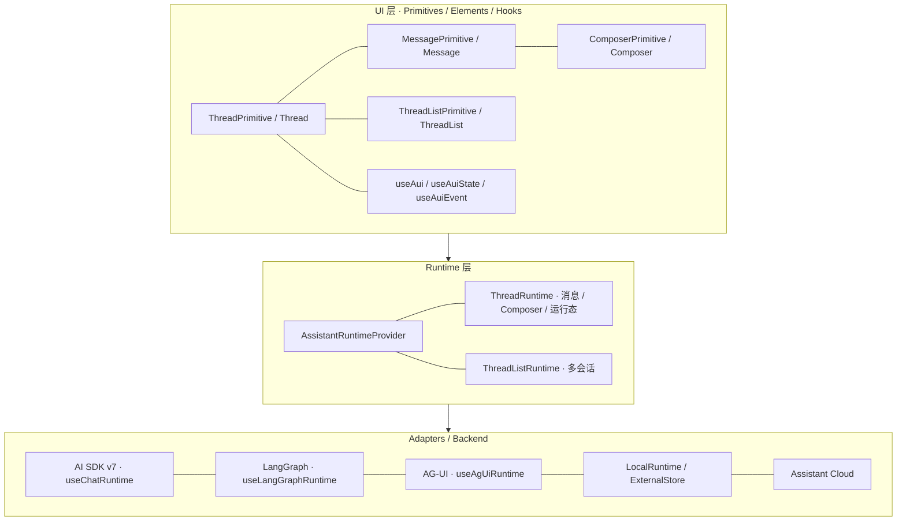
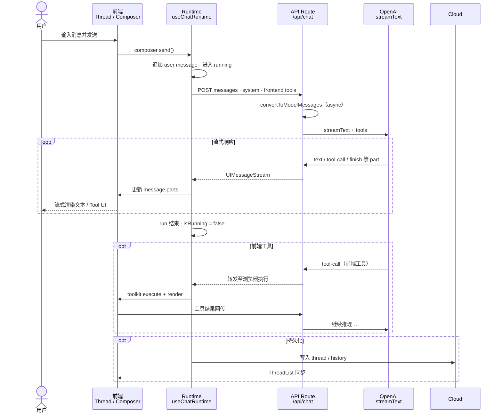
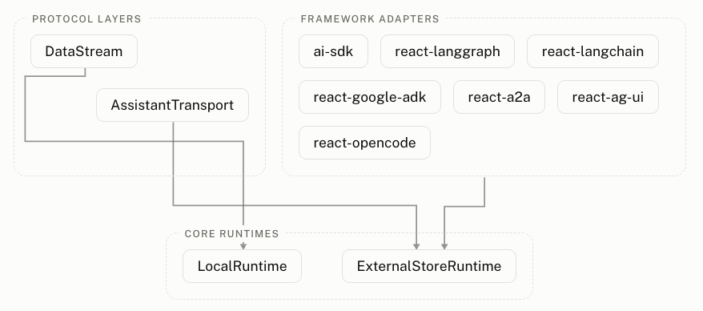

# Assistant UI - The composable AI chat UI toolkit

上一篇 [CopilotKit - The frontend stack for Agent](/blog/2026-08-22-copilotkit.html) 介绍了如何把 Agent 接到产品里—读取页面上下文、调用前端工具、渲染 React 组件、暂停等待用户审批。CopilotKit 是产品的智能助手。

当你的核心需求变成**构建精细、可组合的聊天界面** 时，[Assistant UI](https://www.assistant-ui.com/) 会更合适。它提供 Thread、Message、Composer 等聊天原语，以及连接 Vercel AI SDK、LangGraph、AG-UI 或自定义后端的 Runtime 层，让你像搭积木一样组装 ChatGPT 风格的对话体验。

Assistant UI 的核心能力如下：

| 产品能力        | 说明                                                                                            |
| --------------- | ----------------------------------------------------------------------------------------------- |
| UI Primitives   | 无样式、可访问的 Thread、Message、Composer 等原语，交互细节（自动滚动、流式渲染、分支切换）内置 |
| Elements        | 基于 shadcn/ui 的预置聊天组件，源码复制到项目，样式完全可控                                     |
| Runtime         | 连接 UI 与后端的会话状态层，负责消息、Composer、运行生命周期与分支                              |
| AI SDK v7 集成  | 通过 `@assistant-ui/ai-sdk` 的 `useChatRuntime` 对接 Vercel AI SDK v7 流式对话                  |
| Tool UI         | 为工具调用注册自定义 React 渲染器，展示 loading、结果与交互状态                                 |
| ThreadList      | 多会话列表：创建、切换、归档、重命名                                                            |
| Assistant Cloud | 托管线程持久化、历史记录与用户授权                                                              |
| CLI             | 脚手架创建项目、向现有项目添加组件、升级与 codemod                                              |

> Assistant UI 当前版本 0.15.x，AI SDK 集成面向 v7（`ai@^7`、`@ai-sdk/react@^4`）。

## 架构

从前端到后端，Assistant UI 可以理解为三个部分：**UI Primitives / Elements**、**Runtime**、**Adapters / Backend**。更多详情，请参考 [Architecture](https://www.assistant-ui.com/docs/architecture)。



### 三层职责

**UI 层（Primitives / Elements / Hooks）**

渲染线程、消息、输入框、附件、建议等界面。原语层（`ThreadPrimitive`、`MessagePrimitive`、`ComposerPrimitive`）不带样式，行为类似 Radix UI；Elements 是在原语之上用 shadcn/ui 做好的完整组件（如 `Thread`），源码通过 CLI 复制到项目。

UI 通过 Runtime 上下文读写状态，不直接调用 LLM API。`useAui` 返回当前作用域的 `AssistantClient`；`useAuiState` 用选择器订阅线程、Composer、消息等切片状态；`useAuiEvent` 订阅 Runtime 事件。这些 Hooks 是 UI 层定制行为的入口。

**Runtime 层**

会话状态的边界。`AssistantRuntimeProvider` 注入 Runtime，其下所有原语和 Hooks 共享同一份线程状态。不同 Runtime 适配不同后端对消息、分支、工具调用的组织方式。

**Adapters / Backend**

实际产生模型输出和应用行为的地方。AI SDK 适配器把 `streamText` 的 UI Message 流映射进 Runtime；LangGraph、AG-UI 等各有专属适配器；Assistant Cloud 或自定义 persistence adapter 负责线程与消息持久化。

### 请求过程

以 Next.js + AI SDK v7 + OpenAI 为主线，用户发送消息后，Runtime 把本地状态转成 API 请求，后端流式返回，UI 逐段更新消息部件。



一句话概括：用户说话 → Runtime 组装请求 POST 到 API Route → `streamText` 流式生成 → Runtime 把 UI Message 部件写回 Thread → 原语渲染。

## 集成 Assistant UI

如果想快速搭脚手架，或向已有项目追加组件，可以用官方 CLI。更多详情，请参考 [CLI 文档](https://www.assistant-ui.com/docs/cli)。

> CLI 当前版本 assistant-ui@0.0.117

### 创建新项目

`create` 从模板或示例生成完整项目：

```sh
# 默认模板（Vercel AI SDK）
$ npx assistant-ui@latest create my-app

# 指定 AI SDK v7 示例
$ npx assistant-ui@latest create my-app -e with-ai-sdk-v7

# Cloud 持久化模板
$ npx assistant-ui@latest create my-app -t cloud
```

常用模板（ `-t template`）：

| Name          | 模板          | 说明                               |
| ------------- | ------------- | ---------------------------------- |
| `default`     | Default       | 默认模板，内置 Vercel AI SDK       |
| `minimal`     | Minimal       | 最小起点                           |
| `cloud`       | Cloud         | Cloud 持久化 Starter               |
| `cloud-clerk` | Cloud + Clerk | Cloud 持久化 + Clerk 鉴权          |
| `langchain`   | LangChain     | LangGraph + react-langchain 适配器 |
| `mcp`         | MCP           | MCP Tools + MCP Apps Renderer      |
| `eve`         | Eve           | Eve Agent + Next.js                |

常用示例（`-e example`）：

| Name                             | 示例                      | 说明                                    |
| -------------------------------- | ------------------------- | --------------------------------------- |
| `with-ag-ui`                     | AG-UI                     | AG-UI 协议集成                          |
| `with-google-adk`                | Google ADK                | Google ADK Agent 集成                   |
| `with-ai-sdk-v7`                 | AI SDK v7                 | Vercel AI SDK v7 集成                   |
| `with-eve`                       | Eve                       | Eve Agent 集成                          |
| `with-artifacts`                 | Artifacts                 | HTML Artifact 渲染与实时预览            |
| `with-assistant-transport`       | Assistant Transport       | 通过 Assistant Transport 对接自定义后端 |
| `with-chain-of-thought`          | Chain of Thought          | Chain of Thought、Tool Call 与来源引用  |
| `with-cloud`                     | Cloud Example             | Assistant Cloud 持久化                  |
| `with-custom-thread-list`        | Custom Thread List        | 自定义 ThreadList UI                    |
| `with-elevenlabs-conversational` | ElevenLabs Conversational | ElevenLabs 实时语音对话                 |
| `with-elevenlabs-scribe`         | ElevenLabs Scribe         | ElevenLabs 语音转写                     |
| `with-livekit`                   | LiveKit Voice             | LiveKit 实时语音                        |
| `with-expo`                      | Expo                      | Expo / React Native                     |
| `with-interactables`             | Interactables             | AI 驱动的交互式 UI 组件                 |
| `with-external-store`            | External Store            | External Message Store                  |
| `with-ffmpeg`                    | FFmpeg                    | FFmpeg 视频处理工具                     |
| `with-langgraph`                 | LangGraph Example         | LangGraph Agent 与自定义工具            |
| `with-react-hook-form`           | React Hook Form           | React Hook Form 集成                    |
| `with-react-ink`                 | React Ink                 | React Ink 终端聊天界面                  |
| `with-react-router`              | React Router              | React Router v7 集成                    |
| `with-tanstack`                  | TanStack                  | TanStack Start 集成                     |
| `with-resumable-stream`          | Resumable Stream          | 页面刷新后可恢复的 LLM Stream           |
| `with-openui`                    | OpenUI                    | OpenUI Generative UI 集成               |

### 向现有项目添加

已有 `package.json` 的 Next.js 项目，用 `init` 完成首次配置：

```sh
$ npx assistant-ui@latest init
```

`init` 会检测项目、通过 shadcn registry 安装 quick-start 组件、配置 TypeScript paths。

之后按需追加单个组件：

```sh
# 基础 Thread
$ npx assistant-ui@latest add thread

# 多会话 ThreadList
$ npx assistant-ui@latest add thread-list

# 浮窗形态
$ npx assistant-ui@latest add assistant-modal

# 一次添加多个
$ npx assistant-ui@latest add thread thread-list assistant-sidebar
```

### 升级与维护

```sh
# 添加组件
$ npx assistant-ui@latest add [component]

# 查看可更新包（dry run）
$ npx assistant-ui@latest update --dry

# 更新所有 @assistant-ui/* 包
$ npx assistant-ui@latest update

# 运行 breaking change codemod
$ npx assistant-ui@latest upgrade
```

CLI 添加的组件源码会直接写入项目，可以继续按需修改组件、样式与 Runtime 配置。

## 原语与 Hooks

完整 API 见 [Primitives 概览](https://www.assistant-ui.com/docs/primitives) 与 [Hooks API Reference](https://www.assistant-ui.com/docs/api-reference/hooks)。

### 核心原语一览

| 原语                      | 功能                                                   |
| ------------------------- | ------------------------------------------------------ |
| `ThreadPrimitive`         | 可滚动消息容器：自动滚动、空状态、建议、ViewportFooter |
| `MessagePrimitive`        | 单条消息渲染：按 role 展示 parts、附件、元数据         |
| `ComposerPrimitive`       | 输入区：文本、发送、附件、语音听写                     |
| `ActionBarPrimitive`      | 消息操作：复制、重新生成、编辑、反馈                   |
| `BranchPickerPrimitive`   | 在多条 assistant 分支回复间切换                        |
| `ThreadListPrimitive`     | 多线程列表：创建、切换、归档                           |
| `AssistantModalPrimitive` | 浮窗聊天面板                                           |
| `AttachmentPrimitive`     | 附件渲染                                               |
| `SuggestionPrimitive`     | 建议提示                                               |
| `ChainOfThoughtPrimitive` | 折叠展示推理步骤与工具调用                             |
| `AuiIf`                   | 按 Runtime 状态条件渲染                                |

### 原语详解

#### `ThreadPrimitive`

线程容器，负责 Viewport 滚动、消息迭代与 Composer 锚点。典型结构：

```tsx
import { ThreadPrimitive, MessagePrimitive, ComposerPrimitive, AuiIf } from "@assistant-ui/react";

<ThreadPrimitive.Root className="flex h-full flex-col">
  <ThreadPrimitive.Viewport turnAnchor="top" className="flex-1 overflow-y-auto">
    <AuiIf condition={s => s.thread.isEmpty}>
      <p>开始提问吧</p>
    </AuiIf>

    <ThreadPrimitive.Messages>
      {({ message }) => {
        if (message.role === "user") return <UserMessage />;
        return <AssistantMessage />;
      }}
    </ThreadPrimitive.Messages>

    <ThreadPrimitive.ViewportFooter className="sticky bottom-0">
      <ComposerPrimitive.Root>
        <ComposerPrimitive.Input placeholder="Ask anything..." />
        <ComposerPrimitive.Send>Send</ComposerPrimitive.Send>
      </ComposerPrimitive.Root>
    </ThreadPrimitive.ViewportFooter>
  </ThreadPrimitive.Viewport>
</ThreadPrimitive.Root>;
```

`turnAnchor="top"` 时，用户消息锚定在 Viewport 顶部，assistant 回复在下方展开，接近 ChatGPT 的阅读体验。`autoScroll`、`scrollToBottomOnRunStart` 等控制滚动行为。

#### `MessagePrimitive`

单条消息的渲染单元。`MessagePrimitive.Parts` 按 part 类型（text、tool-call、reasoning 等）渲染内容；配合 `ActionBarPrimitive`、`BranchPickerPrimitive` 实现复制、重新生成与分支切换。

```tsx
<MessagePrimitive.Root className="flex justify-start">
  <div className="rounded-2xl bg-muted px-4 py-2.5">
    <MessagePrimitive.Parts />
  </div>
</MessagePrimitive.Root>
```

ActionBar 和 BranchPicker 必须放在 `MessagePrimitive.Root` 内部。

#### `ComposerPrimitive`

消息输入区。处理 Enter 发送、空内容禁用、流式运行中禁用、附件与听写适配器。既可用于 Thread 底部的新消息 Composer，也可用于 `MessagePrimitive` 内的编辑模式。

```tsx
<ComposerPrimitive.Root>
  <ComposerPrimitive.Input placeholder="输入消息…" />
  <ComposerPrimitive.Send />
  <ComposerPrimitive.Cancel /> {/* 运行中取消 */}
</ComposerPrimitive.Root>
```

### 核心 Hooks 一览

| Hook                         | 功能                                                                |
| ---------------------------- | ------------------------------------------------------------------- |
| `useChatRuntime`             | 创建 AI SDK v7 Runtime（推荐主线）                                  |
| `useAISDKRuntime`            | 把已有 `useChat` 实例适配为 Runtime                                 |
| `useAui`                     | 获取 `AssistantClient`，调用 thread / composer / message 作用域方法 |
| `useAuiState`                | 选择器订阅 Runtime 状态切片                                         |
| `useAuiEvent`                | 订阅 assistant 事件（如 modelContext 更新）                         |
| `useLangGraphRuntime`        | LangGraph Cloud / SDK 集成                                          |
| `useAgUiRuntime`             | AG-UI 协议 agent 集成                                               |
| `useOpenCodeRuntime`         | OpenCode coding agent；session 即 thread，服务端持久化历史          |
| `useLocalRuntime`            | Runtime 内部管理状态，后端只需简单 fetch                            |
| `useExternalStoreRuntime`    | 消息状态放在 Redux / Zustand 等外部 store                           |
| `useRemoteThreadListRuntime` | 自定义数据库的多线程列表                                            |

### Hook 详解

#### `useAui`

返回当前上下文中的 `AssistantClient`，用于 **主动触发行为** 而非订阅状态：

```tsx
import { useAui } from "@assistant-ui/react";

function SendHello() {
  const aui = useAui();

  return (
    <button
      onClick={() => {
        aui.composer().setText("Hello");
        aui.composer().send();
      }}
    >
      发送 Hello
    </button>
  );
}
```

常见调用：`aui.thread().cancelRun()` 取消生成；`aui.threads().switchToThread(id)` 切换线程；`aui.threadListItem().initialize()` 创建远程线程。

#### `useAuiState`

用选择器订阅状态，只在选中切片变化时重渲染：

```tsx
import { useAuiState } from "@assistant-ui/react";

function RunningIndicator() {
  const isRunning = useAuiState(s => s.thread.isRunning);
  const messages = useAuiState(s => s.thread.messages);

  if (!isRunning) return null;
  return <span>生成中…（共 {messages.length} 条消息）</span>;
}
```

注意：选择器应返回原始字段或稳定引用；不要返回每次新建的 object/array，否则会触发多余渲染。可能不存在的作用域用 `s.optional.` 读取。

## Runtime

Runtime 是 UI 原语与 AI 后端之间的 **状态与行为边界**：负责消息、线程、分支、编辑 / 重新生成，以及一次 run 的生命周期。

### Runtime architecture

assistant-ui 的 Runtime 集成分三层。上层都用下层实现；多数项目从 Framework adapters 起步，只有需要更细控制时才下沉到 Protocol 或 Core。

更多详情请参考 [Runtime architecture](https://www.assistant-ui.com/docs/runtimes/concepts/architecture)。



**Core runtimes** — 真正「拥有」会话状态的两套底座：

| Runtime                | 状态归属       | 适合谁                                                                                  |
| ---------------------- | -------------- | --------------------------------------------------------------------------------------- |
| `LocalRuntime`         | Runtime 内部   | 你实现一个 `ChatModelAdapter.run`，分支 / 编辑 / 重新生成由 Runtime 管                  |
| `ExternalStoreRuntime` | 你自己的 store | 消息已在 Redux、Zustand、TanStack Query 里；提供 `onNew` / `onEdit` / `onReload` 等回调 |

**Protocol layers** — 在 Core 上包一层线协议，后端不必为每个应用写一份 `ChatModelAdapter`：

| 协议               | 叠在                   | 何时用                                        |
| ------------------ | ---------------------- | --------------------------------------------- |
| DataStream         | `LocalRuntime`         | 后端已说 data stream，或只要「消息流」合约    |
| AssistantTransport | `ExternalStoreRuntime` | 要流式同步整份 agent 状态，而不只是消息 parts |

**Framework adapters** — 最快路径。每个 adapter 叠在 Core（多数是 `ExternalStoreRuntime`）上，并加上框架便利：

| Adapter                               | 目标后端                        |
| ------------------------------------- | ------------------------------- |
| `ai-sdk`                              | Vercel AI SDK v7（`useChat`）   |
| `react-langgraph` / `react-langchain` | LangGraph Cloud / `useStream`   |
| `react-google-adk`                    | Google ADK                      |
| `react-a2a`                           | A2A v1.0 协议服务器             |
| `react-ag-ui`                         | AG-UI agent（含 CopilotKit 等） |
| `react-opencode`                      | OpenCode coding agent（实验性） |

**怎么选择** — 从上往下选，卡住再往下走：

1. **Framework adapter** — 后端已是 AI SDK、LangGraph、AG-UI、OpenCode 等，直接用对应 hook。
2. **Protocol layer** — 没有现成 adapter，但能约定线格式：消息流用 DataStream，状态流用 AssistantTransport。
3. **Core runtime** — 更定制：简单用 `LocalRuntime`，已有 store 用 `ExternalStoreRuntime`。

更多详情请参考 [Picking a runtime](https://www.assistant-ui.com/docs/runtimes/pick-a-runtime)。

最快也是最简单的路径是使用 **Framework adapters**，下面介绍使用 AI SDK 和 Opencode。

### 使用 AI SDK v7

`@assistant-ui/ai-sdk` 的 `useChatRuntime` 叠在 `ExternalStoreRuntime` 上，封装 `useChat`、`AssistantChatTransport` 与消息格式转换。

需要持久化历史会话和消息时再加上 `adapters.history` 或 Assistant Cloud。

**安装依赖**

```sh
$ npm install @assistant-ui/react @assistant-ui/ai-sdk ai@^7 @ai-sdk/react@^4 @ai-sdk/openai zod
```

**前端**

前端使用 `useChatRuntime`

```tsx
"use client";

import { Thread } from "@/components/assistant-ui/elements/thread.aui";
import { AssistantRuntimeProvider } from "@assistant-ui/react";
import { useChatRuntime, AssistantChatTransport } from "@assistant-ui/ai-sdk";
import { lastAssistantMessageIsCompleteWithToolCalls } from "ai";

export default function Home() {
  const runtime = useChatRuntime({
    // 可选：自定义 endpoint；省略则默认 /api/chat
    transport: new AssistantChatTransport({ api: "/api/chat" }),
    // 可选：当提供时，该函数将在流结束或添加工具调用时被调用，以确定当前消息是否需要重新提交
    sendAutomaticallyWhen: lastAssistantMessageIsCompleteWithToolCalls,
    onThreadIdChange: threadId => {
      // 把 settled threadId 同步到 URL，例如 ?thread=xxx
    }
    // adapters: { history: myHistoryAdapter, attachments: myAttachmentAdapter },
  });

  return (
    <AssistantRuntimeProvider runtime={runtime}>
      <div className="h-full">
        <Thread />
      </div>
    </AssistantRuntimeProvider>
  );
}
```

如果需要直接拿到 `useChat` 实例时，可降级为 `useAISDKRuntime`：

```tsx
import { useChat } from "@ai-sdk/react";
import { useAISDKRuntime } from "@assistant-ui/ai-sdk";

const chat = useChat({ api: "/api/chat" });
const runtime = useAISDKRuntime(chat);
```

更多选项见 [AI SDK](https://www.assistant-ui.com/docs/runtimes/ai-sdk/v7)。

**后端**

在 `app/api/chat/route.ts` 用 AI SDK 的 `streamText` 接住请求，再把 UI Message 流返回给 Runtime：

```ts
import { openai } from "@ai-sdk/openai";
import {
  streamText,
  convertToModelMessages,
  zodSchema,
  createUIMessageStreamResponse,
  toUIMessageStream,
  stepCountIs
} from "ai";
import { frontendTools } from "@assistant-ui/ai-sdk";
import { z } from "zod";

export async function POST(req: Request) {
  const { messages, system, tools } = await req.json();

  const result = streamText({
    model: openai("gpt-5.4-mini"), // 换成你账号可用的模型
    messages: await convertToModelMessages(messages), // v7 为 async
    system,
    tools: {
      ...frontendTools(tools)
      // 后端工具 …
    },
    stopWhen: stepCountIs(10) // 允许多轮 tool call；省略则只跑一步
  });

  return createUIMessageStreamResponse({
    stream: toUIMessageStream({ stream: result.stream })
  });
}
```

OpenAI 模型，添加环境变量 `OPENAI_API_KEY=...`。

`frontendTools` 接收客户端通过 assistant-ui 注册并随请求发送的前端工具定义（`FrontendTools`），再转换成 AI SDK 的 `ToolSet`，供服务端的 `streamText` 使用。

### 使用 OpenCode

[OpenCode](https://opencode.ai/) 是开源 coding agent。`@assistant-ui/react-opencode` 把 OpenCode 的 session / event API 接到 assistant-ui：流式消息、工具权限、交互式提问、fork / revert 等。

Adapter 叠在 `ExternalStoreRuntime` + `RemoteThreadList` 上；

一个 OpenCode session 对应一个 thread。

> 当前 adapter 仍是实验性（文档标注 v0.0.x），API 可能变更。详见 [OpenCode Runtime](https://www.assistant-ui.com/docs/runtimes/opencode/overview)。

**安装**

```sh
$ npm install @assistant-ui/react @assistant-ui/react-opencode @opencode-ai/sdk
```

先在本机按 [opencode.ai](https://opencode.ai/) 启动 OpenCode 服务

```sh
$ opencode serve
```

默认服务地址为 `http://localhost:4096`

**最小接入**

```tsx
"use client";

import { AssistantRuntimeProvider } from "@assistant-ui/react";
import { useOpenCodeRuntime } from "@assistant-ui/react-opencode";
import { Thread } from "@/components/assistant-ui/elements/thread.aui";

export default function Page() {
  const runtime = useOpenCodeRuntime({
    baseUrl: "http://localhost:4096"
    // 可选：新会话默认模型 / agent
    // defaultModel: { providerID: "anthropic", modelID: "claude-sonnet-5" },
    // defaultAgent: "coder",
  });

  return (
    <AssistantRuntimeProvider runtime={runtime}>
      <Thread />
    </AssistantRuntimeProvider>
  );
}
```

Runtime 会对 OpenCode 打开 SSE，把 session 与 message 事件投影进 Thread；ThreadList 默认就是服务器上的 session 列表。

**消息与会话历史持久化**

和 AI SDK 默认「只活在浏览器内存」不同，OpenCode Runtime **天然把会话存在 OpenCode 服务端**：

| 能力       | 行为                                                                                           |
| ---------- | ---------------------------------------------------------------------------------------------- |
| 会话列表   | OpenCode sessions ↔ assistant-ui threads                                                       |
| 消息历史   | 由 OpenCode server 持久化；刷新页面后仍可从同一 session 继续                                   |
| 恢复会话   | `initialSessionId` 指定首次打开的 session                                                      |
| 可选 Cloud | 传入 `cloud`，ThreadList 改由 Assistant Cloud 托管，再通过 external id 映射到 OpenCode session |

恢复已有会话：

```tsx
const runtime = useOpenCodeRuntime({
  baseUrl: "http://localhost:4096",
  initialSessionId: "ses_abc123"
});
```

权限审批、提问、fork / revert 等用 `useOpenCodePermissions`、`useOpenCodeQuestions`、`useOpenCodeRuntimeExtras`，更多详情请参考 [OpenCode Hooks](https://www.assistant-ui.com/docs/runtimes/opencode/hooks)。

## Tools 与 Generative UI

Assistant UI 通过 **toolkit** 把工具定义、执行与 UI 渲染绑在一起。工具可在客户端执行（frontend tool）、仅渲染后端工具（backend render-only），或等待用户填表后再 `addResult`（human tool）。详见 [Tool UI 文档](https://www.assistant-ui.com/docs/tools/tool-ui)。

### 后端工具 + 自定义 Tool UI

服务端在 `streamText` 的 `tools` 里定义工具；客户端用 `defineToolkit` 注册 **仅 render** 的 backend entry：

```tsx
"use client";

import { AssistantRuntimeProvider, AuiConfig, Tools, defineToolkit } from "@assistant-ui/react";
import { useChatRuntime } from "@assistant-ui/ai-sdk";

const toolkit = defineToolkit({
  get_current_weather: {
    type: "backend",
    render: ({ args, result, status }) => {
      if (status.type === "running") {
        return <div>正在查询 {args.city} 的天气…</div>;
      }
      if (status.type === "incomplete" && status.reason === "error") {
        return <div>查询失败</div>;
      }
      return (
        <div className="rounded-lg border p-3">
          <p className="font-medium">{args.city}</p>
          <p>{result}</p>
        </div>
      );
    }
  }
});

export function ChatProvider({ children }: { children: React.ReactNode }) {
  const runtime = useChatRuntime();
  const config = AuiConfig({ tools: Tools({ toolkit }) });

  return (
    <AssistantRuntimeProvider runtime={runtime} config={config}>
      {children}
    </AssistantRuntimeProvider>
  );
}
```

`status.type` 常见值：`running`（执行中）、`complete`（成功）、`incomplete`（错误或未决）。AI SDK v7 还支持服务端 `toolApproval` 门控，assistant-ui 在 tool part 上暴露 `approval` 与 `respondToApproval`，用于生产环境部署等人审批场景。

### 前端工具

客户端定义并执行的工具，通过 toolkit 的 `execute` + `render` 注册，`AssistantChatTransport` 会把 schema 序列化给后端，后端用 `frontendTools(tools)` 合并：

```tsx
const toolkit = defineToolkit({
  highlightText: {
    description: "Highlight text on the page",
    parameters: z.object({ text: z.string() }),
    execute: async ({ text }) => {
      "use client";
      document.designMode = "on";
      window.find(text);
      return { found: true };
    },
    render: ({ args, status }) => {
      if (status.type === "running") return <span>高亮「{args.text}」…</span>;
      return <span>已高亮「{args.text}」</span>;
    }
  }
});
```

若模型需要从 **组件 vocabulary** 组合 UI（而非一对一绑定 tool name），可进一步看 Generative UI 指南；本文不展开。

## 会话与持久化

默认情况下，消息只存在内存里，刷新即丢失。多会话与持久化有三条路径。

### ThreadList

`ThreadListPrimitive`（或 CLI 安装的 `Thread` + `ThreadList` Elements）提供会话列表 UI：新建、切换、归档、重命名。单线程应用只需 `Thread`；产品型聊天通常 `ThreadList` + `Thread` 并排。

```sh
$ npx assistant-ui@latest add thread-list
```

### Assistant Cloud

[Assistant Cloud](https://www.assistant-ui.com/docs/cloud) 是托管服务，提供线程持久化、自动标题、消息反馈与用户授权，无需自建数据库。

- 与 assistant-ui 组件配合：按 [AI SDK + assistant-ui Cloud 指南](https://www.assistant-ui.com/docs/cloud/ai-sdk-assistant-ui) 配置 `useChatRuntime` 的 cloud 选项。
- 已有 AI SDK 应用、只要 hook：可用 `useCloudChat` 最小改动接入。
- LangGraph：见 [LangGraph + Cloud](https://www.assistant-ui.com/docs/cloud/langgraph)。

Cloud 适合快速上线、多租户线程隔离、不想维护 history 存储的团队。

### 自定义 Persistence Adapter

合规、自建数据库或要把线程与应用数据存在同一张表时，实现 **RemoteThreadListAdapter**（线程元数据）和 **ThreadHistoryAdapter**（消息 history）。

AI SDK v7 路径下，history adapter **必须实现 `withFormat`**，让 `useChatRuntime` 把 `UIMessage` 编码为固定行形状 `{ id, parent_id, format, content }`：

```tsx
const historyAdapter: ThreadHistoryAdapter = {
  async load() {
    return { headId: null, messages: [] };
  },
  async append() {},
  withFormat: fmt => ({
    async load() {
      const rows = await fetch("/api/history").then(r => r.json());
      return { messages: rows.map(fmt.decode) };
    },
    async append(item) {
      await fetch("/api/history", {
        method: "POST",
        body: JSON.stringify({
          id: fmt.getId(item.message),
          parent_id: item.parentId,
          format: fmt.format,
          content: fmt.encode(item)
        })
      });
    }
  })
};

const runtime = useChatRuntime({ adapters: { history: historyAdapter } });
```

多线程场景用 `useRemoteThreadListRuntime` 把 thread list adapter 与 per-thread `useChatRuntime` 组合。完整 schema、路由与 Drizzle 示例见 [Custom thread persistence](https://www.assistant-ui.com/docs/integrations/persistence/custom-adapter)。

**怎么决策：**

| 需求                         | 方案                                           |
| ---------------------------- | ---------------------------------------------- |
| 单线程、原型                 | 默认内存态，无需 adapter                       |
| 托管、快速上线               | Assistant Cloud                                |
| 线程与用户数据同库、合规自控 | RemoteThreadListAdapter + ThreadHistoryAdapter |
| 仅 AI SDK hook、自有 UI      | Cloud 的 `useCloudChat` 或自建 history         |

## References

- [Assistant UI 文档首页](https://www.assistant-ui.com/docs/)
- [Architecture](https://www.assistant-ui.com/docs/architecture)
- [Installation](https://www.assistant-ui.com/docs/installation)
- [CLI](https://www.assistant-ui.com/docs/cli)
- [Runtime architecture](https://www.assistant-ui.com/docs/runtimes/concepts/architecture)
- [AI SDK v7 Runtime](https://www.assistant-ui.com/docs/runtimes/ai-sdk/v7)
- [OpenCode Runtime](https://www.assistant-ui.com/docs/runtimes/opencode/overview) · [Quickstart](https://www.assistant-ui.com/docs/runtimes/opencode/quickstart) · [Hooks](https://www.assistant-ui.com/docs/runtimes/opencode/hooks)
- [Picking a Runtime](https://www.assistant-ui.com/docs/runtimes/pick-a-runtime)
- [Primitives 概览](https://www.assistant-ui.com/docs/primitives)
- [Tool UI](https://www.assistant-ui.com/docs/tools/tool-ui)
- [Cloud Persistence](https://www.assistant-ui.com/docs/cloud)
- [Custom thread persistence](https://www.assistant-ui.com/docs/integrations/persistence/custom-adapter)
- [Hooks API Reference](https://www.assistant-ui.com/docs/api-reference/hooks)
- [Assistant UI GitHub](https://github.com/assistant-ui/assistant-ui)
- [Assistant-UI Example](https://www.assistant-ui.com/examples)
- [Assistant-UI Showcase](https://www.assistant-ui.com/showcase)
- [CopilotKit - The frontend stack for Agent](/blog/2026-08-22-copilotkit.html)
