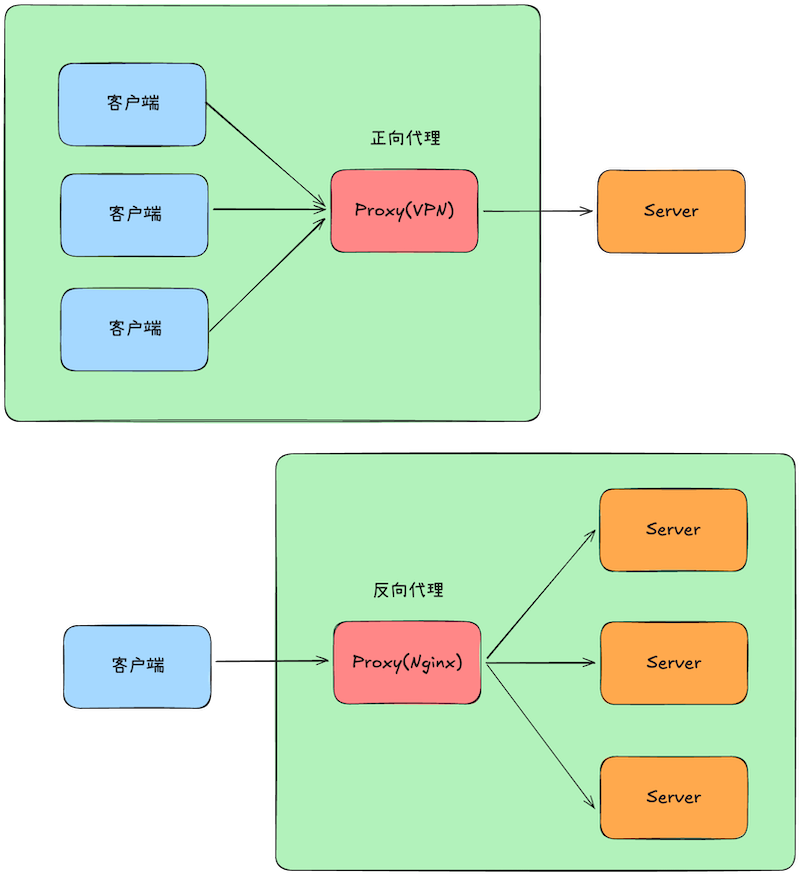
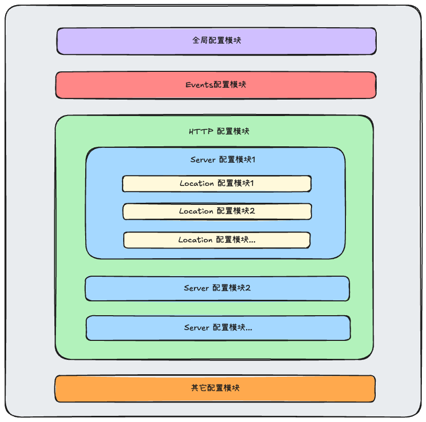
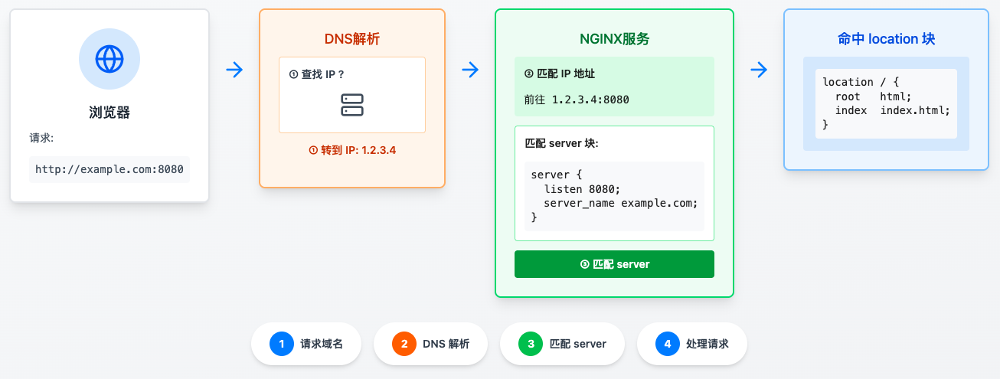
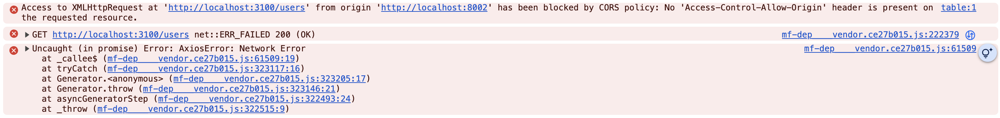

# 前端 Nginx 入门

Nginx 是一个高性能的 Web 服务器和反向代理服务器，也是现代 Web 架构中几乎“标配”的基础设施之一。它最初由 Igor Sysoev 为解决 **C10K（同时处理上万连接）** 问题而设计，如今已经被广泛应用于各类网站、后台服务和云原生系统中。

与传统的 Apache 等 Web 服务器不同，Nginx 采用 **事件驱动 + 异步非阻塞** 的架构，使它在高并发、低资源消耗的场景下表现非常出色。

## 作用

Nginx 的核心作用有：

1. 高性能 Web 服务器（Web Server）

   - 直接对外提供 HTTP / HTTPS 服务
   - 高效托管静态资源（HTML、CSS、JS、图片等）
   - 相比后端服务，更适合处理大量短连接请求

   实现

   ```
   浏览器 → Nginx → 静态资源
   ```

2. 反向代理（Reverse Proxy）

   这是 Nginx 最常见、也是最核心的用途之一

   - 将用户请求转发给后端服务（Node.js / Java / Python 等）
   - 隐藏后端真实地址，统一对外出口
   - 解耦前端访问与后端服务实现

   实现了 

   ```
   浏览器 → Nginx → 后端应用
   ```

3. 负载均衡（Load Balancer）

   当后端服务有多台实例时，Nginx 可以：

   - 按策略分发请求（轮询、权重、IP 哈希等）
   - 提高系统吞吐量
   - 提升整体可用性

   实现了

   ```
   浏览器
     ↓
   Nginx
     ↓     ↓     ↓
   服务A  服务B  服务C
   ```


## 前端为什么需要学习 Nginx

在前端开发阶段，我们更多关注的是组件、状态和交互。但当项目真正部署上线后，很多问题却并不在前端代码里。

你可能遇到过：

- 页面部署到服务器后，**刷新直接 404**
- 本地开发正常，线上却出现 **接口跨域**
- 前端已经重新打包发布，**浏览器仍然加载旧资源**
- 多个前端项目部署在同一台服务器上，**路径频繁出错**
- iframe 或微前端接入时，**页面被浏览器拦截**

这些问题看起来像是前端问题，但改代码往往无效。接下来我将以前端开发人员的视角来学习使用 Nginx。

## 安装

我用的是 Macbook，所以这里介绍怎么在 Macbook 上安装 Nginx。

Macbook 可以使用 Homebrew 安装 Nginx。

如果没有安装 [Homebrew](https://brew.sh/)，可以通过下面的命令安装 。

```sh
/bin/bash -c "$(curl -fsSL https://raw.githubusercontent.com/Homebrew/install/HEAD/install.sh)"
```

查看 Homebrew 是否成安装。

```sh
$ brew -v
# Homebrew 5.0.5
```

然后使用 Homebrew 安装 Nginx。

```sh
$ brew install nginx
```

安装完成后，brew 会提示关键路径，常见的有：

| **项目**   | **路径**                                                     |
| ---------- | ------------------------------------------------------------ |
| 主配置文件 | /opt/homebrew/etc/nginx/nginx.conf（Apple Silicon）<br />/usr/local/etc/nginx/nginx.conf（Intel） |
| 根目录     | /opt/homebrew/Cellar/nginx/1.29.4                            |
| 日志       | /opt/homebrew/var/log/nginx/                                 |
| nginx 程序 | /opt/homebrew/bin/nginx                                      |

## 使用命令

通过下面的命令操作 Nginx

```sh
$ nginx               # 开启 nginx
$ nginx -s stop       # 快速关闭
$ nginx -s quit       # 优雅地关闭
$ nginx -s reload     # 重新加载配置文件
$ nginx -s reopen     # 重新打开日志文件
$ nginx -t            # 测试配置文件是否正确
$ nginx -c filename   # 为 Nginx 指定一个配置文件，来代替缺省的
$ nginx -g directives # 设置全局指令
$ nginx -h            # 查看帮助文档

# 查看 nginx 进程
$ ps aux | grep nginx 
```

查看 Nginx 软件的配置选项

```sh
nginx -V 2>&1 | awk -F: '/configure arguments/ {print $2}' | xargs -n1
```

输出

```
--prefix=/opt/homebrew/Cellar/nginx/1.29.4
--sbin-path=/opt/homebrew/Cellar/nginx/1.29.4/bin/nginx
--with-cc-opt=-I/opt/homebrew/opt/pcre2/include -I/opt/homebrew/opt/openssl@3/include
--with-ld-opt=-L/opt/homebrew/opt/pcre2/lib -L/opt/homebrew/opt/openssl@3/lib
--conf-path=/opt/homebrew/etc/nginx/nginx.conf
--pid-path=/opt/homebrew/var/run/nginx.pid
--lock-path=/opt/homebrew/var/run/nginx.lock
--http-client-body-temp-path=/opt/homebrew/var/run/nginx/client_body_temp
--http-proxy-temp-path=/opt/homebrew/var/run/nginx/proxy_temp
--http-fastcgi-temp-path=/opt/homebrew/var/run/nginx/fastcgi_temp
--http-uwsgi-temp-path=/opt/homebrew/var/run/nginx/uwsgi_temp
--http-scgi-temp-path=/opt/homebrew/var/run/nginx/scgi_temp
--http-log-path=/opt/homebrew/var/log/nginx/access.log
--error-log-path=/opt/homebrew/var/log/nginx/error.log
--with-compat
...
```

## 反向代理

反向代理（Reverse Proxy）是 Nginx 最常见、也是最核心的用途之一。



### 正向代理

正向代理，是指为了从原始服务器取得内容，客户端向代理服务器发送请求并指定原始服务器，然后代理服务器将请求转发给原始服务器，最后将原始服务器的内容返回给客户端。

正向代理是为客户端服务的，客户端可以根据正向代理访问到它本身无法访问的服务器资源，比如 VPN。

正向代理对我们是透明的，对服务端是非透明的，即原始服务端并不知道自己收到的请求是来自代理服务器还是真实客户端。

### 反向代理

反向代理，是指代理服务器接受客户端的请求，然后将请求转发给内部网络上的服务器，并将从服务器上得到的结果返回给客户端。

反向代理是为服务端服务的，反向代理可以帮助服务器接收来自客户端的请求，帮助服务器做请求转发，负载均衡等，比如 Nginx。

反向代理对服务端是透明的，对客户端是非透明的，即客户端并不知道自己访问的是哪个服务器。

## 配置

开启 Nginx 之后，访问 http://localhost:8080。如果看到

```
Welcome to nginx! 
```

表示 Nginx 安装并运行成功。

Nginx 使用一个基于文本的配置文件，默认名为 `nginx.conf`。

Nginx 的配置文件结构如下：



Nginx 配置文件由指令（*directives*）组成。指令分为简单指令和块指令。

简单指令由名称和参数组成，以空格分隔，并以分号（`;`）结束。

块指令则充当“容器”的角色，将相关指令用花括号（`{}`）组合在一起。

如果一个块指令可以在大括号内包含其他指令，它就被称为上下文 （*contexts*），比如 `events`、`http`、`server`、`location` 等

最上层的 *contexts* 被称为 *main contexts*。

为了使配置更容易维护，可以将其拆分为一组特定于功能的配置文件。然后在 `nginx.conf` 主配置文件文件中使用 `include` 指令来引用这些配置文件。

```nginx
include servers/*;
```

下面是默认的配置文件 `nginx.conf` 的内容。

> 去掉了原来的注释，添加了指令解释。

```nginx
# Nginx 启动的工作进程数量，通常与 CPU 核心数相关，决定整体并发处理能力
worker_processes  1;

# 定义 Nginx 处理连接的基础方式，主要和并发、性能有关
events {
  	# 每个 worker 进程最大并发连接数
  	# 总最大连接数 = worker_processes × worker_connections
    worker_connections  1024;
}

# 所有 HTTP 服务相关的配置入口，前端真正会打交道的内容基本都在这里
http {
   	# 导入 MIME 类型映射文件，
  	# 配置文件同目录下有一个 mime.types 文件，定义了各种文件的 MIME Type，
  	# 如 html 文件的 MIME Type 是 "text/html"
    include       mime.types;
  
  	# 当无法识别文件类型时，默认使用的类型
  	# "application/octet-stream" 表示作为二进制流处理
    default_type  application/octet-stream;
  
  	# 使用内核零拷贝技术发送静态文件，提升性能
    sendfile        on;
   	
  	# 浏览器与 Nginx 之间保持长连接的时间，减少重复建立连接的开销
    keepalive_timeout  65;
  
  	# 定义一个虚拟主机，可以理解为一个网站或一个前端项目
    server {
    		# 指定该站点监听的端口号
        listen       8080;
    		# 指定站点对应的域名
        server_name  localhost;
        
    		# 定义访问路径为 "/" 时的处理规则，是前端最常修改的部分。
        location / {
      			# 指定站点的静态资源根目录，可以是绝对地址，也可以是相对地址，
      			# 如果是相对地址，则相对于 Nginx 站点根目录 "/opt/homebrew/var/www"
            root   html;
      
      			# 指定首页文件
            index  index.html index.htm;
        }
        
    		# 指定 50x 错误页面，可以有多个
    		# 比如还可以添加一个 404 错误页
    		# "error_page 404 /404.html;"
        error_page   500 502 503 504  /50x.html;
    		
    		# 精确匹配错误页路径，用于返回自定义错误页面。
        location = /50x.html {
            root   html;
        }
    }
    
  	# 引入其它配置文件，常用于拆分多个站点或多个前端项目配置
  	# 现在多使用 "include conf.d/*;"
    include servers/*;
}
```

完整的指令列表，请参考 [Alphabetical index of directives](https://nginx.org/en/docs/dirindex.html)。

## Nginx 工作流程

一张图解释 Nginx 的工作流程



## 重要指令

下面是前端经常需要用到的一些指令。

### `listen` 指令

[`listen` 指令](https://nginx.org/en/docs/http/ngx_http_core_module.html#listen) 设置监听的 IP 地址和端口，可以同时指定 IP 地址和端口，也可以只指定 IP 地址或端口，还可以是 host。地址支持 IPV4 和 IPV6。它的语法如下：

```nginx
Syntax:	listen address[:port] [default_server] [ssl] [http2 | quic] [proxy_protocol] [setfib=number] [fastopen=number] [backlog=number] [rcvbuf=size] [sndbuf=size] [accept_filter=filter] [deferred] [bind] [ipv6only=on|off] [reuseport] [so_keepalive=on|off|[keepidle]:[keepintvl]:[keepcnt]];
        listen port [default_server] [ssl] [http2 | quic] [proxy_protocol] [setfib=number] [fastopen=number] [backlog=number] [rcvbuf=size] [sndbuf=size] [accept_filter=filter] [deferred] [bind] [ipv6only=on|off] [reuseport] [so_keepalive=on|off|[keepidle]:[keepintvl]:[keepcnt]];
        listen unix:path [default_server] [ssl] [http2 | quic] [proxy_protocol] [backlog=number] [rcvbuf=size] [sndbuf=size] [accept_filter=filter] [deferred] [bind] [so_keepalive=on|off|[keepidle]:[keepintvl]:[keepcnt]];
Default:  listen *:80 | *:8000;
Context:	server
```

它的参数比较多，这里只介绍几个常用的。

```nginx
# 地址 + 端口
listen 127.0.0.1:8000;
# 只有地址
listen 127.0.0.1;
# 只有端口，默认会监听该端口的所有 IPv4 地址（相当于 0.0.0.0:8000）
listen 8000;
# 与上面的区别是，它支持 IPV6 的地址
listen *:8000;
# host
listen localhost:8000;
# IPV6
listen [::]:8000;
listen [::1];
```

Nginx 在决定使用哪个 server 时，首先使用 `listen` 指令匹配**“地址:端口”**，然后使用 `server_name` 指令匹配域名（"Host" 请求头）。如果没有匹配的域名，默认使用第一个 server 为指定的**“地址:端口”**的服务器，也可以通过 `default_server` 指定其为默认服务器。

指定下面的 server 为 80 端口的默认服务器。

```nginx
server {
    listen       80  default_server;
    server_name  _;
}
```

### `server_name` 指令

[`server_name` 指令](https://nginx.org/en/docs/http/ngx_http_core_module.html#server_name) 设置虚拟服务的名称，可以简单理解为域名，它的语法如下:

```nginx
Syntax:	server_name name ...;
Default:	
server_name "";
Context:	server
```

Nginx 检查请求头的 "Host" 字段，来确定将请求路由到哪个虚拟服务。

`server_name` 支持:

1. 确切的名称

```nginx
server {
    server_name .example.com;
}
```

2. 通配符（`*`）

```nginx
server {
    server_name *.example.com www.example.*;
}
```

通配符（`*`）只能放在 name 的开头或结尾

3. 正则表达式（`~`）

```nginx
server {
    server_name www.example.com ~^www\d+\.example\.com$;
}

# 支持捕获组
server {
    server_name ~^(www\.)?(.+)$;

    location / {
        root /sites/$2;
    }
}
# v0.8.25+，支持命名捕获组
server {
    server_name ~^(www\.)?(?<domain>.+)$;

    location / {
        root /sites/$domain;
    }
}
```

优先级依次是

```
确切的名称 > 前通配符 > 后通配符 > 正则表达式
```

#### 特殊的名称

1. 空字符串（`""`）

空字符串表示匹配请求头不带 "Host" 字段的请求。

```nginx
server {
    listen       8080;
    server_name  "";
}
```

`server_name` 的默认值就是空字符串。

2. `$hostname`

使用本机器的主机名。

```nginx
server {
    listen       8080;
    server_name  $hostname;
}
```

3. 无效名称 "`_`"

兜底（catch-all）服务器。

```nginx
server {
    listen       80  default_server;
    server_name  _;
    return       444;
}
```

匹配请求头"Host" 字段为 "`_`" 的请求。一般请求头"Host" 字段不可能为 "`_`"，所以一般把它当 `default_server` 使用，即匹配所有没有匹配到的服务。空字符串（`""`）也能达到这个效果

```nginx
server {
    listen       80  default_server;
    server_name  "";
    return       444;
}
```

但是大家都喜欢使用 "`_`"。因为`_` 比 `""` 更具通用性，它明确告诉人们这是“默认”或“未指定”的服务器，而不是一个真正的空域名。

**但是需要说明的一点是**，这个名称并没有什么特别之处，它只是众多无效域名中的一种，像 `--` 和 `！@#` 这种无效名称也可以使用。

### `location` 指令

[`location` 指令](https://nginx.org/en/docs/http/ngx_http_core_module.html#location) 匹配请求 URI，它的语法如下:

```nginx
Syntax:	location [ = | ~ | ~* | ^~ ] uri { ... }
        location @name { ... }
Default:	—
Context:	server, location
```

`location` 有 5 种匹配类型

```nginx
location = /exact          # 精确匹配
location ^~ /prefix        # 高级前缀匹配
location ~ \.regex$        # 正则匹配（区分大小写）
location ~* \.regex$       # 正则匹配（不区分大小写）
location /prefix           # 普通前缀匹配
```

它们的优先级是

```
=  >  ^~  >  正则  >  普通前缀
```

Nginx 的匹配流程如下:

1. 精确匹配（`=`）：一旦命中，立即停止，优先权最高
2. 高级前缀匹配（`^~`）：取最长的匹配前缀，不会再检查正则匹配
3. 正则匹配（`~` 、`~*`）：按配置文件中出现的顺序进行匹配
4. 普通前缀匹配：选最长的匹配前缀，这是兜底规则

`@name` 用于定义一个特定的位置。这种位置并非用于常规的请求处理，而是用于请求重定向。

```nginx
location / {
    try_files $uri $uri/ @backend;
}

location @backend {
    proxy_pass http://backend.example.com;
}
```

### `try_files` 指令

[`try_files` 指令](https://nginx.org/en/docs/http/ngx_http_core_module.html#try_files) 按照指定的顺序检查文件是否存在，并使用最先找到的文件来进行请求处理。它的语法如下:

```nginx
Syntax:	try_files file ... uri;
				try_files file ... =code;
Default:	—
Context:	server, location
```

可以通过在名称末尾指定斜杠来检查目录是否存在，例如 "$uri/"。如果没有找到任何文件，则对最后一个参数中指定的 `uri` 进行内部重定向。如果末尾是 `code`，则导航到 `code` 指定的页面。

```nginx
location / {
  try_files $uri $uri/ =404;
}

error_page 404 /404.html;
```

`$uri` 是 Nginx 变量，代表当前请求的规范化的 URI

### `proxy_pass` 指令

[`proxy_pass` 指令](https://nginx.org/en/docs/http/ngx_http_proxy_module.html?#proxy_pass) 设置代理服务器的地址。它的语法如下:

```nginx
Syntax:	proxy_pass URL;
Default:	—
Context:	location, if in location, limit_except
```

`proxy_pass` 指令的替换规则是根据参数值是否带 URI（是否以 / 结尾）来决定是否替换原路径。

大致规则如下：

| **location 写法** | **proxy_pass 写法** | **是否替换 URI** |
| ----------------- | ------------------- | ---------------- |
| 前缀 location     | 不带 URI            | ❌ 不替换         |
| 前缀 location     | 带 URI              | ✅ 替换匹配部分   |
| 正则 location     | 任意                | ❌ 不自动替换     |
| rewrite 指令      | 手动                | ✅ 可完全自定义   |

1. 当使用**前缀匹配 location** 时

proxy_pass 不带 URI，不替换路径

```nginx
location /api/ {
    proxy_pass http://localhost:8080;
}
```

例如：`/api/user/list` -> `http://localhost:8080/api/user/list`

proxy_pass 带 URI，替换路径

```nginx
location /api/ {
    proxy_pass http://localhost:8080/;
}
```

例如：`/api/user/list` -> `http://localhost:8080/user/list`

2. 当使用**正则表达式**时，proxy_pass 带或者不带 URI，都不会替换路径

```nginx
location ~ ^/api/(.*)$ {
    proxy_pass http://localhost:8080;
}

location ~ ^/api/(.*)$ {
    proxy_pass http://localhost:8080/;
}
```

例如：`/api/user/list` -> `http://localhost:8080/api/user/list`

3. 使用 [`rewrite` 指令](https://nginx.org/en/docs/http/ngx_http_rewrite_module.html#rewrite)

如果想做复杂映射时，用 `rewrite` 指令

```nginx
location /api/ {
    rewrite ^/api/(.*)$ /v1/$1 break;
    proxy_pass http://localhost:8080;
}
```

例如：`/api/user` -> `http://localhost:8080/v1/user`

## 静态站点

接下来我们看看怎么使用 Nginx。我们开发了一个前端应用，要怎么在服务器上部署呢？这个时候就可以使用 Nginx。

比如我开发了一个纯 HTML 的前端应用。

```
├── 404.html
├── about.html
├── css
|  └── styles.css
├── files
|  └── nginx-book.pdf
├── fonts
|  ├── ALIBABA-PUHUITI-BOLD.TTF
|  ├── ALIBABA-PUHUITI-HEAVY.TTF
|  ├── ALIBABA-PUHUITI-LIGHT.TTF
|  ├── ALIBABA-PUHUITI-MEDIUM.TTF
|  ├── ALIBABA-PUHUITI-REGULAR.TTF
|  └── font.css
├── images
|  ├── app-bg.png
|  └── app.png
├── index.html
└── js
   └── toggle.js
```

有 `html`/`js`/`css`/`image`/`font`/`file` 文件。

为了按应用拆分 Nginx 配置，首先在 Nginx 安装目录下创建 `conf.d` 目录，然后创建 一个配置文件，比如 `nginx-demo.conf`。

```nginx
server {
    listen 3000;
    server_name localhost;
    
    location / {
        root /Users/cp3hnu/Documents/demo/nginx-demo;
        index  index.html;
    }

  	# 错误页
    error_page 404 /404.html;
    location =/404.html {
        root /Users/cp3hnu/Documents/demo/nginx-demo;
    }
}
```

然后在 Nginx 的主配置文件里添加：

```nginx
include conf.d/*;
```

启动 Nginx 或者重新加载 Nginx 配置文件。

```sh
# 启动 nginx
$ nginx               
# 如果已经启动了，就重新加载配置文件
$ nginx -s reload     
```

最后在浏览器地址栏里输入 "localhost:3000"，就能看到我们部署的应用了。


`js`/`css`/`image`/`font` 文件都正确加载了，文件也可以通过超链接下载。

如果在地址栏输入 "localhost:3000/about.html" 显示 "About 页面“，输入其它的，则显示 "404 页面"。

### 优化

现在每次刷新页面都会重新请求资源文件。

```http
HTTP/1.1 200 OK
Server: nginx/1.29.4
Date: Wed, 24 Dec 2025 03:25:48 GMT
Content-Type: image/png
Content-Length: 269414
Last-Modified: Sat, 01 Nov 2025 12:29:58 GMT
Connection: keep-alive
ETag: "6905fd46-41c66"
Accept-Ranges: bytes
```

接下来我们优化 Nginx 配置，对资源文件进行缓存。

```nginx
server {
    listen 3000;
    server_name localhost;

    # 根目录
    root /Users/cp3hnu/Documents/demo/nginx-demo;
    index index.html;
  	
  	# 静态文件
    location / {
      try_files $uri $uri/ =404;
    }

    # 字体
    location ~* \.(?:ttf|woff|woff2|eot)$ {
    	# 取消访问日志
      access_log off; 
    	# 缓存 1 年
      expires 1y;
    }
  
    # 普通文件
    location ~* \.(?:zip|pdf|tar|gz)$ {
      access_log off;
   		# 缓存 30 天
      expires 30d;
    }

    # 图片
    location ~* \.(?:png|jpg|jpeg|gif|webp|avif)$ {
      access_log off;
    	# 缓存 7 天
      expires 7d;
    }

    # js/css
    location ~* \.(?:js|css)$ {
      access_log off;
    	# 缓存 1 天
      expires 1d;
    }

    # 错误页
    error_page 404 /404.html;

    # 设置单独的日志文件
    access_log /opt/homebrew/var/log/nginx/nginx-demo.access.log;
    error_log  /opt/homebrew/var/log/nginx/nginx-demo.error.log warn;
}
```
重新加载配置文件
```sh
$ nginx -s reload
```

再次请求图片资源

```http
HTTP/1.1 200 OK
Server: nginx/1.29.4
Date: Wed, 24 Dec 2025 07:08:30 GMT
Content-Type: image/png
Content-Length: 269414
Last-Modified: Sat, 01 Nov 2025 12:29:58 GMT
Connection: keep-alive
ETag: "6905fd46-41c66"
Expires: Wed, 31 Dec 2025 07:08:30 GMT
Cache-Control: max-age=604800
Accept-Ranges: bytes
```

响应里包含了 `Expires` 和 `Cache-Control`，这是 [HTTP 强缓存](https://mp.weixin.qq.com/s/pU2gPJPDqo2sF1vp80YAQg)。

其它一些优化项 

#### `tcp_nopush on;`

[`tcp_nopush on;`](https://docs.nginx.com/nginx/admin-guide/web-server/serving-static-content/#enable-tcp_nopush) 在一个包中发送响应头和文件的开头，提高网络数据包的传输效率

#### `tcp_nodelay on;`

[`tcp_nodelay on;`](https://docs.nginx.com/nginx/admin-guide/web-server/serving-static-content/#enable-tcp_nodelay) 提高网络数据包的实时性

### SPA

我们经常碰到，使用 React、Vue 框架创建的 SPA (单页应用程序) ，部署到服务器后，运行没有问题，但是一刷新就报 Nginx 404 错误。

因为 SPA 只生成一个 `index.html`，从而导致 Nginx 找不到对应的文件。

比如

```
http://localhost:3000/users
```

根据 Nginx 的配置，它会去找 `users` 文件，很明显找不到，最终报 404 错误。

对于 SPA，所有的路由其实都对应同一个文件 `index.html`。

```nginx
location / {
    try_files $uri $uri/ /index.html; 
}
```

同时 SPA 需要自己处理 404 错误，比如生成一个 404 页面。

## 解决跨域

我们前端开发在请求后台服务时，经常会遇到下面的跨域问题：



这是浏览器为了安全所做的限制，浏览器只能访问同源（same origin）的资源。

[同源](https://developer.mozilla.org/en-US/docs/Web/Security/Defenses/Same-origin_policy) 是指协议（protocol）、主机（hostname）、端口（port）都相同。

我在 `http://localhost:8002` 的 Web 应用中去请求 `http://localhost:3100` 后台的就会产生跨域问题。

在开发的时候一般使用构建工具的代理来解决跨域问题，比如 [`webpack-dev-server`](https://webpack.js.org/configuration/dev-server/#devserverproxy)、[Vite `server.proxy`](https://cn.vite.dev/config/server-options#server-proxy) 等。

在生产环境怎么解决跨域问题呢？答案是使用 Nginx 的反向代理功能。

修改 Nginx 配置，添加 `proxy_pass` 指令

```nginx
location /api/ {
    proxy_pass http://localhost:3100/;
}
```

同时修改前端代码，将 fetch("http://localhost:3100/users") 改为 fetch("/api/users")。Nginx 自动帮我们做转发

将 `http://localhost:8002/api/users` 请求转发到 `http://localhost:3100/users`。

## iframe 嵌入

如果我们通过 `iframe` 嵌入一个不同源的 Web 应用时，可能会出现下面的错误：

```
❌ Refused to display 'http://localhost:3000/' in a frame because it set 'X-Frame-Options' to 'sameorigin'.
```

这是因为被嵌入的 Web 设置 `X-Frame-Options` 为 `SAMEORIGIN`，只允许被同源嵌入。这也是浏览器为了安全所做的限制。`X-Frame-Options` 的另一个选项是 `DENY`， 即不允许被任何 Web 嵌入。

```
❌ Refused to display 'http://localhost:4000/' in a frame because it set 'X-Frame-Options' to 'deny'.
```

我们也可以使用 Nginx 的反向代理来解决这个问题，比如在 `http://localhost:4000/` 嵌入 `http://localhost:3000/` 的页面

```nginx
location ^~ /embed/ {
    proxy_pass http://localhost:3000/;

    # 删除 iframe 限制
    proxy_hide_header X-Frame-Options;
    proxy_hide_header Content-Security-Policy;

    # 可选：重新加一个你自己的策略
    # add_header Content-Security-Policy "frame-ancestors http://localhost:4000" always;
}
```

注意需要提高这个 `location` 指令的优先级，防止匹配下面的 `location` 指令，导致 js、css 文件无法加载

```nginx
# js/css
location ~* \.(?:js|css)$ {
  access_log off;
  # 缓存 1 天
  expires 1d;
}
```

同时修改前端代码，将 `iframe` 的 `src` 改为 `/embed`

```jsx 
<iframe
  src="/embed"
  style={{ border: 'none' }}
></iframe>
```

### 绝对链接地址错误

但是这种解决办法有个问题，如果被嵌入的页面跳转使用了绝对链接地址，将导致显示错误

```html
<!--点击时，地址变成了 http://localhost:4000/about.html，导致 404 错误 -->
<a class="cta" href="/about.html">关于我们</a>

<!--点击时，地址变成了 http://localhost:4000/，显示 4000 的首页而不是 3000 的首页 -->
<a class="cta" href="/about.html">回到首页</a>
```

此时需要添加一个中间层 `http://localhost:4001/`

```nginx
server {
    listen 4001;
    server_name localhost;

    location / {
        proxy_pass http://localhost:3000/;

        # 删除 iframe 限制
        proxy_hide_header X-Frame-Options;
        proxy_hide_header Content-Security-Policy;

        # 可选：重新加一个你自己的策略
        # add_header Content-Security-Policy "frame-ancestors http://localhost:4000" always;
    }
}
```

同时修改前端代码

```jsx
<iframe
  src="http://localhost:4001/"
  style={{ border: 'none' }}
></iframe>
```

这样即使被嵌入的页面跳转使用了绝对地址，也不会有问题。

还可以使用子域，生产环境经常使用这种方法

Nginx 配置

```nginx
server {
  	listen 4000;
    server_name embed.localhost;

    location / {
        proxy_pass http://localhost:3000;
    
    		# 删除 iframe 限制
        proxy_hide_header X-Frame-Options;
        proxy_hide_header Content-Security-Policy;

        # 可选：重新加一个你自己的策略
        # add_header Content-Security-Policy "frame-ancestors http://localhost:4000" always;
    }
}
```

前端代码

```jsx
<iframe src="http://embed.localhost: 4000"></iframe>
```

## References

- [Nginx 官网](https://nginx.org/)
- [Nginx Documentation](https://nginx.org/en/docs/index.html)
- [Nginx - Beginner’s Guide](https://nginx.org/en/docs/beginners_guide.html)
- [Nginx - Admin Guide](https://docs.nginx.com/nginx/admin-guide)
- [Nginx - Alphabetical index of directives](https://nginx.org/en/docs/dirindex.html)
- [Nginx - Alphabetical index of variables](https://nginx.org/en/docs/varindex.html)
- [Nginx - Serve Static Content](https://docs.nginx.com/nginx/admin-guide/web-server/serving-static-content/)
- [Nginx - How nginx processes a request](https://nginx.org/en/docs/http/request_processing.html)
- [Homebrew](https://brew.sh/)
- [Nginx Essentials](https://www.devsheets.io/sheets/nginx)
- [MDN - Media types (MIME types)](https://developer.mozilla.org/en-US/docs/Web/HTTP/Guides/MIME_types)
- [MDN - Common media types](https://developer.mozilla.org/en-US/docs/Web/HTTP/Guides/MIME_types/Common_types)
- [MDN - HTTP caching](https://developer.mozilla.org/en-US/docs/Web/HTTP/Guides/Caching)
- [MDN - Same-origin policy](https://developer.mozilla.org/en-US/docs/Web/Security/Defenses/Same-origin_policy)
- [MDN - X-Frame-Options header](https://developer.mozilla.org/en-US/docs/Web/HTTP/Reference/Headers/X-Frame-Options)
- [MDN - Content Security Policy (CSP)](https://developer.mozilla.org/en-US/docs/Web/HTTP/Guides/CSP)
- [MDN - Content-Security-Policy: frame-ancestors directive](https://developer.mozilla.org/en-US/docs/Web/HTTP/Reference/Headers/Content-Security-Policy/frame-ancestors)
- [MDN - X-Content-Type-Options header](https://developer.mozilla.org/en-US/docs/Web/HTTP/Reference/Headers/X-Content-Type-Options)
- [`jshttp/mime-types`](https://github.com/jshttp/mime-types)
- [Blog - 前端开发者必备的nginx知识](https://zhuanlan.zhihu.com/p/65393365)
- [Blog - 写给前端同学的Nginx配置指南](https://cloud.tencent.com/developer/article/2312675)
- [Blog - 三年前端还不会配置Nginx？刷完这篇就够了](https://www.51cto.com/article/770302.html)
- [Blog - Nginx 极简教程](https://github.com/dunwu/nginx-tutorial?tab=readme-ov-file#nginx-%E6%9E%81%E7%AE%80%E6%95%99%E7%A8%8B)
- [Blog - HTTP 缓存](https://mp.weixin.qq.com/s/pU2gPJPDqo2sF1vp80YAQg)

