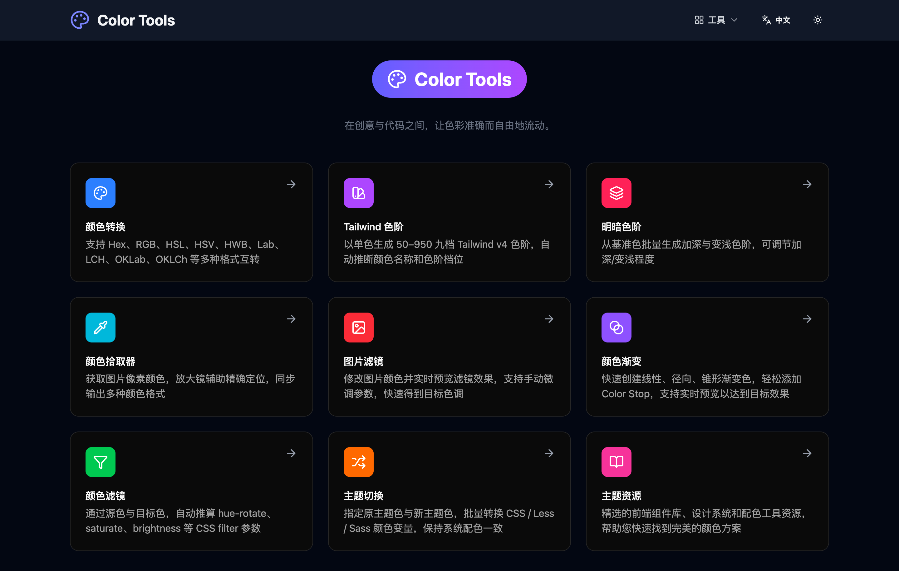

<template>
  

    

      
      
 Color Tools

    

    

      
在创意与代码之间，让色彩准确而自由地流动。

      

        <a class="cta-button" href="https://color.cp3hnu.com" target="_blank" rel="noopener noreferrer">
          Let's go
          →
        </a>
      

    

    

      

        
      

    

    

      <h2 class="features-title">功能介绍</h2>
      

        

          <h3 class="feature-name">{{ tool.name }}</h3>
          
{{ tool.description }}

        

      

    

  

</template>

