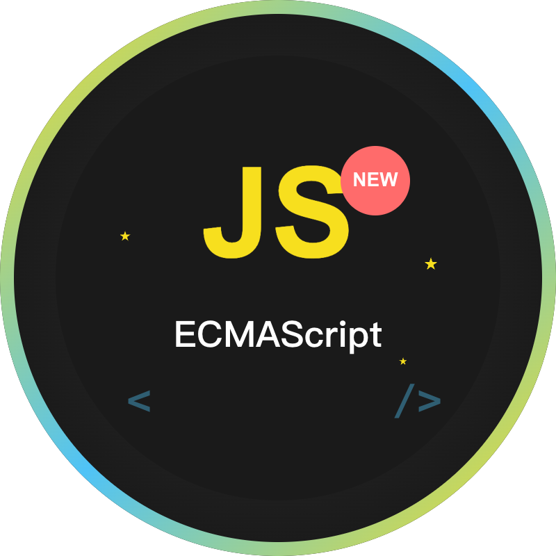
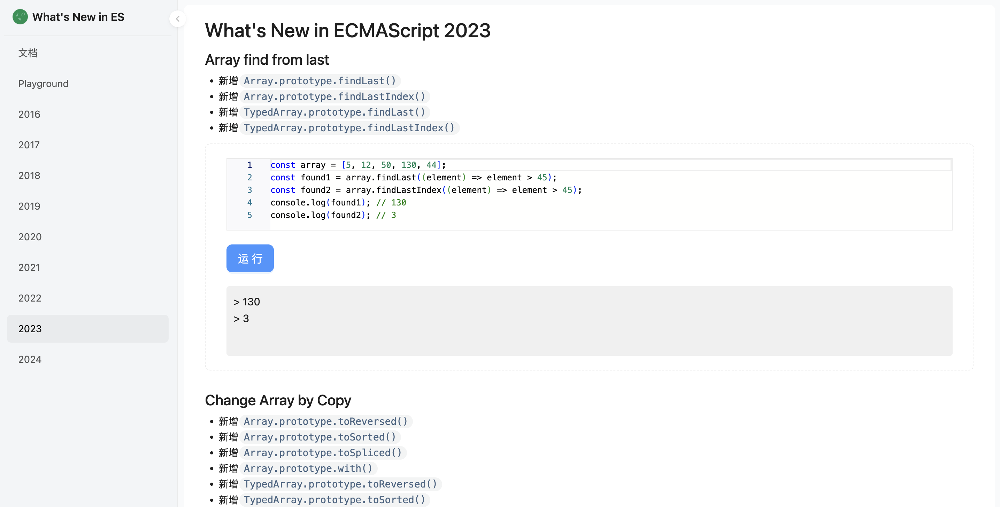

<template>
  

    

      
      
New in JS

    

    

      
A collection of new features in ECMAScript.

      

       <a href="https://new-in-ecmascript.vercel.app/" target="_blank">Online</a>
        <a style="margin-left: 10px;" href="https://cp3hnu.github.io/2022/04/09/what-s-new-ecmascript/" target="_blank">Document</a>
      

    

    

      

        
      

    

  

</template>

