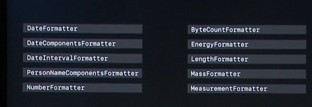
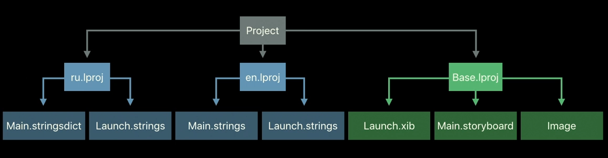
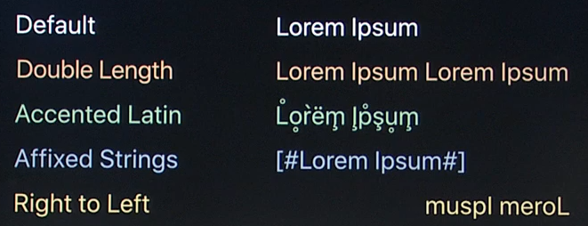

# 401-Localizing with Xcode 9

主要讲两大点

1.  Internationalization
2.  Xcode Localization Workflow

# Internationalization

## Strings Management

1.  Prepare your strings for translation
2.  Use **NSLocalizedString** to load strings in codde
3.  Use **localizedStringWithFormat** to get a localized formatted string

for example

```swift
let format = NSLocalizedString("%d popular languages", comment: "Number of popular languages")
label.text = String.localizedStringWithFormat(format, count)
```

Static analyzer, 静态分析代码中是否存在没有本地化的字符串

在 **Build Setting** 中设置

**Miss Localizability** = YES

**Miss Localization Context Comment** = YES

## Formatting



for example

```swift
let formatter = DateFormatter()
formatter.dateStyle = .full
let str = formatter.string(from: date)
```

## User Interfase



!

# Xcode Localization Workflow

## XLIFF

XML格式的文件，可以导入/导出，XliffReader

## Stringsdict

Xcode 9 新增特性，支持

1.  Plurals
2.  Adaptive Strings