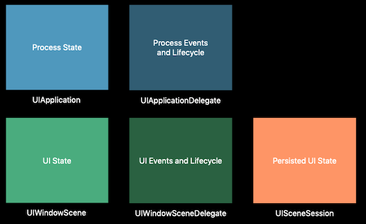
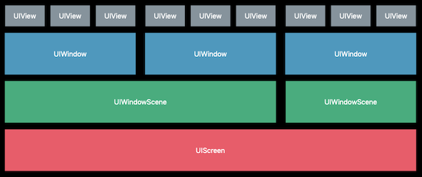
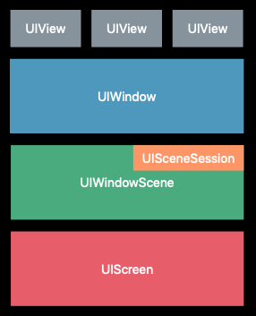

# 212-Introducing Multiple Windows on iPad

iOS 13 以前 iPad 上能同时打开多个不同的应用，我们称之为多任务（Multitasking），现在 iOS 13  iPad 上能同时打开一个应用的多个窗口，称之为多窗口。

## Conceptual Overview

iOS 13 引入 UIScene (UIWindowScene), UISceneDelegate (UIWindowSceneDelegate), UISceneSession，将UI 的管理从 UIApplicationDelegate 转移到 UIWindowSceneDelegate。



### UIScene->UIWindowScene

-   Contains UI
-   Created by the system on demand
-   Destroyed by the system when unused




### UISceneSession

-   Persisted interface state
-   Have defined system role
-   Created for new application representations
-   Scenes connect and disconnect from sessions




## API

```swift
class UIApplication {
  /// A Boolean value indicating whether the app may display multiple scenes simultaneously.
  var supportsMultipleScenes: Bool { get }
  
  /// The app's currently connected scenes.
  var connectedScenes: Set<UIScene> { get }
  
  /// The sessions whose scenes are either currently active or archived by the system.
  var openSessions: Set<UISceneSession> { get }
  
  /// Asks the system to activate an existing scene, or create a new scene and associate it with your app.
  func requestSceneSessionActivation(_ sceneSession: UISceneSession?, userActivity: NSUserActivity?, options: UIScene.ActivationRequestOptions?, errorHandler: ((Error) -> Void)? = nil)
  
  /// Asks the system to update any system UI associated with the specified scene.
  func requestSceneSessionRefresh(_ sceneSession: UISceneSession)
  
  /// Asks the system to dismiss an existing scene and remove it from the app switcher.
  func requestSceneSessionDestruction(_ sceneSession: UISceneSession, options: UISceneDestructionRequestOptions?, errorHandler: ((Error) -> Void)? = nil)
}
```

```swift
class UIWindowSceneDestructionRequestOptions : UISceneDestructionRequestOptions {
  /// The animations to use when dismissing the scene's windows.
  var windowDismissalAnimation: UIWindowScene.DismissalAnimation { get set }
}

enum UIWindowScene.DismissalAnimation : Int {
  case standard
  case commit
  case deadline
}
```

```swift
class UISceneSession {
  /// A unique identifier that persists for the lifetime of the session.
  /// This is is a string that is generated by the system.
  /// You can feel free to write it down into any databases or any files in your apps container that you use for state restoration.
  /// It will be the same identifier for the same scene every time your app is launched, even across backups and restores of devices.
  var persistentIdentifier: String { get }
  
  /// Custom attributes that you can associate with the scene.
  /// It is great for storing small amounts of data, such as per scene customizations.
  var userInfo: [String : Any]? { get set }
}
```

```swift
class UIWindowScene {
  /// The current configuration of the status bar.
  /// 代替 UIApplication 一些 status bar 相关的属性
  var statusBarManager: UIStatusBarManager? { get }
}
```

