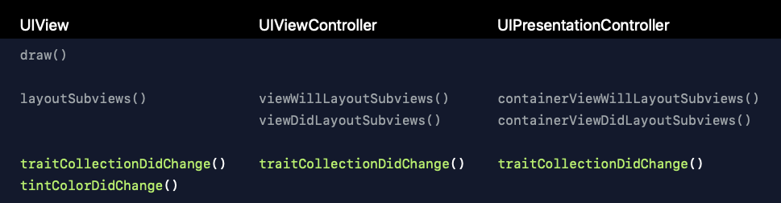
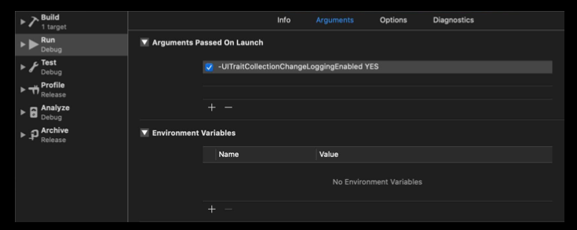

# 214-Implementing Dark Mode on iOS

## System Colors


| Color                            | Light       | Dark        |
| -------------------------------- | ----------- | ----------- |
| systemBackground                 | ffffff      | 000000      |
| secondarySystemBackground        | f2f2f7      | 1c1c1e      |
| tertiarySystemBackground         | ffffff      | 2c2c2e      |
| systemGroupedBackground          | f2f2f7      | 000000      |
| secondarySystemGroupedBackground | ffffff      | 1c1c1e      |
| tertiarySystemGroupedBackground  | f2f2f7      | 2c2c2e      |
| separator                        | 3c3c43 0.29 | 545458 0.6  |
| opaqueSeparator                  | c6c6c8      | 38383a      |
| label                            | 000000      | ffffff      |
| secondaryLabel                   | 3c3c43 0.6  | ebebf5 0.6  |
| tertiaryLabel                    | 3c3c43 0.3  | ebebf5 0.3  |
| quaternaryLabel                  | 3c3c43 0.18 | ebebf5 0.18 |
| link                             | 007aff      | 0984ff      |
| placeholderText                  | 3c3c43 0.3  | ebebf5 0.3  |
| systemFill                       | 787880 0.2  | 787880 0.36 |
| secondarySystemFill              | 787880 0.16 | 787880 0.32 |
| tertiarySystemFill               | 767680 0.12 | 767680 0.24 |
| quaternarySystemFill             | 747480 0.08 | 767680 0.18 |

[**Other System Colors**](https://developer.apple.com/design/human-interface-guidelines/ios/visual-design/color/#dynamic-system-colors)

## Materials

### UIBlurEffect

新增Style

```swift
// dynamic
case systemUltraThinMaterial = 6
case systemThinMaterial = 7
case systemMaterial = 8
case systemThickMaterial = 9
case systemChromeMaterial = 10
// light
case systemUltraThinMaterialLight = 11
case systemThinMaterialLight = 12
case systemMaterialLight = 13
case systemThickMaterialLight = 14
case systemChromeMaterialLight = 15
// dark
case systemUltraThinMaterialDark = 16
case systemThinMaterialDark = 17
case systemMaterialDark = 18
case systemThickMaterialDark = 19
case systemChromeMaterialDark = 20
```

### UIVibrancyEffect

```swift
// 新增 UIVibrancyEffectStyle
// style会忽略 contentview 上的字体颜色
init(blurEffect: UIBlurEffect, style: UIVibrancyEffectStyle)

// Vibrancy for text labels.
case label = 0
case secondaryLabel = 1
case tertiaryLabel = 2
case quaternaryLabel = 3

// Vibrancy for thicker filled areas.
case fill = 4
case secondaryFill = 5
case tertiaryFill = 6

// Vibrancy for separator lines.
case separator = 7
```

### Demo

```swift
let blur = UIBlurEffect(style: .systemMaterial)
let blurView = UIVisualEffectView(effect: blur)
let vibrancy = UIVibrancyEffect(blurEffect: blur, style: .label)
let vibrancyView = UIVisualEffectView(effect: vibrancy)
let contentView = UIView()
blurView.contentView.addSubview(vibrancyView)
vibrancyView.contentView.addSubview(contentView)
```

## Flexible

### UIColor 新增

```swift
// 返回 dynamic color 对应 traitCollection 的 color
func resolvedColor(with traitCollection: UITraitCollection) -> UIColor

// dynamic color 初始化方法
init(dynamicProvider: @escaping (UITraitCollection) -> UIColor)
```

### UITraitCollection

```swift
// dark or light
var userInterfaceStyle: UIUserInterfaceStyle { get }
// dark 模式下，base (全屏) or elevated (非全屏)
var userInterfaceLevel: UIUserInterfaceLevel { get }

// 当前模式
class var current: UITraitCollection { get set }
```

### Dynamic color 工作原理

```swift
class BackgroundView: UIView {
  override func draw(_ rect: CGRect) {
    // UIKit updates UITraitCollection.current before calling several well-known methods of UIView, UIViewController, and UIPresentationController
    // UIKit sets UITraitCollection.current = self.traitCollection
    // 然后 UIKit 根据 UITraitCollection.current 解析出具体的颜色值
    // 当 mode 改变了，UIKit 会再次调用这个方法
    UIColor.systemBackground.setFill()
    UIRectFill(rect) }
}
```

除 `draw` 方法外还有下面这些方法，可以解析 dynamic color。当 mode 改变了，UIKit 也会调用这些方法。可以在这些方法里获取 `traitCollection` ，然后改变颜色，比如 layer border color.

Layout is the best time to use trait



### Border Color

```swift
// Option 1
let resolvedColor = UIColor.label.resolvedColor(with: traitCollection)
layer.borderColor = resolvedColor.cgColor

// Option 2
traitCollection.performAsCurrent {
  layer.borderColor = UIColor.label.cgColor
}

// Option 3
let savedTraitCollection = UITraitCollection.current
UITraitCollection.current = traitCollection
layer.borderColor = UIColor.label.cgColor
UITraitCollection.current = savedTraitCollection
```

### When Dynamic Color Might Change

*UITraitCollection* 新增 `hasDifferentColorAppearance` 方法

```swift
override func traitCollectionDidChange(_ previousTraitCollection: UITraitCollection?) {
  super.traitCollectionDidChange(previousTraitCollection)
  // 只是颜色模式发生了改变
  if traitCollection.hasDifferentColorAppearance(comparedTo: previousTraitCollection) { 
    // Resolve dynamic colors again
  } 
}
```

### Image

*UIImageView* 使用 `traitCollection` 展示不同 mode 下的 image，如果你想自定义 image view，可以这么做

```swift
let image = UIImage(named: "HeaderImage")
let asset = image?.imageAsset
let resolvedImage = asset?.image(with: traitCollection)
```

### Trait Collection Changes in iOS 13

Traits are predicted during initialization

`traitCollectionDidChange(_:)` will only be called if any of those initial traits change

A trait change may not occur when you moved into the hierarchy  as before.

### Enable debug logging with launch argument

-UITraitCollectionChangeLoggingEnabled YES



### Overriding User Interface Style

让 *UIViewController* 或者 *UIView* 只使用某一种 mode 

```swift
class UIViewController {
  var overrideUserInterfaceStyle: UIUserInterfaceStyle
}

class UIView {
  var overrideUserInterfaceStyle: UIUserInterfaceStyle
}
```

让整个 app 只使用某一种 mode

在 Info.plist 设置 *UIUserInterfaceStyle* 为 Light or Dark

### Overriding Traits

Only specify values for traits you want to override, leave all of the other traits unspecified

```swift
class UIPresentationController {
  var overrideTraitCollection: UITraitCollection?
}

class UIViewController {
  func setOverrideTraitCollection(_: UITraitCollection?, forChild: UIViewController)
}

```

### Status Bar Style

新增 darkContent 用于 light mode

原来的 lightContent 用于 dark mode

### UIActivityIndicatorView Style

废弃 gray, white, whiteLarge

新增 .medium .large, 使用 `color` 属性设置颜色

### Drawing Attributed Text

使用 [.foregroundColor: UIColor.label] 设置文字颜色

