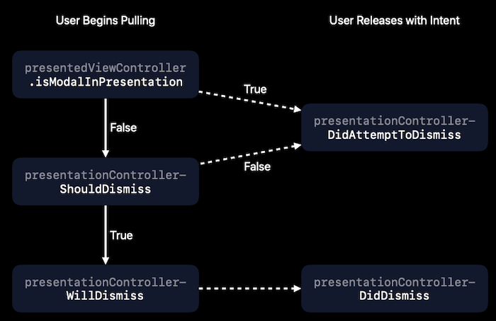

# 224-Modernizing Your UI for iOS 13

## Flexible UI

### Launch Storyboards

App Store 现在要求 App 必须包含 launch storyboard 文件

## Bars

新增 *UINavigationBarAppearance* 类，配置 NavigationBar 的外观

```swift
class UINavigationBarAppearance : UIBarAppearance {
  /// String attributes to apply to the text of a standard-size title.
  var titleTextAttributes: [NSAttributedString.Key : Any] { get set }
  
  /// String attributes to apply to the text of a large-size title.
  var largeTitleTextAttributes: [NSAttributedString.Key : Any] { get set }
  
  /// The distance, in points, by which to offset the title horizontally and vertically.
  var titlePositionAdjustment: UIOffset { get set }
  
  /// Sets the back button indicator image and its transition mask.
  func setBackIndicatorImage(_ backIndicatorImage: UIImage?, transitionMaskImage backIndicatorTransitionMaskImage: UIImage?)
  
   /// The image to display on the leading edge of the back button.
  var backIndicatorImage: UIImage { get }
  
  /// The image for masking content flowing under the back indicator image during push and pop transitions.
  var backIndicatorTransitionMaskImage: UIImage { get }
  
  /// The appearance attributes for bar button items in the navigation bar.
  var buttonAppearance: UIBarButtonItemAppearance { get set }
  var backButtonAppearance: UIBarButtonItemAppearance { get set }
  var doneButtonAppearance: UIBarButtonItemAppearance { get set }
}
```

*UINavigationBar* 和 *UINavigationItem* 新增 appearance 属性

```swift
class UINavigationBar {
  /// The appearance settings for a standard-height navigation bar.
  var standardAppearance: UINavigationBarAppearance { get set }
  
  /// The appearance settings for a compact-height navigation bar. 
  /// 除 plus、XR(11)、XS Max(11 Pro Max) 之外横屏 iPhone
  var compactAppearance: UINavigationBarAppearance? { get set }
  
  /// The appearance settings to use when the edge of any scrollable content reaches the matching edge of the navigation bar.
  /// If the value of this property is nil, UIKit uses a modified version of the settings found in the standardAppearance property.
  var scrollEdgeAppearance: UINavigationBarAppearance? { get set }
}
```

此外还新增下面这些类，分别对应相应的控件

*UIBarAppearance*

*UITabBarAppearance*

*UIToolbarAppearance*

*UITabBarItemAppearance*

*UIBarButtonItemAppearance*

*UITabBarItemStateAppearance*

*UIBarButtonItemStateAppearance*

### New

```swift
let appearance = UINavigationBarAppearance() 
appearance.configureWithOpaqueBackground()
appearance.titleTextAttributes = [.foregroundColor: myAppLabelColor]
appearance.largeTitleTextAttributes = [.foregroundColor: myAppLabelColor]
 
navigationBar.standardAppearance = appearance
```

### Deprecated

```swift
// UINavigationBar
UINavigationBar.appearance().titleTextAttributes = ...
UINavigationBar.appearance().tintColor = ...
        
let backImage = ...
UINavigationBar.appearance().backIndicatorImage = backImage
UINavigationBar.appearance().backIndicatorTransitionMaskImage = backImage
        
// UIBarButtonItem
let navbarItemTA = [...]
UIBarButtonItem.appearance(whenContainedInInstancesOf: [UINavigationBar.self]).setTitleTextAttributes(navbarItemTA, for: .normal)

UIBarButtonItem.appearance(whenContainedInInstancesOf: [UINavigationBar.self]).setTitleTextAttributes(navbarItemTA, for: .highlighted)
```

## Presentations

### 重新设计UIModalPresentationStyle的 .pageSheet 和 .formSheet 

.pagesheet 展示的页面比 .formSheet 大

在 regular height（例如：iPhone 竖屏），没有铺面全屏，有点像 stack，并且 presenting view controller 可见，iOS 13 以前效果等同于 .fullScreen。

在 compact height（例如： iPhone 横屏），等价于 .fullScreen。

在 iPad 中，居中，有点像 stack，其 size 可变（dynamic type size 改变 readable width 继而改变 view size），下面的 presenting view controller 可见。

.popover 也有变化，在 compact width,  效果等同于 Sheet。

### 新增并默认 .automatic

.automatic 的行为因 view controller 而已，系统的相册选择 view controller 是 .pageSheet，而系统的拍照 view controller 是.fullScreen，自定义的 view controller是 .pageSheet。

### .pageSheet 和 .formSheet 禁止手势 dismiss



新增属性和方法

```swift
class UIViewController {
  /// 设置 true, 阻止dismiss
  var isModalInPresentation: Bool { get set }
}

protocol UIAdaptivePresentationControllerDelegate {
  /// 当isModalInPresentation == true, 试图dismiss时，是会调用这个方法
  /// 可以在这个方法里 present sheet action
  func presentationControllerDidAttemptToDismiss(_ presentationController: UIPresentationController) 
}
```

将实现了 *UIAdaptivePresentationControllerDelegate* 协议的对象赋值给 *UIPresentingController* 的 `delete` 属性

#### Demo

```swift
// In present action of a view controller
func action() {
  let controller = CustomViewController()
  controller.presentationController?.delegate = controller
  present(controller, animated: true)
}

class CustomViewController: UIAdaptivePresentationControllerDelegate {
  func presentationControllerDidAttemptToDismiss(_ presentationController: UIPresentationController) {
    // present sheet action
  }
}
```

## Search

### 新增属性

```swift
class UISearchController {
  /// 是否自动显示/隐藏 cancel button, 默认是 true 
  /// 设置 searchBar 的 showsCancelButton 属性将导致 automaticallyShowsCancelButton 设为 false
  var automaticallyShowsCancelButton: Bool { get set }
  
  /// 是否自动显示/隐藏 scope bar, 默认是 true 
  /// 设置 searchBar 的 showsScopeBar 属性将导致 automaticallyShowsScopeBar 设为 false
  var automaticallyShowsScopeBar: Bool { get set }
  
  /// 是否自动显示/隐藏搜索结果, 默认是 true 
  /// 设置 showsSearchResultsController 将导致 automaticallyShowsSearchResultsController 设为 false
  var automaticallyShowsSearchResultsController: Bool { get set }
  
  /// true, 当 search activated, 立刻显现搜索结果
  var showsSearchResultsController: Bool { get set }
}

class UISearchBar {
  /// 终于等到它
  var searchTextField: UISearchTextField { get }
}
```

### Search token

*UISearchToken* 用于 *UISearchTextField* 中，带有图片和文字，作为一个整体能被选中和删除，以及支持 copy/paste  和 drag/drop

#### Create search token

```swift
let selectedText = field.textIn(filed.selectedTextRange)
let token = UISearchToken(icon: nil, text: selectedText)
field.replaceTextualPortion(of: field.selectedTextRange, with: token, at: field.tokens.count)
```

### textualRange (in UISearchTextField)

The beginning of the textualRange is the first nontoken character in the field, and its end is the end of the document.

## Gestures

### Selection gestures in custom text views

UITextInteraction, 提供 text selection gestures and UI for custom text views（像 UITextView, UITextField一样）.

三行代码

```swift
// Create a selection interaction for non-editable content.
let selectionInteraction = UITextInteraction(for: .nonEditable)

// Assign `textInput` to your view that implements the `UITextInput` protocol
// to get more control over the selection behavior and the text input system.
selectionInteraction.textInput = customTextView

// Add the interaction to the view.
customTextView.addInteraction(selectionInteraction)
```

### Multiple selection gestures in tables and collections 

两根手指滑动，可以将列表置为编辑模式，同时两根手指可以滑动选中多个。

带键盘的时候，按住 Shift 键或者 Command 键, 可以多选。

#### 新增 delegate 方法，collection view 也有类似的代理方法

```swift
class ViewController: UIViewController, UITableViewDelegate {
  /// 是否允许某一行可以多选 
  func tableView(_ tableView: UITableView, shouldBeginMultipleSelectionInteractionAt indexPath: IndexPath) -> Bool {
    return true
  }
  
  /// Tells the delegate when the user starts using a two-finger pan gesture to select multiple rows in a table view.
  func tableView(_ tableView: UITableView, didBeginMultipleSelectionInteractionAt indexPath: IndexPath) {
    // Replace the Edit button with Done, and put the
    // table view into editing mode.
    self.setEditing(true, animated: true)
  }
  
  /// Tells the delegate when the user stops using a two-finger pan gesture to select multiple rows in a table view
  func tableViewDidEndMultipleSelectionInteraction(_ tableView: UITableView) {}
}
```

### Editing gestures

1.  Using three fingers, users can now swipe to undo or redo. (需要使用 undo manager?)
2.  Pinching three fingers in will copy, and then pinching them out will paste.

可以禁止 editing 手势, 自定义 view, 然后 override `editingInteractionConfiguration = .none`

```swift
protocol UIResponder {
  var editingInteractionConfiguration: UIEditingInteractionConfiguration { get }
}

enum UIEditingInteractionConfiguration {
  case `default` // 默认
  case none      // 禁止
}
```

## Menus

展示菜单，新增类和协议

#### UIContextMenuInteraction 类

An interaction object that you use to display relevant actions for your content.

```swift
let interaction = UIContextMenuInteraction(delegate: self)
// Attach It to Our View
self.view.addInteraction(interaction)
```

#### *UIContextMenuInteractionDelegate* 协议

Providing the set of actions to perform on your content, and for customizing the preview of that content.

#### UIContextMenuConfiguration

An object containing the configuration details for the contextual menu.

#### UITargetedPreview

An object describing the view to use during preview-related animations.

#### UIMenuElement 类

An object representing a menu, action, or command. 下面三个类（UIMenu, UIAction, UICommand）的父类，定义 title, image, attribute 和 state

#### UIMenu 类

A container for grouping related menu elements in an app menu or contextual menu

#### UIAction 类

A menu element that performs its action in a closure.

#### UICommand 类

A menu element that performs its action in a selector.

#### UIKeyCommand 类（原来就有的，用于iPad 和 Mac）

An object that specifies a key press performed on a hardware keyboard and the resulting action.

### Demo

3D Touch/Haptic Touch/Long press/Secondary click (Mac)，弹出菜单

```swift
class ViewController: UIViewController {
  func addInteraction() {
    // Create a UIContextMenuInteraction with Some Delegate
    let interaction = UIContextMenuInteraction(delegate: self)

    // Attach It to Our View
    self.view.addInteraction(interaction)
  }
}

// Delegate
extension ViewController: UIContextMenuInteractionDelegate {
  /// 创建 menu content 和 content preview view controller (可选)
  func contextMenuInteraction(_ interaction: UIContextMenuInteraction, configurationForMenuAtLocation location: CGPoint) -> UIContextMenuConfiguration? {
    let actionProvider = { (suggestedActions: [UIMenuElement]) -> UIMenu? in
      let editMenu = UIMenu(title: "Edit...", children: [
        UIAction(title: "Copy") { ... },
        UIAction(title: "Duplicate") { ... }
      ])
      return UIMenu(title: "", children: [
        UIAction(title: "Share") { ... },
        editMenu,
        UIAction(title: "Delete", attributes: .destructive) { ... }
      ])
    }
    return UIContextMenuConfiguration(identifier: "unique-ID" as NSCopying,
      previewProvider: nil,
      actionProvider: actionProvider)
  }

  /// Returns the source view to use when animating the appearance of the preview interface.
  func contextMenuInteraction(_ interaction: UIContextMenuInteraction, previewForHighlightingMenuWithConfiguration configuration: UIContextMenuConfiguration) -> UITargetedPreview? {
    let parameters = UIPreviewParameters()
    parameters.backgroundColor = UIColor.clear
    let visibleRect = label.bounds.insetBy(dx: -10, dy: -10)
    let visiblePath = UIBezierPath(roundedRect: visibleRect, cornerRadius: 10.0)
    parameters.visiblePath = visiblePath
    return UITargetedPreview(view: label, parameters: parameters)
  }
  
  /// Returns the destination view to use when animating the appearance of the preview interface.
  func contextMenuInteraction(_ interaction: UIContextMenuInteraction, previewForDismissingMenuWithConfiguration configuration: UIContextMenuConfiguration) -> UITargetedPreview? {
    
  }
}
```

### UITableView and UICollectionView

```swift
protocol UITableViewDelegate {
  func tableView(_ tableView: UITableView, contextMenuConfigurationForRowAt indexPath: IndexPath, point: CGPoint) -> UIContextMenuConfiguration? 

  func tableView(_ tableView: UITableView, previewForDismissingContextMenuWithConfiguration configuration: UIContextMenuConfiguration) -> UITargetedPreview?
  
  func tableView(_ tableView: UITableView, previewForHighlightingContextMenuWithConfiguration configuration: UIContextMenuConfiguration) -> UITargetedPreview?
  
  func tableView(_ tableView: UITableView, willPerformPreviewActionForMenuWith configuration: UIContextMenuConfiguration, animator: UIContextMenuInteractionCommitAnimating)
}
```

*UICollectionViewDelegate* 类似

### Peek and Pop (deprecated)

*UIViewControllerPreviewing* is deprecated，使用 *UIContextMenuInteraction* 代替


