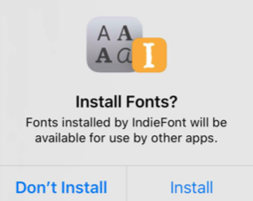
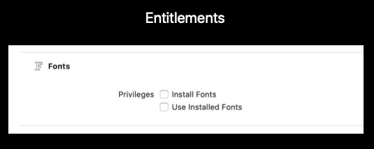
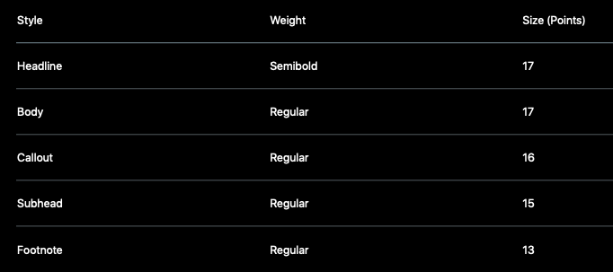

# 227-Font Management and Text Scaling

## New system fonts

-   Rounded: used in Schedule
-   Serif: used in Book
-   Monospaced: used in Swift Playground

#### New API

```swift
extension UIFontDescriptor.SystemDesign {
  static let `default`: UIFontDescriptor.SystemDesign
  static let rounded: UIFontDescriptor.SystemDesign
  static let serif: UIFontDescriptor.SystemDesign
  static let monospaced: UIFontDescriptor.SystemDesign }
  open func withDesign(_ design: UIFontDescriptor.SystemDesign) -> UIFontDescriptor?
}
```

#### Demo

```swift
let descriptor = UIFont.systemFont(ofSize: 17.0, weight: .bold).fontDescriptor
if let roundedDescriptor = descriptor.withDesign(.rounded) {
let roundedBoldFont = UIFont(descriptor: roundedDescriptor, size: 0.0)
  //
}
```

## Installing and accessing user fonts

**Font Provider**—Installing Fonts

-   Ability to register fonts system wide
-   Setting app to manage fonts



-   Entitlements—Fonts

    

#### New API

**CoreText/CTFontManager.h**

*CTFontManagerRegisterFontURLs*

*CTFontManagerUnregisterFontURLs*

*CTFontManagerRegisterFontDescriptors*

*CTFontManagerUnregisterFontDescriptors*

*CTFontManagerRegisterFontsWithAssetNames*

*CTFontManagerCopyRegisteredDescriptors*

*CTFontManagerRequestFonts*

**Font Consumer**—Loading Fonts

## Font selection

新增 **UIFontPickerViewController**, 在 Mac 上作为 Menu 展示，因为需要展示在按钮上，因此需要使用 **UIPopoverPresentationController** 来控制

UIPopoverPresentationController 是 UIPresentationController 的子类，用于控制 presentation style = `UIModalPresentationStyle.popover ` 的展示效果

**UITextFormattingCoordinator** 在 Mac 上展示 Font Panel

Adopt some of the new ***UIResponderStandardEditActions*** protocol methods in order to be notified when changes are made through the Font Panel, for example `updateTextAttributes` method

#### Demo

```swift
func updateTextAttributes(conversionHandler: UITextAttributesConversionHandler) {
  // Create a new mutable string
  let newString = NSMutableAttributedString(string: attributedString.string)
  // Enumerate attributes to modify
  attributedString.enumerateAttributes(in: NSMakeRange(0, attributedString.length),
  options: []) { (attributeDictionary, range, stop) in
    // Get the updated attributes
    newString.setAttributes(conversionHandler(attributeDictionary), range: range)
  }
}
```

## Text scaling

Visual consistency impacts cross-platform user experience

-   iPad Apps for Mac
-   Copy and Paste
-   Document interchange



17 point in iOS

13 point in Mac

#### New API

```swift
enum NSTextScalingType {
  case iOS       // in iOS
  case standard  // in Mac
}

class UITextView {
  var usesStandardTextScaling: Bool { get set }
}

static let textScaling: NSAttributedString.DocumentAttributeKey 
static let sourceTextScaling: NSAttributedString.DocumentAttributeKey
static let targetTextScaling: NSAttributedString.DocumentReadingOptionKey
static let sourceTextScaling: NSAttributedString.DocumentReadingOptionKey
```


