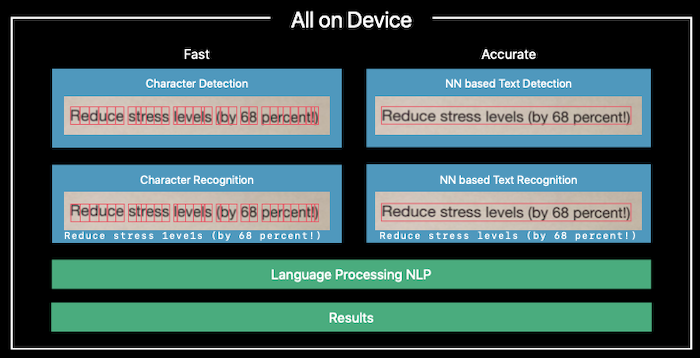
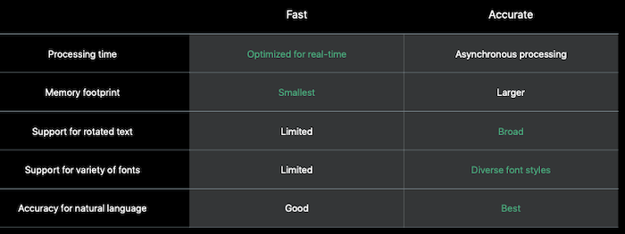

# 234-Text Recognition in Vision Framework

以前 Vision 只能识别 text rectangles ( *VNDetectTextRectanglesRequest* )。iOS 13 新增 *VNRecognizeTextRequest* 类，用于识别 text。

现在只支持 **en_US**。

> iOS 14 的 VNRecognizeTextRequestRevision2 现在已经支持 en-US, fr-FR, it-IT, de-DE, es-ES, pt-BR, zh-Hans, zh-Hant。

```swift
let array = try? VNRecognizeTextRequest.supportedRecognitionLanguages(for: .fast, revision: VNRecognizeTextRequestRevision1)
// 输出：["en_US"]
// .accurate 也是一样的
// 说明在 VNRecognizeTextRequestRevision1 下只支持英语
```

## How Text Recognition works

Text recognition 有两种方式，**Fast** 和 **Accurate**

Fast：一个字符一个字符识别，组成 text

Accurate：使用先进的神经网络 (neural network) 识别 text

### 结构



### 对比


## Example applications

### 样例代码

```swift
// 创建 request handler
let myRequestHandler = VNImageRequestHandler(url: fileURL, options: [:])
// 创建 request
let myTextRecognitionRequest = VNRecognizeTextRequest()
// 设置 request completion handler
myTextRecognitionRequest.completionHandler = { (request, error) in
  // 确定 VNRecognizedTextObservation
  guard let results = request.results as? [VNRecognizedTextObservation] else {
    return
  }
  // 多行
  for visionResult in results { 
    // 候选数量
    let maximumCandidates = 1
    guard let candidate = visionResult.topCandidates(maximumCandidates).first else {
      continue
    }
    
    // 识别出的 text
    print(candidate.string)
 
    // bounding box
    let boundingBox = visionResult.boundingBox
     
    if let range = candidate.string.range(of: "stress"),
      let boxObservation = try? candidate.boundingBox(for: range) {
      // stress 单词的 bounding box
      let foundTextBox = boxObservation.boundingBox
    }
  }
}
 
// Select the recognition level
myTextRecognitionRequest.recognitionLevel = VNRequestTextRecognitionLevel.accurate
// Set the revision
myTextRecognitionRequest.revision = VNRecognizeTextRequestRevision1
// 是否自动更正
myTextRecognitionRequest.usesLanguageCorrection = true
  
// Send the request to the request handler
try myRequestHandler.perform([myTextRecognitionRequest])
```

### Phone Number Reader

[Reading Phone Numbers in Real Time](https://developer.apple.com/documentation/vision/reading_phone_numbers_in_real_time)

### Document Camera

```swift
import VisionKit

func present() {
  let documentCameraViewController = VNDocumentCameraViewController()
  documentCameraViewController.delegate = self
  present(documentCameraViewController, animated: true)
}

func documentCameraViewController(_ controller: VNDocumentCameraViewController, didFinishWith scan: VNDocumentCameraScan) {
  controller.dismiss(animated: true) {
    textRecognitionWorkQueue.async {
      for pageIndex in 0 ..< scan.pageCount {
        let image = scan.imageOfPage(at: pageIndex) 
        if let cgImage = image.cgImage {
          let requestHandler = VNImageRequestHandler(cgImage: cgImage, options: [:])
          do {
            try requestHandler.perform(self.requests)
          } catch {
            print(error)
          } // do
        } // if
      }  // for
    } // queue
  } // dismiss
}
```

[Simple Text Recognition](https://developer.apple.com/documentation/vision/locating_and_displaying_recognized_text_on_a_document)

## Best practices

[My First Image Reader](https://developer.apple.com/documentation/vision/locating_and_displaying_recognized_text_on_a_document)

[Locating and Displaying Recognized Text on a Document](https://developer.apple.com/documentation/vision/locating_and_displaying_recognized_text_on_a_document)

### Processing Results

#### Use Geometry to Map Results
Compare spatial information

-   Position and scale
-   Rotation

#### Use Parsers to Label Results
Data Detectors

-   NSDataDetector for types of interest
-   Addresses, URLs, dates, and phone numbers

Domain-specific filters

-   Your own lexicon 
-   Regular expressions


## VNRecognizeTextRequest 其它属性

```swift
// 识别的语言，目前只支持 en_US
var recognitionLanguages: [String]

// 自定义单词，某些特殊单词
var customWords: [String]

// 识别单词最小高度，单位是图片高度
var minimumTextHeight: Float

// 识别单词最小高度，单位是图片高度
var minimumTextHeight: Float

// 识别区域 0~1.0
var regionOfInterest: CGRect

// 只使用CPU，把 GPU 和 Neural Engine 用于优先级高的应用
var usesCPUOnly: Bool

// 识别进度报告
var progressHandler: VNRequestProgressHandler
```

