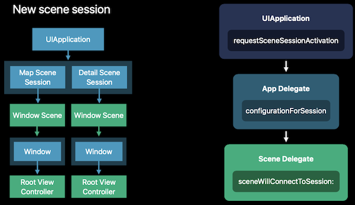
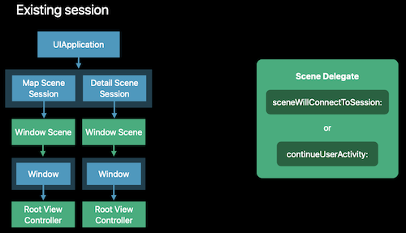
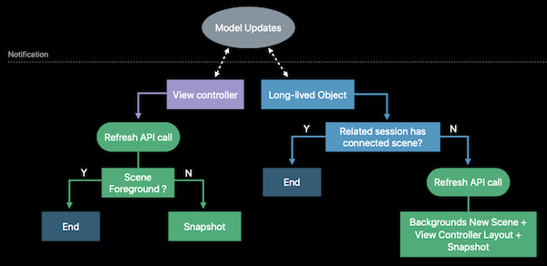

# 246-Window Management in Your Multitasking App

## Activate

Activate a session only in response to direct and local user interaction

```swift
@UIApplicationMain
class AppDelegate: UIResponder, UIApplicationDelegate {
  func activateSessionForClown(_ clown: Clown!, sourceScene: UIWindowScene?, errorHandler: ((Error) -> Void)? = nil) {
    let existingSession = existingSessionForClown(clown)
    // The userActivity is passed to UIScene.ConnectionOptions of scenewillConnectToSession.
    let userActivity = userActivityForClown(clown)
    let options = UIScene.ActivationRequestOptions.init()
    // The system uses this information to avoid replacing the requestingScene with the activated one.
    options.requestingScene = sourceScene
    UIApplication.shared.requestSceneSessionActivation(existingSession, userActivity: userActivity, options: options, errorHandler: errorHandler)
  }
}
```

### New Session



### Existing Session



For disconnected session, call sceneWillConnectToSession.

For connected session, call continueUserActivity

## Refresh
Refresh a session for user-relevant updates. 比如保持多个窗口同步。

```swift
func requestSceneSessionRefresh(_ sceneSession: UISceneSession)
```




>   Backgrounds New Scene: The scene is going then to be background connected

## Destroy

Destroy a session only in response to direct user interaction.

```swift
func requestSceneSessionDestruction(_ sceneSession: UISceneSession, options: UISceneDestructionRequestOptions?, errorHandler: ((Error) -> Void)? = nil)
```

### Animation

```swift
enum UIWindowScene.DismissalAnimation: Int {
  case standard
  case commit
  case decline
}

class UIWindowScene.DestructionRequestOptions: UIScene.DestructionRequestOptions {
  var windowDismissalAnimation: UIWindowScene.DismissalAnimation
}
```

