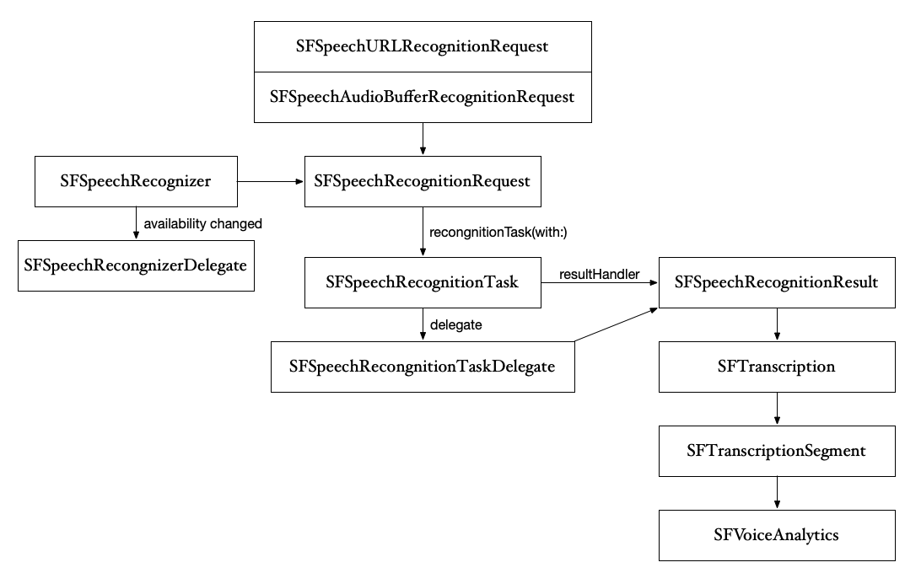

# 256-Advances in Speech Recognition

## What's New

### Support for macOS

*   Supports both AppKit and iPad apps
*   50+ languages supported
*   required privacy approval
*   must have Siri enabled

### On-Device Speech Recognition

*   Speech is private, stays on-device
*   Network connection not required
*   No cellular data consumption
*   iPhone 6s and later; iPad (5th generation) and later; All mac

#### Server VS  On-Device

|           | Server                                   | On-Device |
| --------- | ---------------------------------------- | --------- |
| Accuracy  | Best                                     | Good      |
| Limits    | 1 minute max audio duration; Limited requests per day | None      |
| Languages | 50+                                      | 10+       |

#### On-Device Languages


#### Code

```swift
let locale = Locale(identifier: "en-US")
speechRecongnizer = SFSpeechRecognizer(locale: locale)!
// 是否支持 On Device
// supportsOnDeviceRecognition 这个属性有疑问，它竟然是可写的，本身是 false 设为 true 有用吗？(经测试没有，应该要改为只读)
if speechRecognizer.supportsOnDeviceRecognition {
    // 要求识别必须 On Device，不请求网络
	request.requiresOnDeviceRecognition = true
}
```

### Speech Recognition Results 		

*   Speaking rate
*   Average pause duration
*   Voice Analytics features


### Voice Analytics Features (SFVoiceAnalytics)

#### Pitch

Measures frequency characteristics of voice

#### Voicing

Identifies voiced regions in speech

#### Shimmer

Measures variation in amplitude

#### Jitter

Measures variation in pitch

### 类结构图

