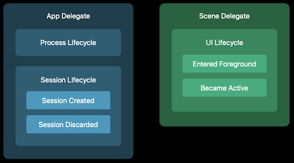
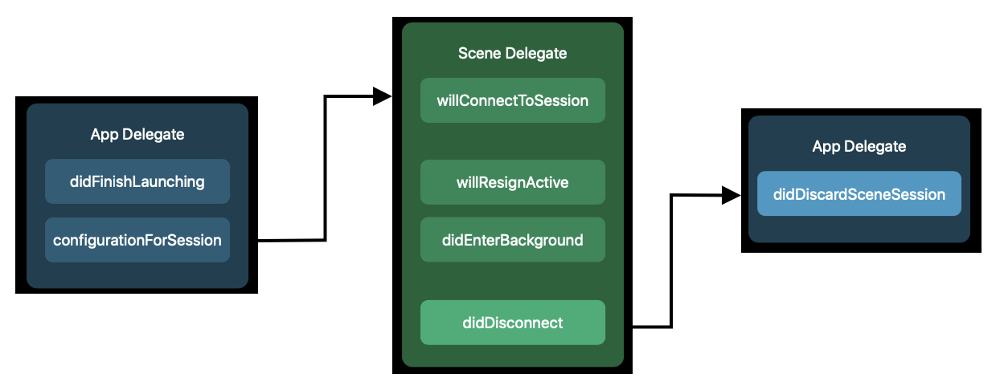
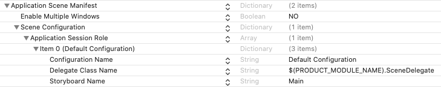
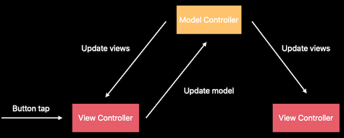

# 258-Architecting Your App for Multiple Windows

## Changes to app lifecycle

iOS 13 支持多 window，为了支持多 window， 引入 Scene Delegate，将 UI Lifecycle 从 App Delegate 移动到  Scene Delegate。现在 Scene Delegate 负责 UI Lifecycle，App Delegate 负责 Process Lifecycle (App Launched, App Terminated, ...) 和 Session Lifecycle。

iOS 13 以前，App 有一个进程和一个用户界面，而 iOS 13 App 多个用户界面（scenes）共享一个进程。



##  Lifecycle


## Configuring new session

创建  scene configurations 有两种方式，一个是在 info.plist 进行配置，一个是编码

#### info.plist

现在用 Xcode 11 新建一个工程，默认就是这个方式


***UISceneConfigurations***

The default configuration details for UIKit to use when creating new scenes. Two keys:

 `UIWindowSceneSessionRoleApplication`

Scenes that you use to display content on the device's main screen and respond to user interactions.

`UIWindowSceneSessionRoleExternalDisplay`

Scenes that you use to display content on an externally connected display.

#### Programming

```swift
class AppDelegate: UIResponder, UIApplicationDelegate {
  /// Returns the configuration data for UIKit to use when creating a new scene.
  func application(_ application: UIApplication, configurationForConnecting connectingSceneSession: UISceneSession, options: UIScene.ConnectionOptions) -> UISceneConfiguration {
    // Called when a new scene session is being created.
    // Use this method to select a configuration to create the new scene with.
    let config = UISceneConfiguration()
    config.sceneClass = UIWindowScene.self
    config.delegateClass = SceneDelegate.self
    config.storyboard = UIStoryboard(name: "Main", bundle: nil)
    return config
  }
}
```

#### Without storyboard

```swift
class SceneDelegate: UIResponder, UIWindowSceneDelegate {
    var window: UIWindow?
    func scene(_ scene: UIScene, willConnectTo session: UISceneSession, options connectionOptions: UIScene.ConnectionOptions) {
        // Use this method to optionally configure and attach the UIWindow `window` to the provided UIWindowScene `scene`.
        // If using a storyboard, the `window` property will automatically be initialized and attached to the scene.
        // This delegate does not imply the connecting scene or session are new (see `application:configurationForConnectingSceneSession` instead).
        guard let windowScene = (scene as? UIWindowScene) else { return }
        
        window = UIWindow(windowScene: windowScene)
        let viewController = ...
        window?.rootViewController = viewController
        window?.backgroundColor = UIColor.white
        window?.makeKeyAndVisible()
    }
  }
```

## State restoration

```swift
class SceneDelegate: UIResponder, UIWindowSceneDelegate {
  // 保存
  func stateRestorationActivity(for scene: UIScene) -> NSUserActivity? {
    let currentActivity = fetchCurrentUserActivity(for: self.window)
    return currentActivity
  }
  // 恢复
  func scene(_ scene: UIScene, willConnectTo session: UISceneSession, options: UIScene.ConnectionOptions)
    if let restorationActivity = session.stateRestorationActivity {
      self.configure(window: window, with: restorationActivity)
  }
}
```

## Keeping scenes in sync 

为了同步 scenes, 现在不能只更新一个 view controller, 需要更新 model, 然后由 model 更新 所有相关的 view controller，可以使用 delegates,  notifications, 新增的 Combine Framework等



### Demo

```swift
class ChatViewController: UIViewController {
  @objc func didEnterMessage(sender: UITextField) {
    let message = Message(text: sender.text)
    // Update the model
    ChatModelController.shared.add(message: message)
  }
  
  override func viewDidLoad() {
    // 接收通知，更新 UI
    NotificationCenter.default.addObserver(selector: ..., name: .NewMessageNotification)
  }
}

class ChatModelController {
  static let shared = ChatModelController()
  func add(message: Message) {
    saveToDisk(message)
    let event = UpdateEvent.NewMessage(message: message)
    event.post()
  }
}

enum UpdateEvent {
  case NewMessage(message: Message)
  static let NewMessageNotification = Notification.Name(rawValue: "NewMessage")
  func post() {
    // Notify subscribers
    switch self {
      case .NewMessage(message: _):
        NotificationCenter.default.post(name: UpdateEvent.NewMessageNotification, object: self)
    }
  }
}
```

## Classes and Protocols

***UISceneConfiguration***

Information about the scene, scene delegate and storyboard for UIKit to use when creating a particular scene.

***UISceneSession***

An object containing information about one of your app's scenes.

***UIScene*** -> ***UIWindowScene***

An object that represents one instance of your app's user interface.

***UISceneDelegate*** ->  ***UIWindowSceneDelegate***

The core methods you use to respond to life-cycle events occurring within a scene.

***UIScene.ConnectionOptions***

A data object containing information about the reasons why UIKit created the scene.

***UISceneActivationConditions***

The set of conditions that define when UIKit activates the current scene.

