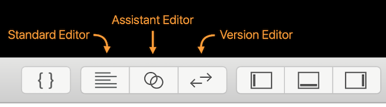
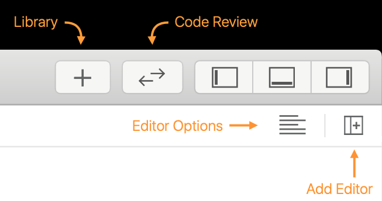
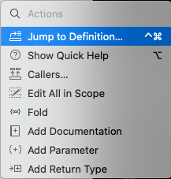
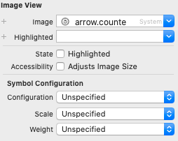
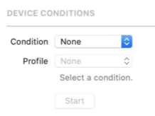

# 401-What's New in Xcode

## Source editor





把 Source Control History 从 Version Editor 移动到 Inspectors

添加 Editor Options 和 Add Editor

按住 option 键改变  Add Editor 的方向

Destination Chooser: 按住 option 键和 shift 键，然后选择文件，再通过方向键选择用哪个 Editor 窗口打开文件

Source Control: Show Change 点击显示以前的改变

command + shift + L 打开 Library

command + option + shift + L 打开 Library，并保持

### Minimap

可以显示 mark、函数、搜索字符、断点、source  change等

按住 command 键显示所有函数 

### Action 

command + 点击函数



添加 Callers、Add Documentation、Add Parameter、Add Return Type  

## Source Control

新增 git stash 操作和 git cherry-pick 操作 

如果想将 test 分支中的 C2 commit 合并到 master 分支，丢弃 C3 的修改。直接 merge 会把 C3 也合并进去，这时用 git cherry-pick 可以解决问题

-   git log，记录 C2 commit id
-   git checkout master
-   git cherry-pick C2_commit_id

如果出现冲突，

-   先解决冲突
-   git add 将解决了冲突的文件添加到暂存区
-   git cherry-pick --continue

##  Design Tools

新增 mac 设备预览、dark mode 预览、image 添加 System Symbol、Symbol Configuration


与之对应的 API 是

```swift
// UIImage
init?(systemName name: String, withConfiguration configuration: UIImage.Configuration?)
```

## Debugging

新增 Network and Temperature Conditions




