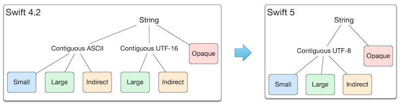

# 402-What's New in Swift

## Overview

-   [Shared Swift Runtime for Apps](#shared-swift-runtime-for-apps)
-   [Binary Frameworks](#binary-frameworks)
-   [Library Evolution](#library-evolution)
-   [Shared Swift Runtime for Apps](#shared-swift-runtime-for-apps)
-   [UTF-8 String](#utf-8-string)
-   [Swift Tooling and Open Source](#swift-tooling-and-open-source )
-   [Language and Standard Library](#language-and-standard-library)

## Binary Frameworks

[ABI Stability and More](https://swift.org/blog/abi-stability-and-more/)

[Swift ABI 稳定对我们到底意味着什么](https://onevcat.com/2019/02/swift-abi/)

[Evolving Swift On Apple Platforms After ABI Stability](https://swift.org/blog/abi-stability-and-apple/)

Module + ABI stability 
= Binary frameworks

详情请看 [Binary Frameworks in Swift](416-Binary%20Frameworks%20in%20Swift.md)

### 什么是 ABI Stability

ABI = “Application Binary Interface”

Specifies details of a program’s representation at runtime

Compatible ABIs allows separately compiled code to interact at runtime

ABI 决定了编译后的代码在运行时如何交互，比如像函数调用这样的细节。

它到底是怎么工作的？参数中的值如何从调用方传递到被调用方？可用的元数据是什么？它在内存中是如何布局的？所有这些细节都是编译后的代码进行交互所必需的。

Exec 使用来自 Framework 的 API，它们必须能够在运行时相互通信。为了让这个工作，他们必须有一个兼容的 ABI。Exec 和 Framework 是独立编译的，但编译后的代码需要协同工作。在 ABI 稳定性之前，我们唯一的保证是，如果使用同一个编译器构建这些 ABI，它们将具有兼容的 ABI。所以 ABI Stability 以前，编译的 App Bundle 里面有 Swift runtime。

在 Swift 5 中，我们已经明确了这些细节，Swift 5 现在具有 ABI 稳定性，这意味着 App 和 Framework 不再需要用同一个编译器构建，只要它们是用 Swift 5 编译器或更高版本构建的就可以了。Swift runtime 已经存在 iOS 、macOS、tvOS 以及 watchOS 系统里了。


### ABI Stability 带来的好处

1.  App Size 减少。对于 iOS 12.2 的系统，因为它们预装了 Swift 5 的 runtime，所以不再需要 Swift 的库，它们会被从 app bundle 中删掉。
2.  因为系统集成了 Swift，所以大家都用同一个 Swift 了，App 启动的时候也就不需要额外加载 Swift，所以在新系统上会更快更省内存。
3.  对于 Apple 的工程师来说，他们终于能在系统的框架里使用 Swift 了。这样一来，很多东西就不必通过 Objective-C wrap 一遍，这会让代码运行效率提高很多。

### ABI Stability 带来的坏处

在 ABI 稳定之前，Swift runtime 是作为开发工具的一部分，被作为库打包到 app 中的。这样一来，在开发时，我们可以随意使用新版本 Swift 的类型或特性，因为它们的版本是开发者自己决定的。不过，当 ABI 稳定后，Swift runtime 变为了用户系统的一部分，它从开发工具，变为了运行的环境，不再由我们开发者唯一决定。比如说，对应 iOS 13 的 Swift 5.1 的标准库中添加了某个类型 `A`，但是在 iOS 12.2 这个只搭载了 Swift 5 的系统中，并没有这个类型。这意味着我们需要在使用 Swift 的时候考虑设备兼容的问题：如果你需要兼容那些搭载了旧版本 Swift 的系统，那你将无法在代码里使用新版本的 Swift runtime 特性。

这和我们一直以来适配新系统的 API 时候的情况差不多，在 Swift 5 以后，我们需要等到 deploy target 升级到对应的版本，才能开始使用对应的 Swift 特性。这意味着，我们可能会需要写一些这样的兼容代码：

```swift
if #available(iOS 13.0, *) {
    // Swift 5.1 标准库中存在 A
    let a = A()
} else {
    // 不存在 A 时的处理
}
```

对于"新添加的某个类型"这种程度的兼容，我们可以用上面的方式处理。但是对于更靠近语言层面的一些东西 (比如现在已有的 `Codable` 这样的特性)，恐怕适配起来就没有那么简单了。在未来，Deployment target 可能会和 Swift 语言版本挂钩，新的语言特性出现后，我们可能需要等待一段时间才能实际用上。而除了那些纯编译期间的内容外，任何与 Swift runtime 有关的特性，都会要遵守这个规则。

### 	什么是 Module Stability

Swift libraries and the APIs they export are known as “modules”

ABI Stability 是关于在运行时混合不同的 Swift 版本。Module Stability 是关于编译时，主要是针对App使用的第三方库。以前用 Carthage 管理第三方库，当升级 Xcode 时，重新编译 App 的时候，经常提示第三库不是用当前编译器编译的，Module Stability 就是用来解决这个问题的。

以前，如果使用一个 Framework提供的 API，则这些 API 称为模块，是共享命名空间的一部分。当 Swift 编译器构建该 Framework 时，它会生成该 Framework 中所有 API 的清单(manifest)，这个清单被称为 Swift module file。Swift module file与当前的 Swift 编译器绑定，这意味着如果 Framework 是用不同版本的 Swift 编译器构建的，应用程序开发人员就无法导入这个Framework。也就是说，应用程序开发人员和库作者必须使用相同版本的编译器。

在 Swift 5.1中，我们引入了一个新的补充清单，它被称为 Swift module interface file，它更像是一个源文件。框架可以使用它来提供一个稳定的接口。现在 App 和 Framework 可以用不同的编译器进行编译。


## Library Evolution

现在，当 Swift Library 发生变化时，任何使用该 Library 的 App 必须重新编译。优点：因为编译器知道应用程序正在使用的 Library 的确切版本，所以它可以做出额外的假设，从而减少代码大小并使 App 运行得更快。但这些假设在 Library 的下一个版本的中可能不成立。

Library Evolution：发布 Library 新版本时，不需要重新编译 App。

Swift 已经实现了对 Library Evolution 的支持，非正式地称为**弹性(resilience)**。对于需要它的 Library 来说，这是一个可选的特性，它使用还没有定稿的标注在性能和未来灵活性之间取得平衡。这在标准库的源代码中可以看到。在 Swift 4.2（[SE-0193](https://github.com/apple/swift-evolution/blob/master/proposals/0193-cross-module-inlining-and-specialization.md)）中添加了@inlineable，这是第一个 Swift Evolution 过程，期待将来更多关于 Swift Evolution 的提议。

## Shared Swift Runtime for Apps 

In the OS

-   iOS 12.2
-   macOS 10.14.4
-   tvOS 12.2
-   watchOS 5.2

iOS 12.2 及以上的系统使用 iOS 系统里的 Swift Runtime，iOS 12.2 以下的系统使用App Bundle里的 Swift Runtime。

从 App Store 下载 App 时，如果 target 运行的是 iOS 12.2 及以上的系统，则thins out runtime copy。

### 疑问

Swift 5.1 的新特性能正常运行在 iOS 12.2（Swift 5 Runtime）上吗？

答：有的可以，有的不可以

比如 **Opaque return types** 这个新特性就不行，必须运行在iOS 13上，而 **Property Wrappers**  和 **Implicit returns from single-expression functions** 这个新特性就可以。如果不能运行 Xcode 编译时会提示。

## UTF-8 String

出于性能考虑，Swift 5 将 string 的编码方式由 UTF-16 转化为UTF-8， [UTF-8 String](https://swift.org/blog/utf8-string/)


String 结构变化


## Swift Tooling and Open Source

### SwiftNIO

[SwiftNIO](https://github.com/apple/swift-nio) is a cross-platform asynchronous event-driven network application framework for rapid development of maintainable high performance protocol servers & clients.

#### SourceKit-LSP

[SourceKit-LSP](https://github.com/apple/sourcekit-lsp): Language Server Protocol implementation for Swift and C-based languages.  The SourceKit-LSP defines the protocol used between the editor or IDE and a language server that provides language features like autocomplete, jump to definition, or find our references. Using SourceKit-LSP, IDEs are editors which support the language server protocol, get these features for Swift packages.


## Language and Standard Library

[What‘s New in Swift](https://github.com/cp3hnu/What-s-New-in-Swift)