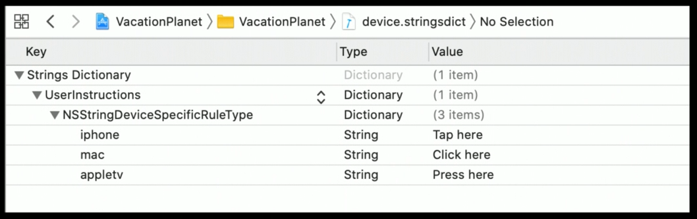

# 403-Creating Great Localized Experiences with Xcode 11

## New localization features

iOS 13 每个 App 现在可以自由切换 language

API

```swift
Locale.preferredLanguages
// 返回用户在 “设置”-"语言和地区"中设置的语言列表
Bundle.main.preferredLocalizations
// 综合用户设置的语言列表和App支持的语言列表
Bundle.preferredLocalizations(from localizationsArray)
// 综合用户设置的语言列表和localizationsArray里的语言列表，一般是服务器支持的语言
```

## Localization workflow improvements

新增 device-specific strings

-   One `NSLocalizedString()` call
-   Device-specific strings defined in the .stringsdict
-   Can be combined with plural and variable width rules

NSStringDeviceSpecificRuleType

-   appletv
-   applewatch
-   ipad
-   iphone
-   ipod
-   mac

#### Example



Asset image 支持本地化了

## Localized screenshots with XCTest

支持本地化 screenshot

