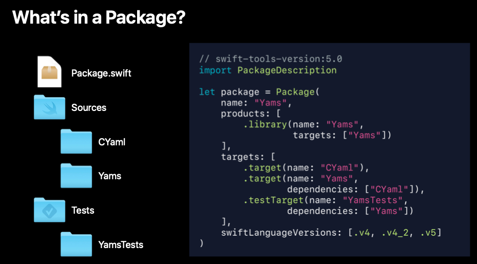

# 408-Adopting Swift Packages in Xcode

## Overview

-   [Using an open source package](#using-an-open-source-package)
-   [A closer look at packages](#a-closer-look-at-packages)
-   [Package resolution in more detail](#package-resolution-in-more-detail)
-   [Updating packages](#updating-packages)
-   [Resolving package conflicts](#resolving-package-conflicts)

## Using an open source package

File -> Swift Packages -> Add Package Dependency

你使用 package manager 管理你的 package 版本, 并遵循 [Semantic Versioning](https://semver.org/) 里的策略。

Xcode has created a directory called SwiftPM, that's for the Swift Package Manager, underneath the shared data, underneath the workspace. 

Xcode stores information about the package versions that resolved. And you want to check that in so that everybody on your team gets the same versions.

## A closer look at packages

The Package is a directory that contains a Swift Package manifest. The manifest is a file called Package.swift, and it identifies that directory as a Swift Package.

## Package resolution in more detail

Package resolution is the process that Xcode selects the versions of packages to use inside of your workspace.

Xcode 帮助你找到正确的版本的 package。

不要直接 import 间接依赖的 package，因为直接依赖的 package 可能随时不依赖这个 package。要想使用这个间接依赖的 package，在工程中创建一个直接依赖。

## Updating packages

File -> Swift Packages -> Update to Latest Package Versions.

It updates package.resolved file and Xcode will pull down the new versions for you.

package.resolved records version information about all the packages inside of your workspace. This file is typically shared with your team and source control. 

package.resolved is at xxx.xcodeproj/project.xcworkspace/xcshareddata/swiftpm

## Resolving package conflicts

In SwiftPMs integration into Xcode, you can only have one version of a package in a workspace.

