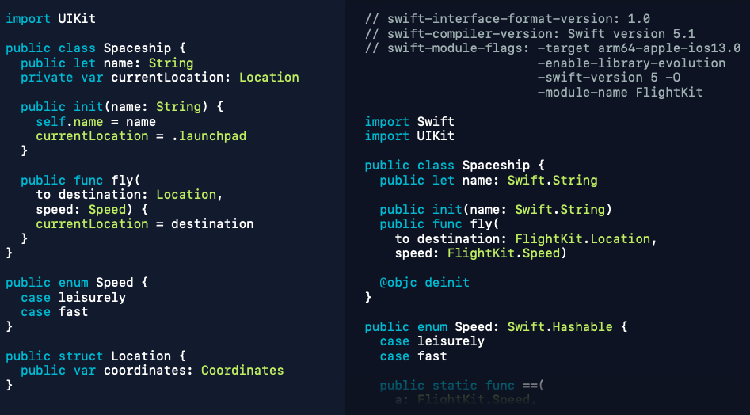

# 416-Binary Frameworks in Swift

## Overview

-   [Introducing XCFrameworks](#introducing-xcframeworks)
-   [Creating an XCFramework](#creating-an-xcframework)
-   [Framework author considerations](#framework-author-considerations)

## Introducing XCFrameworks

使用 [Swift Packages](408-Adopting%20Swift%20Packages%20in%20Xcode.md) 管理第三方库不需要考虑 Binary Compatibility.

XCFrameworks are a new way to bundle up multiple variants of your framework in a way that will work across Xcode versions going forward.

A single XCFramework can contain 

-   a variant for the simulator, and for the device.
-   a variant for any of the platforms that Xcode supports.
-   a variant for Mac apps that use AppKit, and a variant for Mac apps that use UIKit

XCFramework can not only  bundle up frameworks, but also bundle up static libraries, and their corresponding headers.  XCFramework support binary distribution of Swift and C-based code.

## Creating an XCFramework

以前在自己的 Project 中使用 Framework ，经常出现 Framework 与当前的 compiler 不相同的错误，比如说 "Module compiled with Swift 4.0 cannot be imported by the Swift 5.0 compiler"，这是因为以前 Framework 使用 Compiled Module Format—.swiftmodule. 这种格式

-   是一种 binary 格式，包含内部 Compiler 数据结构
-   它随着 Swift Compiler 的每个版本而发生变化
-   不同版本的 Swift Compiler 不能相互解析

为了解决这个问题Xcode 11引入了一种新的格式： Swift Module Interface—.swiftinterface，这种格式

-   更像源代码的文本格式
-   兼容不同版本的 Swift Compiler
-   通过设置 “Build Libraries for Distribution" = true

### Swift Module Interface



### Building an XCFramework

1.  Enable "Build Libraries for Distribution"

2. xcodebuild archive

    ```swift
    xcodebuild archive 
      -scheme XXXX 
      -destination generic/platform=ios 
      -destination 'platform=iOS Simulator,name=iPhone 11,OS=13.0' 
      SKIP_INSTALL=NO
    ```

3. xcodebuild -create-xcframework

    ```swift
    xcodebuild 
      -create-xcframework 
      -framework XXXX.framework 
      -framework XXXX.framework 
      -framework XXXX.framework 
      -output XXXX.xcframework
    ```

关于第二步中的 -destination 请看[Xcodebuild Destination Cheatsheet](https://www.mokacoding.com/blog/xcodebuild-destination-options/)

## Framework author considerations

## overview

-   Evolving your framework
-   Trading flexibility for optimizability
-   Helping your clients

### Evolving your framework

首先 framework 的版本号是很重要的，应遵循 [Semantic Versioning](https://semver.org/)

-   Patch Version represents when you make bug fixes, or implementation changes to your framework that shouldn't affect your clients. 
-   Middle component is for backwards compatible editions, new APIs, or new capabilities. 
-   Major component is for any breaking changes that you have to make, whether that's source breaking, binary breaking, or semantics breaking in a way where clients will have to rebuild.

### Trading flexibility for optimizability

"Build Libraries for Distribution" build setting set the default to the flexibility side.

flexibility 表现在新增方法，新增枚举值、新增属性等不需要 client 重新编译。但是会增加 client 和 framework 之间的握手和额外通信。

为了优化性能，Swift 提供有三种方式: inlinable functions, frozen enums, and frozen structs.

#### inlinable function

Inlinable function copies function body into the Module Interface file.

And when a client is compiling against that interface, they'll be able to copy that body directly into their own code, and possibly optimize it even further if they know something about the cargo that's being checked.

如果 framework 改变 Inlinable function 的函数体，将可能导致 client 和 framework 的结果不一致

As a rule of thumb, make sure not to change the output or observable behavior. It's okay to add a better algorithm, or some additional fast pads, but if you change the observable behavior of the function, then you could end up with these really subtle problems that are only visible at runtime, and possibly only under certain inputs. If you need to do this, all your clients need to recompile.

#### frozen enum

Marking this enum with the frozen attribute, then I as the framework author can promise that there are no new cases added in future releases of the framework. The compiler is able to compile it more efficiently.

改变 frozen enums 需要改变 framework 的 major component, 需要 client 需要重新编译。

#### frozen struct

The frozen attribute can be used to promise that the stored properties will not change. They will not be added, or reordered, or removed. The types of stored properties must be public, or @usableFromInline.  And The framework author can now write inlinable initializers. .

The compiler to be able to manipulate the stored properties of this struct directly, so that it can generate more efficient code on the client side.

### Helping your clients

#### Entitlements

-   Document you requirements
-   Minimize entitlement requests
-   Handle denial gracefully

####  Dependencies

-   Document your dependencies
-   Minimize your dependencies
-   Dependencies must user "Build Library for Distribution"
-   Binary frameworks cannot depend on Packages. 

#### If Your Swift Code Has No Objective-C API

-   If your Swift code doesn't have any Objective-C API that it's trying to publish

    set "Install Objective-C Compatibility Header" = No

- If your framework doesn't vend any Objective-C API, well then there's no reason to support this Objective-C Import Syntax

    set "Defines Module" = No


