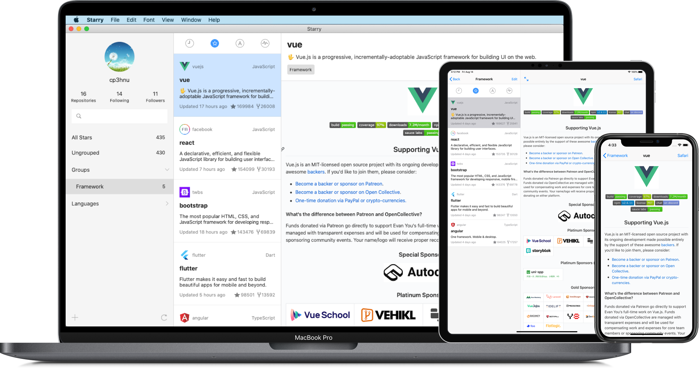

<template>
  

    

      
      
Starry

    

    

      
Group, manage and read your starred repositories on GitHub.

    

    

      

        
      

    

    

      <video class="video" controls>
        <source src="./video.mp4" type="video/mp4">
      </video>
    

    

      
    

    

      <h3>Starry has the following features.</h3>
      <ul>
        <li>
          
Group you starred repositories on GitHub

        </li>
        <li>
          
Synchronize your groups to all of your iPhone, iPad and Mac with iCloud. Synchronize when the app will enter foreground.

        </li>
        <li>
          
Sort groups by drag and drop

        </li>
        <li>
          
Language groups based on the languages of repositories

        </li>
        <li>
          
Load repositories quickly by caching documents and images of repositories

        </li>
        <li>
          
Search starred repositories via the name, owner, and description of repository

        </li>
        <li>
          
Sort starred repositories by the starred date, star count of repository, repository name and update date of repository

        </li>
        <li>
          
Unstar repositories

        </li>
        <li>
          
Handoff

        </li>
        <li>
          
Spotlight search (iOS)

        </li>
        <li>
          
Pay once ($2.99), use on iPhone, iPad and Mac

        </li>
      </ul>
    

    

      <h3>Little known details.</h3>
      <ul>
        <li><strong>Delete group:</strong> cmd + delete</li>
        <li><strong>Copy repository to a group:</strong> Hold down the option key and drag repository to a group</li>
        <li><strong>Reverse order:</strong> Click the same button at the top of the middle column twice</li>
        <li><strong>Back or Forward in repository document page:</strong> swipe mouse or trackpad</li>
        <li><strong>Cancel refreshing starred repositories from GitHub:</strong> Click the rotating refresh button</li>
        <li><strong>Create new group:</strong> cmd + a</li>
        <li><strong>Toggle read mode:</strong> cmd + r</li>
        <li><strong>Increase font size of repository document:</strong> cmd + +</li>
        <li><strong>Decrease font size of repository document:</strong> cmd + -</li>
      </ul>
    

  

</template>

